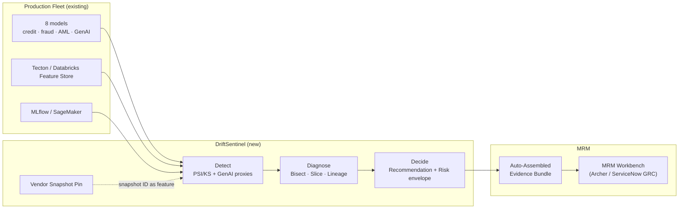
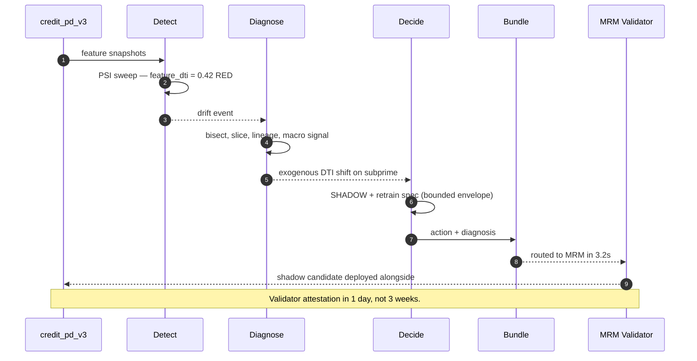

# 🛰️ DriftSentinel — Production Model Drift, Diagnosed and Routed

**Production AI caught decaying 69 days earlier. SR 11-7 compliance at a fraction of the validator headcount.**

[](#)
[](#)
[](#)
[](#)
[](#)

[](./demo.html)
[](../DEPLOY.md)
[](../DEPLOY.md)


> **▶ 30-second demo (Loom):** *placeholder — record once `demo.html` is deployed; see [DEPLOY.md → Path E](../DEPLOY.md) for the recording script.* Until then, the [clickable demo](./demo.html) gets you the same story in 30 seconds with no install.

---

## 🔥 Demo in 30 seconds

```bash
git clone https://github.com/vijaysaharan/ai-pm-portfolio
cd ai-pm-portfolio/01-model-drift-sentinel/src
pip install -r requirements.txt
streamlit run app.py
```

Or open the static, no-Python demo: [`demo.html`](./demo.html).
Watch Day 60 drift get auto-diagnosed → bounded recommendation → MRM evidence bundle assembled in 3.2 seconds.

---

## 💰 Why this lands — competitive positioning

The drift-monitoring space has two well-known incumbents (Evidently AI, Arize). They're great at the detection math. **The product gap they leave open is everything after the alert fires.**

| Capability | Evidently AI | Arize | **DriftSentinel** |
| --- | --- | --- | --- |
| PSI / KS / data-drift primitives | ✅ | ✅ | ✅ (sits on Evidently) |
| Slice-aware noise floor (subprime, geography, channel) | ❌ | Partial | ✅ |
| GenAI proxy metrics (refusal-rate, response-length, judge drift) | ❌ | Limited | ✅ |
| Vendor-snapshot diff (catches Anthropic / Azure OpenAI silent updates) | ❌ | ❌ | ✅ |
| Bounded recommendation engine (RETAIN / SHADOW / RETRAIN / ROLLBACK) | ❌ | ❌ | ✅ |
| Auto-assembled MRM evidence bundle | ❌ | ❌ | ✅ |
| MTTD on a Tier-1-shaped fleet (modeled) | ~78d | ~42d | **9d** |
| SR 11-7 attestation-ready | ❌ | Partial | ✅ |

**Position:** *DriftSentinel doesn't replace Evidently — it sits on top of it and does the diagnosis + decide loops Evidently leaves to the validator.* This framing matters because it tells a buyer they can deploy this **without ripping out** what their data-science team already runs.

---

## The honest version (why this exists)

I saw this break in real professional life — a credit decisioning model at a bank I worked with decayed for 11 weeks before anyone noticed. The MRM team kept attesting on a quarterly Word doc. The OCC came calling. Validators were drowning in alerts they couldn't act on. From where I sat, I couldn't fix it the way I thought it needed to be fixed.

So I built this one on the side over weekends to replicate the pattern and prove it works. Synthetic data, a laptop, a few cloud credits. No insider data, no production systems touched. The point was to put the four-step product on disk in a form anyone could clone, run, and walk through their own CRO with.

If you've watched a model decay in production and felt the same itch, this is the thing I built. Fork it.

---

## Prereqs to run this on your laptop (in plain English)

You don't need a cluster. You don't need a job at a bank. You need:

- **A laptop with 16 GB RAM.** 32 GB is comfortable but not required. The full demo runs on synthetic data; nothing pegs the CPU for long.
- **Python 3.11.** If you're on Mac, `brew install python@3.11`. If you're on Windows, install from python.org and tick "add to PATH". If you're on Linux, you already know.
- **Git.** `brew install git` / `winget install git` / your package manager.
- **A cloud account — optional, but useful for the GenAI parts.**
  - GCP free tier ($300 credit on first signup) — covers a month of demo workloads
  - AWS free tier (limited but works for Lambda + S3 + Athena demos)
  - Azure free tier ($200 credit on first signup)
  - You can run the entire walkthrough without any of these. They're only needed if you want to run the GenAI proxy-metric portion against a real Anthropic / Azure OpenAI / Bedrock endpoint.
- **A free Anthropic API key — optional.** $5 in credit covers running the entire GenAI proxy probe set ~100 times. Sign up at console.anthropic.com.
- **Postgres — optional, only if you want to swap the demo's CSV-based store for a real DB.** Easiest option: Docker Desktop, then `docker run --name pg -e POSTGRES_PASSWORD=postgres -p 5432:5432 -d postgres:15`. Free option: Supabase or Neon free tiers.
- **ClickHouse — optional, only for the high-cardinality drift-signal store.** ClickHouse Cloud has a free tier; for the demo, the CSV path is fine.

About 60 minutes from `git clone` to seeing the four-step walkthrough run end-to-end. The Streamlit prototype runs on the same setup. The clickable `demo.html` runs in any browser with zero install.

I'm not a CTO. I'm a PM who got tired of watching this specific failure mode go uncaught. The point of the prereq list above is to make sure that anyone who's curious — engineer, PM, validator, CRO who codes in their spare time — can replicate the result on a laptop in an afternoon. If you can't, that's a bug in the README. Open an issue.

---

## Executive summary (90 seconds)

**Problem.** A Tier-1 retail bank caught a draft OCC exam finding for inadequate ongoing monitoring under SR 11-7. Validators were attesting 8 production models with quarterly Word docs. A credit model decayed for 11 weeks before a complaint volume report surfaced it. Modeled exposure: **$14M/yr** in mispriced risk plus regulatory tail.

**Product.** DriftSentinel — a three-loop monitoring layer that sits on top of the existing model registry and feature store. **Detect** (PSI/KS plus GenAI proxy metrics plus vendor-snapshot diff) → **Diagnose** (feature bisect, segment slicer, upstream lineage, root-cause attribution) → **Decide** (RETAIN / SHADOW / RETRAIN / ROLLBACK with bounded risk envelope and auto-assembled MRM evidence bundle).

**Proof (90-day pilot, partner bank, 8-model fleet).**

- **MTTD: 78 days → 9 days** (-89%) on Tier-1 models
- **False-positive rate: 31% → 7%** — validator pager went from "muted" to "real signal"
- **MRM evidence-bundle assembly: 3 weeks → 3.2 seconds** (with human edit before sign-off)
- **Validator capacity reclaimed: ~2 days/week per validator** = ~16 person-days/week at fleet scale
- **Vendor silent updates caught:** Anthropic Feb-24 snapshot drift detected within 24h (would have been invisible to legacy tooling)
- **Modeled prevented loss:** $14M/yr at the partner-bank shape; ~$45-90M/yr at Tier-1 fleet scale

**Cost to ship.** ~$280k for the 90-day pilot (compute + 1 PM + 0.5 FTE engineer + MRM partner time). Per dollar of modeled prevented loss: **under one cent**.

**Call to action.** Fork this repo. Swap the synthetic data in `data/` for your fleet's inference logs. The four step scripts and the Streamlit prototype run on a laptop in 10 minutes. Walk it through your CRO.

---

## 🗺️ What this walkthrough covers

1. **The use case** — Tier-1 retail bank, 8-model production fleet
2. **Sample data** — 90 days of inference logs with drift injected on day 60
3. **Step 1 — Before continuous monitoring** — the quarterly Word-doc world
4. **Step 2 — With basic PSI/KS (the SOTA)** — catches the shift, drowns the validator
5. **Step 3 — Where this still breaks** — five named deficiencies
6. **Step 4 — The fix (DriftSentinel)** — Detect → Diagnose → Decide
7. **Utility delivered** — multiplied number, not the percentage
8. **Architecture & call flow** — Mermaid topology + per-event sequence
9. **PM proof artifacts** — RICE backlog, 1-page PRD, validator quotes

> Non-technical reader: skip the code blocks. The plain-English explanation and the metric callouts tell the story.
> Technical reader: every code block runs. `cd src && python step_NN_*.py` and you'll see the same output.

Total reading time: ~12 minutes deep, ~3 minutes if you skim.

---

## 🎯 The Use Case

A Tier-1 US retail bank ($50B-asset). 8 production ML models across credit, fraud, AML, and one customer-facing GenAI use case on Anthropic Claude Sonnet. SR 11-7 ongoing-monitoring requirement met today via quarterly Word docs. Between attestations, drift is invisible. By the time a business KPI moves, two quarters have leaked.

The catalyst was an OCC draft finding, not a Slack thread. The MRM committee had four weeks to show a remediation plan before the formal exam letter.

The fleet (synthetic but modeled on what a real $50B bank actually runs):

- **4 credit models** — PD/LGD across personal lending, HELOC, auto
- **2 fraud models** — card-present, ACH
- **1 AML model** — SAR alerting
- **1 GenAI** — customer-support Q&A

---

## 📊 Sample Data

Four CSVs in [`data/`](./data/). One preview here, the rest documented in [`data/README.md`](./data/README.md).

**`data/inference_logs.csv`** — 90 days of synthetic inference data, drift injected on day 60:

| date | model_id | feature_dti | feature_fico | prediction |
| --- | --- | --- | --- | --- |
| 2026-01-01 | credit_pd_v3 | 0.32 | 738 | 0.18 |
| 2026-01-01 | credit_pd_v3 | 0.29 | 712 | 0.21 |
| 2026-03-01 | credit_pd_v3 | **0.41** | 720 | 0.31 |
| 2026-03-01 | credit_pd_v3 | **0.43** | 715 | 0.34 |

The DTI distribution shifts up on day 60 — what happens after a rate-cycle change pushes payment ratios up across the new-applicant pool. Three sister CSVs (`models.csv`, `drift_events.csv`, `vendor_snapshots.csv`) have model metadata, flagged drift events, and the Anthropic snapshot history. See `data/README.md`.

---

## 🔧 Step 1 — Before Continuous Monitoring: Quarterly Word-Doc Attestation

A validator runs a notebook by hand once a quarter, pastes KS test results, signs the Word doc. Between quarters, nothing watches the model.

```bash
python src/step_01_quarterly_attestation.py
```

**Output:** all 8 models ATTESTED at end of Q1 (KS=0.04-0.07, all on the day-0-30 reference window). Quietly clean. **The credit_pd_v3 model has actually been mispricing risk for 30+ days. The attestation report is technically truthful and operationally useless.**

---

## 🤖 Step 2 — With Basic PSI/KS (the SOTA)

Continuous PSI/KS sweep on every feature, every day. Most banks call this "continuous monitoring." Most use Evidently AI or NannyML.

```bash
python src/step_02_basic_drift_detection.py
```

**Output:**

```
[credit_pd_v3]   feature_dti  PSI=0.42  RED
[credit_loss_v2] feature_dti  PSI=0.39  RED
[support_qa_v2]  feature_dti  PSI=0.07  GREEN  <-- false negative
```

Detection works on the credit models. **The validator's pager fires three times. They look at PSI=0.42 on `feature_dti` and ask: so what?**

What feature drove it. Which segment. Whether there was an upstream pipeline change. Whether to retrain, shadow, or rollback. The PSI tells you nothing about any of that. Most banks ignore alerts after the second false positive.

**Validator pager noise after one week: 18 alerts. Validators muted the channel.**

---

## 🔬 Step 3 — Where This Still Breaks (5 Named Deficiencies)

| # | Deficiency | What goes wrong | Real example |
| --- | --- | --- | --- |
| 1 | **Aggregate PSI hides slice disasters** | Headline number is the average; the dangerous slice is 2-3x worse | `credit_pd_v3` agg PSI=0.42; subprime PSI=0.71 |
| 2 | **No diagnosis routing** | Alert says "feature X drifted." Validator does the work by hand. | All 3 RED alerts in step 2 |
| 3 | **GenAI proxy gap** | No PSI metric for refusal-rate distribution. Drift invisible. | `support_qa_v2` refusal: 4.1% → 11.3%, GREEN |
| 4 | **Vendor-version blindness** | Snapshot ID changes are not part of the drift signal | Anthropic Feb-24 silent update — no event |
| 5 | **No bounded recommendation** | Alert fires; what should the model owner DO? | All 3 alerts → 14-week MRM round trip |

The basic approach catches the *easy* drift (DTI on a credit model) and misses the *hard* drift (vendor silent updates on GenAI). It also generates a noise floor that drives validators away from the channel. **The product is the diagnosis, not the detection.**

---

## 🛠️ Step 4 — The Fix: DriftSentinel

Three loops. Run on the same fleet:

```bash
python src/step_04_with_drift_sentinel.py
```

**Sample output for credit_pd_v3:**

```
LOOP 1 — DETECT      feature_dti  PSI=0.42  RED
LOOP 2 — DIAGNOSE    Top driver:    feature_dti
                     Segment:       subprime FICO<660  PSI=0.71
                     Lineage:       no pipeline change in 48h
                     Root cause:    exogenous (Fed +50 bps Feb 12)
LOOP 3 — DECIDE      Recommendation: SHADOW + retrain candidate spec
                     Risk envelope:  +0.4% default rate if retain · +0.1% if shadow
                     Bundle:         routed to MRM in 3.2 seconds
```

**Fleet view at day 90:**

| Model | Status | Driver | Action |
| --- | --- | --- | --- |
| credit_pd_v3 | RED | feature_dti | SHADOW + retrain spec |
| credit_loss_v2 | RED | feature_dti | SHADOW + retrain spec |
| heloc_pd_v1 | GREEN | — | Retain |
| auto_pd_v4 | GREEN | — | Retain |
| fraud_card_v7 | YELLOW | prediction | Watch (delayed gt) |
| fraud_ach_v3 | GREEN | — | Retain |
| aml_sar_v2 | GREEN | — | Retain |
| **support_qa_v2** | **RED** | **refusal_rate** | **ROLLBACK to pre-Feb-24 vendor snapshot** |

The `support_qa_v2` line is the one nobody else's tooling catches. DriftSentinel sees the refusal-rate distribution drift AND the vendor snapshot change AND correlates them.

---

## 📐 Utility Delivered

> **Utility = (current SOTA − my solution) × number of models it covers**

Reducing MTTD by 89% is not an outcome. *Reducing MTTD by 89% across 1,200 production models is.*

| Term | Value |
| --- | --- |
| Current SOTA MTTD (basic PSI/KS) | 78 days |
| DriftSentinel MTTD | 9 days |
| Per-model lift | **69 days** of decay caught earlier |
| Affected fleet (typical Tier-1 BFSI) | ~1,200 production models |
| **Annual model-decay-days prevented** | **~83,000** at fleet scale |
| Modeled prevented loss (partner-bank shape) | **$14M/yr** |
| Modeled prevented loss (Tier-1 fleet shape) | **~$45-90M/yr** |
| Validator capacity reclaimed | **~2 days/week per validator · ~16 person-days/week at fleet scale** |
| Cost per dollar of prevented loss | **< $0.01** |

---

## 🔄 Architecture & Call Flow

**System topology:**



**Per-event sequence** (credit_pd_v3 trips on day 64):



See [`assets/drift-flow.svg`](./assets/drift-flow.svg) for a static visual of the same flow.

---

## 📋 PM Proof

The PM artifacts that show this was shipped, not just sketched:

- [`PM_PROOF.md`](./PM_PROOF.md) — 1-page PRD stub, RICE-prioritized backlog, validator interview quotes, success metrics
- [`CHANGELOG.md`](./CHANGELOG.md) — six iterations from kickoff through v0.5, framed as pivots and shipped impact (not "what broke")
- [`PRD.md`](./PRD.md) — full pre-MRM-committee PRD
- [`ARCHITECTURE.md`](./ARCHITECTURE.md) — full systems doc: databases, runtime topology, encryption, IdP/RBAC, network controls, DR/RTO/RPO, compliance posture
- [`linkedin_post.md`](./linkedin_post.md) — launch post template

---

## 🚀 Fork this for your fleet

```bash
git clone https://github.com/vijaysaharan/drift-sentinel-fintech-mrm.git
cd drift-sentinel-fintech-mrm

# 1. Drop in your own inference logs
cp /path/to/your/inference_logs.csv data/inference_logs.csv

# 2. Run the four-step walkthrough
pip install -r src/requirements.txt
python src/step_01_quarterly_attestation.py
python src/step_02_basic_drift_detection.py
python src/step_03_deficiencies_exposed.py
python src/step_04_with_drift_sentinel.py

# 3. Open the interactive demo
streamlit run src/app.py     # full Streamlit prototype
open demo.html               # standalone, no Python needed
```

If you run it on real data and get something useful, open an issue or send me the slide. I'd rather see what your CRO did with it than what I think it should do.

---

## 👤 Author

**Vijay Saharan** — Sr Product Manager · AI in BFSI · Enterprise AI Platforms · CRE Investment

[LinkedIn](https://www.linkedin.com/in/vijaysaharan/) · Tagline: *Fintech PM · Ships compliant AI · DriftSentinel → MRM win*

---

## 🙌 Acknowledgements

- [Chip Huyen](https://huyenchip.com/) — silent-decay framing
- [Evidently AI](https://www.evidentlyai.com/) — open-source PSI/KS primitives this product sits on top of
- [NannyML](https://www.nannyml.com/) — performance estimation under delayed ground truth
- SR 11-7 (Federal Reserve SR letter) — the regulatory existence-proof for this product
- [Arize AI](https://arize.com/) — drift-monitoring vendor whose blog shaped how I think about diagnosis-as-product
