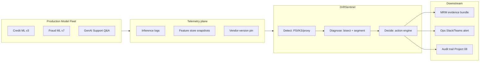

# Architecture · Production Model DriftSentinel

## System architecture



## Data flow — single drift event

```mermaid
sequenceDiagram
    participant Model as Deployed Model
    participant Tel as Telemetry
    participant Det as Detect
    participant Diag as Diagnose
    participant Dec as Decide
    participant MRM as MRM Validator

    Model->>Tel: Inference + feature snapshot
    Tel->>Det: Reference vs current windows
    Det->>Det: PSI/KS sweep
    Det-->>Diag: PSI > 0.25 on dti
    Diag->>Diag: Segment slicer + upstream lineage
    Diag-->>Dec: Driver = dti shift; segment = subprime
    Dec->>Dec: Risk envelope check
    Dec->>MRM: Recommendation = SHADOW + bundle
    MRM-->>Dec: Validator attestation in 1 day
```

## Key trade-offs

- **Single-pane vs federated UX.** Single pane wins for CRO/Validator; federated wins for Ops Lead per business line. Resolution: single backbone, federated views.
- **Auto-rollback authority.** Tier-1 always requires human attestation; Tier-2/3 auto-rollback with audit trail (Project 08).
- **Vendor-version pinning vs. latest.** GenAI must pin or it isn't governable. Cost: 4–8 week lag on quality improvements. Worth it.

## Interlocks

- **Project 02 (Eval-First Console)** — shares eval-set storage and version pinning.
- **Project 06 (Inference Economics)** — drift events log $/inference deltas.
- **Project 08 (Audit Trail)** — every Decide-loop output is a lineage event.
