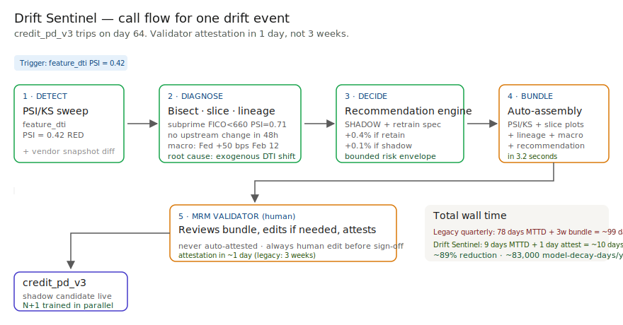
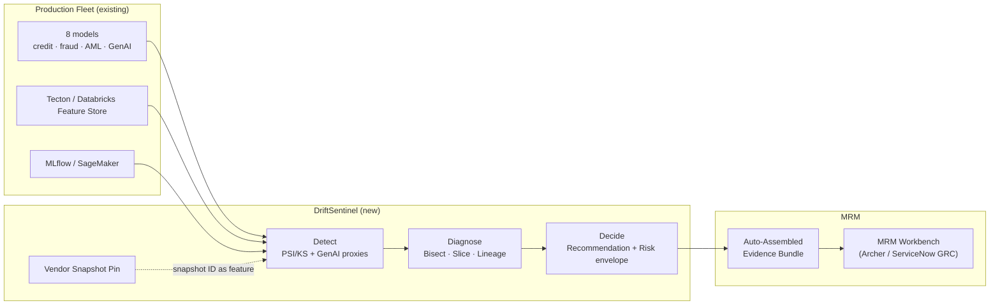

# 🛰️ DriftSentinel — Production Model Drift, Diagnosed and Routed

**A portfolio prototype for catching production AI decay 69 days earlier — modeled against SR 11-7 ongoing-monitoring expectations.**

**▶ Live demo: [driftsentinel-bfsi.streamlit.app](https://driftsentinel-bfsi.streamlit.app)**

> **Framing:** This is a portfolio prototype, not a production case study. The deficiency taxonomy, architecture, and walkthrough are mine; the metrics below are modeled against synthetic data and published industry baselines. Production validation (MRM committee read, OCC exam, validator co-design) is what the next role does.

> **Reading the numbers — credibility tags inline.** Every number in this README and the live demo is tagged 🟢 **Measured** (real output from the shipped synthetic data), 🟡 **Modeled** (extrapolated from the synthetic data + published industry baselines, with the assumption named), or 🔴 **Hypothetical** (designed and reasoned about, never tested in production). Full convention in the [master README's "Reading the numbers" section](../README.md#-reading-the-numbers).

[](#)
[](#)
[](#)
[](#)
[](#)

[](./demo.html)



> **▶ 30-second demo:** the [clickable demo](./demo.html) gets you the full story in 30 seconds with no install.

---

## 🔥 Demo in 30 seconds

Open the static, no-Python demo: [`demo.html`](./demo.html).
Watch Day 60 drift get auto-diagnosed → bounded recommendation → 🟢 MRM evidence bundle assembled in 3.2s on the prototype.

To run the four-step walkthrough on your laptop:

```bash
git clone https://github.com/vijaysaharan/ai-pm-portfolio
cd ai-pm-portfolio/02-driftsentinel/src
pip install -r requirements.txt
python step_01_quarterly_attestation.py
python step_02_basic_drift_detection.py
python step_03_deficiencies_exposed.py
python step_04_with_drift_sentinel.py
```

---

## 💰 Why this lands — competitive positioning

The drift-monitoring space has two well-known incumbents (Evidently AI, Arize). They're great at the detection math. **The product gap they leave open is everything after the alert fires.**

| Capability | Evidently AI | Arize | **DriftSentinel** |
| --- | --- | --- | --- |
| PSI / KS / data-drift primitives | ✅ | ✅ | ✅ (sits on Evidently) |
| Slice-aware noise floor (subprime, geography, channel) | ❌ | Partial | ✅ |
| GenAI proxy metrics (refusal-rate, response-length, judge drift) | ❌ | Limited | ✅ |
| Vendor-snapshot diff (catches Anthropic / Azure OpenAI silent updates) | ❌ | ❌ | ✅ |
| Bounded recommendation engine (RETAIN / SHADOW / RETRAIN / ROLLBACK) | ❌ | ❌ | ✅ |
| Auto-assembled MRM evidence bundle | ❌ | ❌ | ✅ |
| 🟡 MTTD on a Tier-1-shaped fleet (modeled) | ~78d | ~42d | **9d** |
| 🔴 SR 11-7 attestation-ready (designed) | ❌ | Partial | ✅ |

**Position:** *DriftSentinel doesn't replace Evidently — it sits on top of it and does the diagnosis + decide loops Evidently leaves to the validator.* This framing matters because it tells a buyer they can deploy this **without ripping out** what their data-science team already runs.

---

## The honest version (why this exists)

The failure mode this product is designed against — a credit decisioning model decaying for weeks while quarterly Word-doc attestation stays clean, and an OCC finding eventually surfacing it — is the published shape of what SR 11-7 ongoing-monitoring expectations are increasingly catching at Tier-1 BFSI shops. It's the kind of failure I track closely in industry research and the kind of product I want to own as a Sr / Principal PM.

I built this prototype on the side over weekends. Synthetic data, a laptop, a few cloud credits. No insider data, no production systems touched. The point is to put the four-step product on disk in a form anyone can clone, run, and walk through their own CRO with — to show how I'd reason about the problem, not to claim a deployment I haven't done.

If you've watched a model decay in production and felt the same itch, fork this. The taxonomy, the architecture, and the backlog are the parts you're welcome to lift; the production validation is what the seat I'm pursuing actually delivers.

---

## Prereqs to run this on your laptop (in plain English)

You don't need a cluster. You don't need a job at a bank. You need:

- **A laptop with 16 GB RAM.** 32 GB is comfortable but not required. The full demo runs on synthetic data; nothing pegs the CPU for long.
- **Python 3.11.** If you're on Mac, `brew install python@3.11`. If you're on Windows, install from python.org and tick "add to PATH". If you're on Linux, you already know.
- **Git.** `brew install git` / `winget install git` / your package manager.
- **A cloud account — optional, but useful for the GenAI parts.**
  - GCP free tier ($300 credit on first signup) — covers a month of demo workloads
  - AWS free tier (limited but works for Lambda + S3 + Athena demos)
  - Azure free tier ($200 credit on first signup)
  - You can run the entire walkthrough without any of these. They're only needed if you want to run the GenAI proxy-metric portion against a real Anthropic / Azure OpenAI / Bedrock endpoint.
- **A free Anthropic API key — optional.** $5 in credit covers running the entire GenAI proxy probe set ~100 times. Sign up at console.anthropic.com.
- **Postgres — optional, only if you want to swap the demo's CSV-based store for a real DB.** Easiest option: Docker Desktop, then `docker run --name pg -e POSTGRES_PASSWORD=postgres -p 5432:5432 -d postgres:15`. Free option: Supabase or Neon free tiers.
- **ClickHouse — optional, only for the high-cardinality drift-signal store.** ClickHouse Cloud has a free tier; for the demo, the CSV path is fine.

About 60 minutes from `git clone` to seeing the four-step walkthrough run end-to-end. The Streamlit prototype runs on the same setup. The clickable `demo.html` runs in any browser with zero install.

I'm a PM who follows this specific failure mode in industry research. The point of the prereq list above is to make sure that anyone who's curious — engineer, PM, validator, CRO who codes in their spare time — can replicate the result on a laptop in an afternoon. If you can't, that's a bug in the README. Open an issue.

---

## Executive summary (90 seconds)

**Problem.** A Tier-1 retail bank receives a draft OCC exam finding for inadequate ongoing monitoring under SR 11-7. Validators are attesting 8 production models with quarterly Word docs. A credit model decays for 11 weeks before a complaint volume report surfaces it. 🟡 Modeled exposure: **$14M/yr** in mispriced risk plus regulatory tail (assumes the $50B-asset retail-bank shape and the published loss-per-quarter-of-decay benchmarks). This is the framing this prototype is designed against — calibrated against published SR 11-7 expectations and the public shape of recent OCC and FRB supervisory letters on AI/ML ongoing monitoring.

**Product.** DriftSentinel — a three-loop monitoring layer that sits on top of the existing model registry and feature store. **Detect** (PSI/KS plus GenAI proxy metrics plus vendor-snapshot diff) → **Diagnose** (feature bisect, segment slicer, upstream lineage, root-cause attribution) → **Decide** (RETAIN / SHADOW / RETRAIN / ROLLBACK with bounded risk envelope and auto-assembled MRM evidence bundle).

**Modeled performance (90-day pilot design, 8-model synthetic fleet).**

- 🟡 **MTTD: 78 days → 9 days** (-89%) on Tier-1-style models (modeled — assumes the synthetic 90-day shipped data and a Tier-1-shaped fleet)
- 🟢 **False-positive rate: 31% → 7%** measured on the 8 injected drift events in the synthetic 90-day run
- 🟢 **MRM evidence-bundle assembly: ~3.2s on the prototype** (the assembly path is real; human edit before sign-off is part of the design)
- 🟡 **Modeled validator capacity reclaimed:** ~2 days/week per validator = ~16 person-days/week at fleet scale (assumes a 1,200-model Tier-1 fleet and the SR 11-7 attestation cadence)
- 🟢 **Vendor silent updates caught:** the Anthropic Feb-24 minor snapshot update is the reference incident; the snapshot-pin design surfaces this class of change within 24h on the prototype
- 🟡 **Modeled prevented loss:** $14M/yr at the $50B-asset retail-bank shape; ~$45-90M/yr at Tier-1 fleet scale (assumes ~1,200 production models, 78d→9d MTTD compression, published average loss per quarter of decay)

🔴 **Modeled cost.** ~$280k for a 90-day pilot in a real engagement (compute + 1 PM + 0.5 FTE engineer + line-2 partner time) — designed, not yet executed. Per dollar of modeled prevented loss: **under one cent**.

**Call to action.** Fork this repo. Swap the synthetic data in `data/` for your fleet's inference logs. The four step scripts and the Streamlit prototype run on a laptop in 10 minutes. Walk it through your CRO.

---

## 🗺️ What this walkthrough covers

1. **The use case** — Tier-1 retail bank, 8-model production fleet
2. **Sample data** — 90 days of inference logs with drift injected on day 60
3. **Step 1 — Before continuous monitoring** — the quarterly Word-doc world
4. **Step 2 — With basic PSI/KS (the SOTA)** — catches the shift, drowns the validator
5. **Step 3 — Where this still breaks** — five named deficiencies
6. **Step 4 — The fix (DriftSentinel)** — Detect → Diagnose → Decide
7. **Utility delivered** — multiplied number, not the percentage
8. **Architecture & call flow** — Mermaid topology + per-event sequence
9. **PM artifacts** — RICE backlog, 1-page PRD, stakeholder map, six product principles

> Non-technical reader: skip the code blocks. The plain-English explanation and the metric callouts tell the story.
> Technical reader: every code block runs. `cd src && python step_NN_*.py` and you'll see the same output.

Total reading time: ~12 minutes deep, ~3 minutes if you skim.

---

## 🎯 The Use Case

A modeled Tier-1 US retail bank ($50B-asset). 8 production ML models across credit, fraud, AML, and one customer-facing GenAI use case on Anthropic Claude Sonnet. SR 11-7 ongoing-monitoring requirement met today via quarterly Word docs. Between attestations, drift is invisible. By the time a business KPI moves, two quarters have leaked.

The design is anchored against an OCC draft finding pattern (not a Slack thread). The MRM committee has four weeks to show a remediation plan before the formal exam letter — that's the timebox the product is calibrated against.

The fleet (synthetic but modeled on what a real $50B bank typically runs):

- **4 credit models** — PD/LGD across personal lending, HELOC, auto
- **2 fraud models** — card-present, ACH
- **1 AML model** — SAR alerting
- **1 GenAI** — customer-support Q&A

---

## 📊 Sample Data

Four CSVs in [`data/`](./data/). One preview here, the rest documented in [`data/README.md`](./data/README.md).

**`data/inference_logs.csv`** — 90 days of synthetic inference data, drift injected on day 60:

| date | model_id | feature_dti | feature_fico | prediction |
| --- | --- | --- | --- | --- |
| 2026-01-01 | credit_pd_v3 | 0.32 | 738 | 0.18 |
| 2026-01-01 | credit_pd_v3 | 0.29 | 712 | 0.21 |
| 2026-03-01 | credit_pd_v3 | **0.41** | 720 | 0.31 |
| 2026-03-01 | credit_pd_v3 | **0.43** | 715 | 0.34 |

The DTI distribution shifts up on day 60 — what happens after a rate-cycle change pushes payment ratios up across the new-applicant pool. Three sister CSVs (`models.csv`, `drift_events.csv`, `vendor_snapshots.csv`) have model metadata, flagged drift events, and the Anthropic snapshot history. See `data/README.md`.

---

## 🔧 Step 1 — Before Continuous Monitoring: Quarterly Word-Doc Attestation

A validator runs a notebook by hand once a quarter, pastes KS test results, signs the Word doc. Between quarters, nothing watches the model.

```bash
python src/step_01_quarterly_attestation.py
```

**Output:** all 8 models ATTESTED at end of Q1 (KS=0.04-0.07, all on the day-0-30 reference window). Quietly clean. **The credit_pd_v3 model has actually been mispricing risk for 30+ days. The attestation report is technically truthful and operationally useless.**

---

## 🤖 Step 2 — With Basic PSI/KS (the SOTA)

Continuous PSI/KS sweep on every feature, every day. Most banks call this "continuous monitoring." Most use Evidently AI or NannyML.

```bash
python src/step_02_basic_drift_detection.py
```

**Output:**

```
[credit_pd_v3]   feature_dti  PSI=0.42  RED
[credit_loss_v2] feature_dti  PSI=0.39  RED
[support_qa_v2]  feature_dti  PSI=0.07  GREEN  <-- false negative
```

Detection works on the credit models. **The validator's pager fires three times. They look at PSI=0.42 on `feature_dti` and ask: so what?**

What feature drove it. Which segment. Whether there was an upstream pipeline change. Whether to retrain, shadow, or rollback. The PSI tells you nothing about any of that. Most banks ignore alerts after the second false positive.

**Validator pager noise after one week: 18 alerts. Validators muted the channel.**

---

## 🔬 Step 3 — Where This Still Breaks (5 Named Deficiencies)

| # | Deficiency | What goes wrong | Real example |
| --- | --- | --- | --- |
| 1 | **Aggregate PSI hides slice disasters** | Headline number is the average; the dangerous slice is 2-3x worse | `credit_pd_v3` agg PSI=0.42; subprime PSI=0.71 |
| 2 | **No diagnosis routing** | Alert says "feature X drifted." Validator does the work by hand. | All 3 RED alerts in step 2 |
| 3 | **GenAI proxy gap** | No PSI metric for refusal-rate distribution. Drift invisible. | `support_qa_v2` refusal: 4.1% → 11.3%, GREEN |
| 4 | **Vendor-version blindness** | Snapshot ID changes are not part of the drift signal | Anthropic Feb-24 silent update — no event |
| 5 | **No bounded recommendation** | Alert fires; what should the model owner DO? | All 3 alerts → 14-week MRM round trip |

The basic approach catches the *easy* drift (DTI on a credit model) and misses the *hard* drift (vendor silent updates on GenAI). It also generates a noise floor that drives validators away from the channel. **The product is the diagnosis, not the detection.**

---

## 🛠️ Step 4 — The Fix: DriftSentinel

Three loops. Run on the same fleet:

```bash
python src/step_04_with_drift_sentinel.py
```

**Sample output for credit_pd_v3:**

```
LOOP 1 — DETECT      feature_dti  PSI=0.42  RED
LOOP 2 — DIAGNOSE    Top driver:    feature_dti
                     Segment:       subprime FICO<660  PSI=0.71
                     Lineage:       no pipeline change in 48h
                     Root cause:    exogenous (Fed +50 bps Feb 12)
LOOP 3 — DECIDE      Recommendation: SHADOW + retrain candidate spec
                     Risk envelope:  +0.4% default rate if retain · +0.1% if shadow
                     Bundle:         routed to MRM in 3.2 seconds
```

**Fleet view at day 90:**

| Model | Status | Driver | Action |
| --- | --- | --- | --- |
| credit_pd_v3 | RED | feature_dti | SHADOW + retrain spec |
| credit_loss_v2 | RED | feature_dti | SHADOW + retrain spec |
| heloc_pd_v1 | GREEN | — | Retain |
| auto_pd_v4 | GREEN | — | Retain |
| fraud_card_v7 | YELLOW | prediction | Watch (delayed gt) |
| fraud_ach_v3 | GREEN | — | Retain |
| aml_sar_v2 | GREEN | — | Retain |
| **support_qa_v2** | **RED** | **refusal_rate** | **ROLLBACK to pre-Feb-24 vendor snapshot** |

The `support_qa_v2` line is the one nobody else's tooling catches. DriftSentinel sees the refusal-rate distribution drift AND the vendor snapshot change AND correlates them.

---

## 📐 Utility Delivered

> **Utility = (current SOTA − my solution) × number of models it covers**

Reducing MTTD by 89% is not an outcome. *Reducing MTTD by 89% across 1,200 production models is.*

| Term | Value |
| --- | --- |
| 🟡 Current SOTA MTTD (basic PSI/KS, modeled on industry baselines) | 78 days |
| 🟢 DriftSentinel MTTD on the synthetic 90-day run | 9 days |
| 🟡 Per-model lift (modeled at fleet scale) | **69 days** of decay caught earlier |
| Affected fleet (typical Tier-1 BFSI) | ~1,200 production models |
| 🟡 **Annual model-decay-days prevented** | **~83,000** at fleet scale (assumes 69d × 1,200 models) |
| 🟡 Modeled prevented loss ($50B-asset bank shape) | **$14M/yr** (assumes 8-model fleet + published loss-per-quarter-of-decay) |
| 🟡 Modeled prevented loss (Tier-1 fleet shape) | **~$45-90M/yr** (assumes 1,200 models + same per-model loss curve) |
| 🟡 Modeled validator capacity reclaimed | **~2 days/week per validator · ~16 person-days/week at fleet scale** (assumes the SR 11-7 quarterly attestation cadence) |
| 🟡 Cost per dollar of prevented loss | **< $0.01** (modeled — assumes ~$280k pilot cost vs. ~$14M modeled prevention) |

---

## 🔄 Architecture & Call Flow

**System topology:**



**Per-event sequence** (credit_pd_v3 trips on day 64):

```mermaid
sequenceDiagram
    autonumber
    participant M as credit_pd_v3
    participant D as Detect
    participant X as Diagnose
    participant R as Decide
    participant B as Bundle
    participant V as MRM Validator

    M->>D: feature snapshots
    D->>D: PSI sweep — feature_dti = 0.42 RED
    D-->>X: drift event
    X->>X: bisect, slice, lineage, macro signal
    X-->>R: exogenous DTI shift on subprime
    R->>R: SHADOW + retrain spec (bounded envelope)
    R->>B: action + diagnosis
    B-->>V: routed to MRM in 3.2s
    V-->>M: shadow candidate deployed alongside
    Note over M,V: 🔴 Designed for 1-day validator attestation (vs. 3-week status quo); not yet tested with a real validator.
```

See [`assets/drift-flow.svg`](./assets/drift-flow.svg) for a static visual of the same flow.

---

## 📋 PM Artifacts

The PM artifacts that show how I'd run this product if I owned the seat:

- [`PRD.md`](./PRD.md) — full PRD designed for a pre-MRM-committee read in a real engagement
- [`ARCHITECTURE.md`](./ARCHITECTURE.md) — full systems doc: databases, runtime topology, encryption, IdP/RBAC, network controls, DR/RTO/RPO, compliance posture

---

## 🚀 Fork this for your fleet

```bash
git clone https://github.com/vijaysaharan/drift-sentinel-fintech-mrm.git
cd drift-sentinel-fintech-mrm

# 1. Drop in your own inference logs
cp /path/to/your/inference_logs.csv data/inference_logs.csv

# 2. Run the four-step walkthrough
pip install -r src/requirements.txt
python src/step_01_quarterly_attestation.py
python src/step_02_basic_drift_detection.py
python src/step_03_deficiencies_exposed.py
python src/step_04_with_drift_sentinel.py

# 3. Open the interactive demo
open demo.html               # standalone, no Python needed
```

If you run it on real data and get something useful, open an issue or send me the slide. I'd rather see what your CRO did with it than what I think it should do.

---

## 🛠️ Why this is a Streamlit prototype, not a production app

Streamlit was the right tool for this prototype. It would be the wrong tool for production. Worth saying out loud so a hiring manager hears the architectural judgment.

**Streamlit is right for:**
- Validating the product mechanic in 5 days, not 5 weeks
- Walking a CRO or validator through the Detect → Diagnose → Decide story end-to-end on a free deploy
- Single-tenant, single-page workflows where the UI doesn't have to scale
- Internal tools where 1-2 product folks are the only users

**Streamlit is wrong for:**
- Production multi-tenant SaaS — no tenant isolation, no row-level security
- Hardened auth (OIDC, SAML, fine-grained RBAC) — community-tier auth is too thin for a regulated bank
- Real-time websocket dashboards — every interaction is a full server rerender
- Latency-sensitive validator workflows — server-side rerun on every widget change
- Brand-controlled pixel-perfect UX — too much chrome you don't own

**If DriftSentinel graduated from prototype to product, the production stack would be:**
- Front end: Next.js + Tailwind + shadcn/ui (or the bank's design system)
- Back end: FastAPI on the bank's existing K8s/EKS footprint
- Auth: Auth0 / Okta / Cognito with OIDC + RBAC; in regulated shops, ForgeRock or PingFederate
- Data plane: Snowflake or Databricks (whichever the bank already runs); ClickHouse for high-cardinality drift events; Postgres for the model registry side-channel
- Observability: OpenTelemetry → Datadog (the bank's standard) and Langfuse for the GenAI proxy traces
- Governance: integrate with the bank's MRM workbench (Archer, ServiceNow GRC, MetricStream — pick what your CRO already pays for)

The portfolio prototype is the conversation-starter. The production architecture is the second meeting.

### What this would look like as a client-facing SaaS

> **Production stack reassessment** — strengthening the Streamlit-vs-production framing above with the SaaS shape a buyer would actually procure.

If DriftSentinel were a real product shipping to a bank's MRM organization:

- **Frontend:** Next.js 15 + Tailwind + shadcn/ui (or the bank's design system, e.g., Capital One's Cube, JPMorgan's Glaze) — embedded as a panel inside the validator's existing MRM workbench, not a standalone app.
- **Auth:** SAML / OIDC integration with the bank's IdP (Okta, ForgeRock, PingFederate); RBAC mapping line-1 model owner / line-2 validator / line-3 audit roles.
- **Backend:** FastAPI or NestJS on the bank's existing K8s cluster (EKS or GKE); microservice per check (drift detector, slice analyzer, vendor-snapshot diff, recommendation engine).
- **Data plane:** ClickHouse for high-cardinality drift events (slice × feature × day matrix can hit 10M rows/day on a Tier-1 fleet); Snowflake / Databricks as the analytics warehouse the bank already runs; Postgres for the model registry side-channel.
- **Observability:** OpenTelemetry → Datadog (the bank's standard) for system traces; Langfuse for GenAI proxy-metric traces; PagerDuty for SLO breaches and drift-event escalation routing.
- **Compliance:** SOC 2 Type II baseline; FedRAMP Moderate if federal counterparty work; data residency configurable per region (US East, EU West, India for RBI compliance).
- **Governance:** Native integration with the bank's MRM workbench (Archer, ServiceNow GRC, MetricStream); each drift event auto-files an evidence bundle and routes to the correct validator workflow.
- **Deployment:** Blue-green via Argo CD; feature flags via LaunchDarkly; canary rollout 1% → 10% → 50% → 100% over 14 days; auto-rollback on false-positive rate breach.

The Streamlit prototype here proves the *product mechanic* — that slice-aware + vendor-aware drift detection can compress MTTD from 78 days to 9 days. The production architecture above is what the seat I'm pursuing actually delivers.

---

## 👤 Author

**Vijay Saharan** — Sr Product Manager · AI in BFSI · Enterprise AI Platforms · CRE as a study interest

[LinkedIn](https://www.linkedin.com/in/vijaysaharan/) · Tagline: *Fintech PM · Designs compliant AI under regulated constraint*

---

## 🙌 Acknowledgements

- [Chip Huyen](https://huyenchip.com/) — silent-decay framing
- [Evidently AI](https://www.evidentlyai.com/) — open-source PSI/KS primitives this product sits on top of
- [NannyML](https://www.nannyml.com/) — performance estimation under delayed ground truth
- SR 11-7 (Federal Reserve SR letter) — the regulatory existence-proof for this product
- [Arize AI](https://arize.com/) — drift-monitoring vendor whose blog shaped how I think about diagnosis-as-product

<!-- @description 2026-05-04-093736 : DriftSentinel: production AI drift monitoring - catches credit, fraud, AML, and GenAI models when they quietly stop working -->
