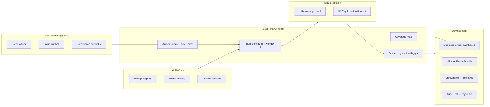
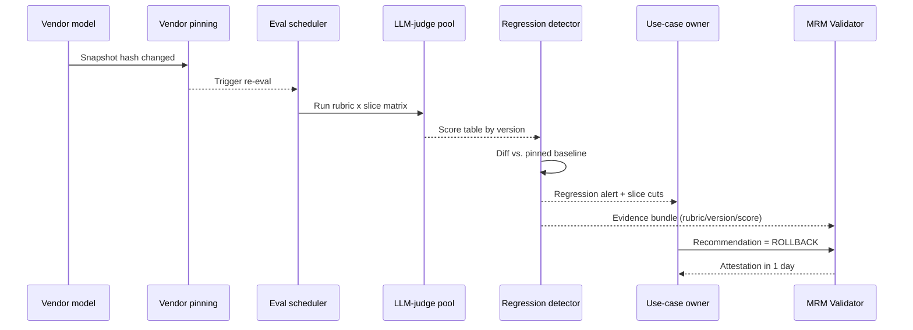

# Architecture · Eval-First Console for Regulated AI

## System architecture

## Data flow — single eval run on vendor silent update

## Key trade-offs

- **LLM-as-judge vs. SME gold panel.** Judge for cost and frequency; SME panel weekly to calibrate. Judge alone is unsafe in regulated workflows; SME alone is unscalable.
- **Per-prompt-change cadence vs. nightly.** Per-change is correct for promotion gating; nightly catches pinned-vendor drift. Run both.
- **Aggregate vs. slice-first reporting.** Aggregate is the trap (commercial-vs-retail gap of 18 points hides at the aggregate). Slice-first is non-negotiable for regulated workflows.
- **Eval cost vs. coverage.** Tiered cadence: hot use cases nightly, warm weekly, cold monthly. Per-use-case eval budget caps with line-1 owner sign-off.
- **SME authorship vs. engineer authorship.** SME-authored rubrics are 4–8x slower to produce, but they are the only ones that survive a regulator question. Engineer-authored rubrics are an anti-pattern in regulated workflows.

## Interlocks

- **Project 01 (DriftSentinel)** — consumes eval-set artifacts as the GenAI proxy-metric source; shares vendor-version pinning.
- **Project 03 (Hallucination Containment)** — eval rubrics include factuality; calibration data flows in.
- **Project 05 (Synthetic Eval Data)** — seeds rubric coverage for under-represented slices.
- **Project 06 (Inference Economics)** — eval budget caps; cost-per-eval visibility.
- **Project 08 (Audit Trail)** — every rubric edit, vendor pin change, and regression flag is a lineage event.
