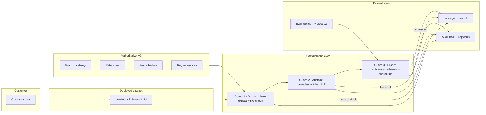
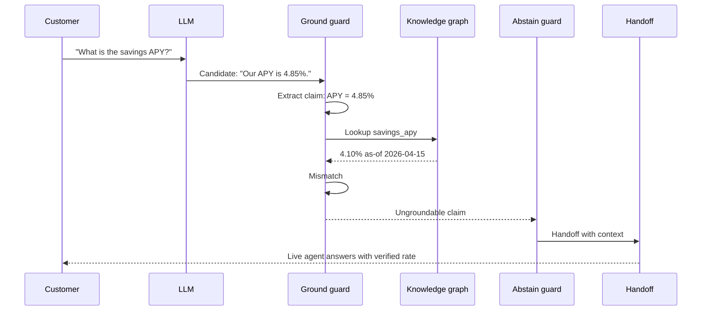
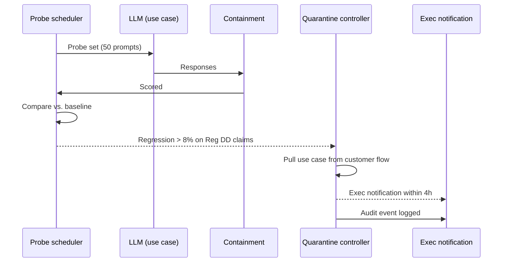

# Architecture · Hallucination Containment for Bank Chatbots

## System architecture

## Data flow — single grounded turn

## Data flow — auto-quarantine on probe regression

## Key trade-offs

- **Containment vs. model selection.** The instinct is "switch models." Switching introduces a new unknown-unknown set. Containment is model-agnostic and survives vendor swaps.
- **Refuse-rewrite vs. refuse-hard.** Rewriting an ungroundable claim with the KG value is better customer experience but introduces a small risk of paraphrase distortion. We start refuse-hard for v1; rewrite-with-citation is v2.
- **Abstention threshold per intent.** Single threshold is the trap (rate intents need higher confidence than directional questions). Per-intent thresholds are mandatory.
- **Auto-quarantine authority.** The system pulls a use case without human approval, with a 4-hour exec notification SLO. The reverse posture (human-required) loses the speed advantage.
- **KG as source of truth.** The LLM is never the source of truth on a rate, fee, or regulation. The KG is. The LLM is the natural-language interface to the KG.
- **Deflection give-back budget.** A 3-point give-back on deflection is the right trade for a 70-point hallucination cut. This must be defended explicitly, in writing, with the Head of CX.

## Interlocks

- **Project 01 (DriftSentinel)** — calibration drift on the abstention guard is a Tier-1 drift signal.
- **Project 02 (Eval-First Console)** — factuality rubrics and probe sets are co-authored here; results feed back to the console.
- **Project 07 (LLM Red Team)** — adversarial probes feed Guard 3 schedule; new jailbreaks discovered there land here.
- **Project 08 (Audit Trail)** — every guard fire (ground refuse, abstain, quarantine) is a lineage event with full evidence.
