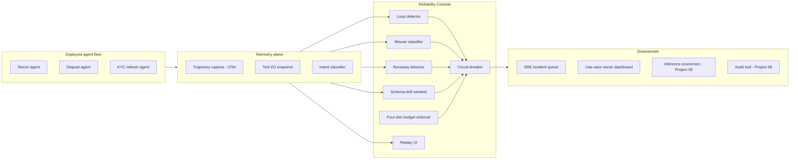
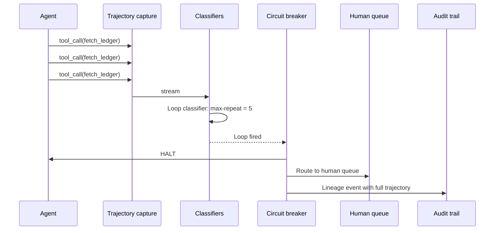
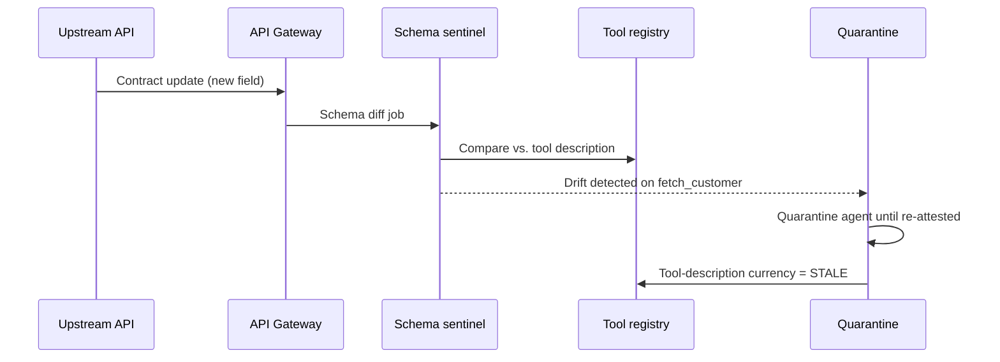

# Architecture · Agent Reliability & Tool-Use Observability

## System architecture

## Data flow — trajectory with circuit-breaker fire

## Data flow — schema-drift sentinel

## Key trade-offs

- **Trajectory as unit of observation, not request.** A request-centric view misses loops, misuse, and runaway. Trajectory is the only useful unit for agents.
- **Four-dim budgets vs. single-dim cost cap.** Tokens alone is insufficient — wall-clock loops can blow up regardless. All four dimensions are required for blast-radius enforcement.
- **Inline classifiers vs. async.** Loop and misuse must be inline (they enforce the breaker). Schema-drift is async (it informs quarantine, not real-time halt).
- **SRE org vs. AI/ML org ownership.** SRE is the right home — reliability is an operational discipline, and the tools (OTel, SLO, error budget) are SRE-native.
- **Tool descriptions as a regulated artifact.** Every write-tool exposed to a regulated agent must have a Compliance-attested description. Read-tools require AI Risk attestation. This is the governance lever.
- **Replay PII handling.** Tokenize at capture; replay UI scoped by role. 90 days hot, 365 cold-tokenized.

## Interlocks

- **Project 02 (Eval-First Console)** — agent eval rubrics include trajectory shape; classifier calibration shares the SME panel.
- **Project 06 (Inference Economics)** — runaway detector reads $/trajectory from the inference-economics ledger.
- **Project 07 (LLM Red Team)** — adversarial prompt suites that induce tool misuse run here as drills.
- **Project 08 (Audit Trail)** — every classifier hit, breaker fire, and replay session is a lineage event with full evidence.
