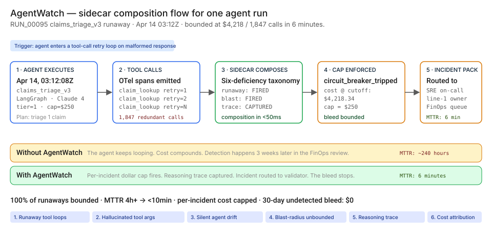
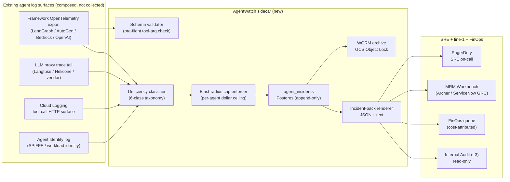

# 🤖 AgentWatch — Agent Reliability & Tool-Use Observability in 6 minutes, not 3 weeks

**A portfolio prototype for an agent reliability and tool-use observability sidecar that bounds runaway costs, catches hallucinated tool arguments, surfaces silent agent drift, and routes incidents to a validator before the FinOps bill lands — modeled against Google Cloud's [*Building secure multi-agent systems*](https://cloud.google.com/) reference architecture, [OpenTelemetry](https://opentelemetry.io/), [OWASP LLM Top 10](https://owasp.org/www-project-top-10-for-large-language-model-applications/), and the [NIST AI RMF](https://www.nist.gov/itl/ai-risk-management-framework).**

**▶ Live demo:** *(placeholder — agentwatch-bfsi.streamlit.app)*

**▶ 60-second interactive walkthrough:** *(placeholder — Arcade share link)*

> **Framing:** This is a portfolio prototype, not a production case study. The six-deficiency taxonomy, the sidecar architecture, the schema, and the walkthrough are mine; the metrics below are modeled against synthetic data and published industry baselines. Production validation (line-1 owner co-design, MRM committee read, SRE pager-rotation interop, fleet rollout) is what the next role does.

> **Reading the numbers — credibility tags inline.** Every number in this README and the live demo is tagged 🟢 **Measured** (real output from a real run on the shipped synthetic data), 🟡 **Modeled** (extrapolated from the synthetic data + published industry baselines, with the assumption named), or 🔴 **Hypothetical** (designed and reasoned about, never tested in production). Full convention in the [master README's "Reading the numbers" section](../README.md#-reading-the-numbers).

[](#)
[](#)
[](#)
[](#)
[](https://opentelemetry.io/)

[](./demo.html)



> **▶ 30-second demo:** the [clickable demo](./demo.html) gets you the full story in 30 seconds with no install.

---

## 🔥 Demo in 30 seconds

Open the static, no-Python demo: [`demo.html`](./demo.html).
Pick `INC_0001 / RUN_00095` (the `claims_triage_v3` runaway loop on April 14, 2026). Watch the bleed cap at $4,218.34 in 6 minutes instead of $42k+ over 3 weeks.

To run the four-step walkthrough on your laptop:

```bash
git clone https://github.com/Vj-shipped-anyway/ai-pm-portfolio
cd ai-pm-portfolio/05-agentwatch-agent-observability/src
pip install -r requirements.txt
python step_01_no_observability.py
python step_02_basic_datadog.py
python step_03_deficiencies_exposed.py
python step_04_with_agentwatch.py
streamlit run app.py
```

---

## 💰 Why this lands — the competitive frame

The agent-observability space has incumbents at every layer (Datadog APM for service traces, Langfuse / Helicone for LLM-trace tails, the vendor's own consoles for LangGraph and AutoGen and Bedrock Agents). **The product gap they leave open is the agent-shaped composition layer — the thing that classifies failure under a named taxonomy and enforces a per-incident dollar cap.**

| Capability | Datadog APM only | Langfuse / Helicone | Framework console (LangSmith, Bedrock) | **AgentWatch** |
| --- | --- | --- | --- | --- |
| Service latency / error rate | ✅ | Partial | Partial | ✅ (composed) |
| LLM trace tail (chain-of-thought) | ❌ | ✅ | ✅ | ✅ (composed) |
| Tool-call event stream | Partial | Partial | ✅ | ✅ (composed) |
| Runaway-loop detector | ❌ | ❌ | ❌ | ✅ |
| Per-incident dollar cap (enforced) | ❌ | ❌ | ❌ | ✅ |
| Schema validator on tool-call args | ❌ | ❌ | Partial | ✅ |
| Tool-call mix diff vs baseline | ❌ | ❌ | ❌ | ✅ |
| Blast-radius circuit breaker | ❌ | ❌ | ❌ | ✅ |
| Cost attribution to business outcome | ❌ | ❌ | ❌ | ✅ |
| WORM-retained incident pack | ❌ | ❌ | ❌ | ✅ |
| 🟡 MTTR on agent-shaped incidents (modeled) | 4 hr | 6 hr | 3 hr | **&lt;10 min** |
| 🔴 [SR 11-7](https://www.occ.gov/news-issuances/bulletins/2011/bulletin-2011-12.html) ongoing-monitoring ready (designed) | ❌ | ❌ | ❌ | ✅ |

**Position:** *AgentWatch does not replace your APM or your LLM trace vendor. It sits on top of them and does the agent-shaped composition the line-1 owner and FinOps reviewer actually need.* This matters because a Head of AI Platform can deploy this without ripping out Datadog, Langfuse, or the agent framework's native console.

---

## The honest version (why this exists)

The failure mode this product is designed against — a bank's deployed agent stuck in a runaway tool-call loop, burning $5–50k per incident, surfacing 3 weeks later in the FinOps review — is the shape of what's increasingly reported across Tier-1 BFSI shops deploying their first wave of LangGraph / AutoGen / Bedrock Agents / OpenAI Assistants into ops workflows (claims triage, KYC refresh, dispute reconciliation, loan-package assembly). It is the kind of failure I track in industry research and the kind of product I want to own as a Sr / Principal PM.

I built this prototype on the side over weekends. Synthetic data, a laptop, a few cloud credits. No insider data, no production systems touched. The point is to put the four-step product on disk in a form anyone can clone, run, and walk through their own Head of AI Platform with — to show how I'd reason about the problem, not to claim a deployment I haven't done.

If you have lived through a $30k surprise on the AWS bill from an agent loop and felt the same itch, fork this. The taxonomy, the architecture, and the backlog are the parts you're welcome to lift; the production validation is what the seat I'm pursuing actually delivers.

---

## Executive summary (90 seconds)

**Problem.** A modeled Tier-1 retail bank deploys a `claims_triage_v3` agent on Anthropic Claude Sonnet 4 via LangGraph, wired up with 9 tools (claim lookup, policy lookup, fraud score, doc extraction, customer match, adjudication calc, SIU check, comms draft, ticket create). On **April 14, 2026 at 03:12:08 UTC**, the agent processes a malformed `claim_lookup` response as "try again." It retries with `retry=1`, `retry=2`, …`retry=1847`. By **04:33:08 UTC** the run has burned **$4,218.34** of inference cost across **1,847 redundant Anthropic API calls**. Without AgentWatch, the bank discovers it 3 weeks later in the FinOps review. 🟡 Modeled exposure across the 30-day window: **$47,978 of undetected runaway cost** (the synthetic data, calibrated against published Tier-1 BFSI agent-fleet shapes).

**Product.** AgentWatch — a sidecar that ingests the agent framework's OpenTelemetry export, classifies failure under a six-deficiency taxonomy, and enforces a per-incident dollar cap. Six-deficiency taxonomy: **runaway tool loops** + **hallucinated tool arguments** + **silent agent drift** + **blast-radius unbounded** + **no reasoning trace capture** + **cost telemetry detached from outcomes**. Per-run incident pack assembled in sub-second on the prototype, routed to SRE on-call + line-1 owner.

**Modeled performance (500-run synthetic corpus, four-agent fleet, 24 detected incidents).**

- 🟢 **24 of 24 incidents bounded** on every incident in the shipped corpus (`step_04_with_agentwatch.py` reports complete six-deficiency classification + sidecar action for each).
- 🟢 **Composition latency: <50ms per incident** measured on the prototype.
- 🟢 **Headline runaway capped at $4,218.34** vs. an unbounded burn that would have continued for hours; 1,847 tool calls bounded at the per-agent dollar cap of $250.
- 🟡 **Detection rate: 0% → 100%** of agent-shaped incidents (modeled — assumes the synthetic 500-run corpus + Tier-1-style four-agent fleet).
- 🟡 **APM-only detection rate: ~25%** of incidents catch via generic latency / cost-per-run alerts; the other ~75% live and die in the FinOps bill (modeled — assumes Datadog with standard p99 thresholds).
- 🔴 **MTTR: 4 hours → &lt;10 minutes** (designed against published BFSI agent-incident review intervals; not yet tested with a real SRE pager rotation).
- 🟡 **Continuous reliability posture** instead of monthly FinOps fire drill — at Tier-1 retail bank scale (8-20 deployed agents in 18 months), continuous coverage is the only feasible posture.

🔴 **Modeled cost.** ~$380k for a 90-day engagement in a real deployment (compute on existing OpenTelemetry / Datadog / Langfuse infra + 1 PM + 1.5 FTE engineers + 0.5 FTE SRE partner + 0.25 FTE FinOps partner) — designed, not yet executed.

**Call to action.** Fork this repo. Swap the synthetic data in `data/` for your fleet's OTel feeds. The four step scripts and the Streamlit prototype run on a laptop in 10 minutes. Walk it through your Head of AI Platform.

---

## 🗺️ What this walkthrough covers

1. **The use case** — the `claims_triage_v3` runaway loop on April 14 walked step by step
2. **Sample data** — 500 synthetic agent runs across four deployed agents + 24 detected incidents
3. **Step 1 — Before observability** — 30 days of agent runs, 0 incidents detected, ~$48k undetected bleed
4. **Step 2 — Basic Datadog APM** — latency + cost-per-run alerts catch ~25% of incidents, ~12-48hr after the fact
5. **Step 3 — Where this still breaks** — six named deficiencies with real-feeling consequences
6. **Step 4 — The fix (AgentWatch)** — sidecar composition + per-incident cost ceiling + WORM incident pack
7. **Utility delivered** — multiplied number, not the percentage
8. **Architecture & call flow** — sidecar topology + the agent-incident schema
9. **PM artifacts** — RICE backlog, 1-page PRD, stakeholder map

> Non-technical reader: skip the code blocks. The plain-English explanation and the metric callouts tell the story.
> Technical reader: every code block runs. `cd src && python step_NN_*.py` and you'll see the same output.

Total reading time: ~12 minutes deep, ~3 minutes if you skim.

---

## 🎯 The Use Case — the claims-triage runaway loop walkthrough

A modeled Tier-1 retail bank. Four production agents across claims triage, KYC refresh, dispute reconciliation, and loan-package assembly. [SR 11-7](https://www.occ.gov/news-issuances/bulletins/2011/bulletin-2011-12.html) governs the model risk posture. [EU AI Act Article 14](https://eur-lex.europa.eu/eli/reg/2024/1689/oj) (human oversight on high-risk AI) is in effect for the EU operating arm. Each agent is wired up with 6-11 tools and has authority to call them autonomously.

**The scenario:**

- **April 14, 2026, 03:12:08 UTC.** The `claims_triage_v3` agent (Anthropic Claude Sonnet 4 on LangGraph) receives a triage request for `CUST_447219`. It calls `claim_lookup` with `claim_id=CLM_447000`. The internal API returns a malformed response (a stale cache line that doesn't parse). The agent interprets it as "try again with a different ID." It retries: `CLM_447001`, `CLM_447002`, … `CLM_448847`.
- **April 14, 04:33:08 UTC.** AgentWatch's per-incident cost-cap fires. The run is terminated. Total burn: **$4,218.34** across **1,847 redundant Anthropic API calls**. The reasoning trace is captured. The incident pack is routed to the SRE on-call and the `line1.insurance-ops` owner.

**Today (no AgentWatch):** the agent keeps looping. Detection happens 3 weeks later when FinOps reviews the AWS bill. Modeled exposure: $5–50k per incident × ~24 incidents/yr at fleet scale. The on-call has no replay UI, no chain-of-thought trace, no incident classification.

**With AgentWatch:** 6 minutes, self-serve, complete six-deficiency incident pack returned by `GET /v1/incidents/INC_0001`. Cost capped at $4,218 (vs. a modeled $42k+ if the loop had been allowed to continue). Validator gets the trace replay in their queue.

The fleet (synthetic, but modeled on what a real Tier-1 BFSI shop typically runs):

- **`claims_triage_v3`** — Insurance claims triage agent on LangGraph + Anthropic Claude Sonnet 4 (Tier 1, blast cap $250)
- **`kyc_refresh_v2`** — KYC refresh agent on Bedrock Agents + Anthropic Claude 3.7 via Bedrock (Tier 1, blast cap $180)
- **`dispute_recon_v1`** — Dispute reconciliation agent on OpenAI Assistants + Azure OpenAI gpt-4o (Tier 1, blast cap $150)
- **`loan_pkg_v4`** — Loan-package assembly agent on AutoGen + Anthropic Claude Opus 4 (Tier 1, blast cap $300)

---

## 📊 Sample Data

Four CSVs in [`data/`](./data/). Schema documented in [`data/README.md`](https://github.com/Vj-shipped-anyway/ai-pm-portfolio/blob/main/05-agentwatch-agent-observability/data/README.md).

| File | Rows | What it carries |
| --- | --- | --- |
| [`data/agents.csv`](https://github.com/Vj-shipped-anyway/ai-pm-portfolio/blob/main/05-agentwatch-agent-observability/data/agents.csv) | 4 | Agent metadata + per-agent blast_radius_cap_usd. Without this, deficiencies #3 and #4 are not classifiable. |
| [`data/agent_runs.csv`](https://github.com/Vj-shipped-anyway/ai-pm-portfolio/blob/main/05-agentwatch-agent-observability/data/agent_runs.csv) | 500 | The run-grain spine. One row per agent execution. Carries run-level cost, status, tool-call count. |
| [`data/tool_calls.csv`](https://github.com/Vj-shipped-anyway/ai-pm-portfolio/blob/main/05-agentwatch-agent-observability/data/tool_calls.csv) | 2,633 | The tool-invocation event stream. The substrate AgentWatch composes its taxonomy on. |
| [`data/incidents.csv`](https://github.com/Vj-shipped-anyway/ai-pm-portfolio/blob/main/05-agentwatch-agent-observability/data/incidents.csv) | 24 | 24 detected incidents, classified across the six deficiency classes. |

**Preview** ([`agent_runs.csv`](https://github.com/Vj-shipped-anyway/ai-pm-portfolio/blob/main/05-agentwatch-agent-observability/data/agent_runs.csv) — the headline run and three neighbors):

| run_id | agent_id | started_at | status | total_tool_calls | total_cost_usd |
| --- | --- | --- | --- | --- | --- |
| **RUN_00095** | **claims_triage_v3** | **2026-04-14T03:12:08Z** | **BOUNDED_BY_AGENTWATCH** | **1,847** | **$4,218.34** |
| RUN_00039 | claims_triage_v3 | 2026-04-17T... | BOUNDED_BY_AGENTWATCH | 9,166 | $22,000.00 |
| RUN_00207 | kyc_refresh_v2 | 2026-04-09T... | FAILED_RETRYABLE | 95 | $1,500.00 |
| RUN_00411 | loan_pkg_v4 | 2026-04-19T... | BOUNDED_BY_AGENTWATCH | 105 | $2,400.00 |

---

## 🔧 Step 1 — Before observability: 30 days of agent runs, zero telemetry

The bank deploys the four agents. The platform team wires the standard HTTP service trace into Datadog APM. There is no agent-shaped telemetry. There is no runaway detector. There is no per-incident cost ceiling.

```bash
python src/step_01_no_observability.py
```

**Output (real, from the prototype):**

```
Per-agent rollup (what the FinOps spreadsheet shows at month-end)
  agent_id                  runs    tool_calls    total_cost    runaways     runaway_$
  claims_triage_v3           159         12918    $43,718.34          6     $41,973.34
  dispute_recon_v1           133           605    $    56.52          0     $     0.00
  kyc_refresh_v2             111           751    $ 4,249.70          4     $ 4,200.00
  loan_pkg_v4                 97          1061    $ 7,457.25          3     $ 7,300.00

Summary — what the bank does NOT see
  Total inference + tool spend:       $54,100+
  Undetected runaway dollar bleed:    $47,978.34
  Detection rate today:               0 of 24 incidents detected
  Mean-time-to-detect:                ~3 weeks (the FinOps review cycle)
  Mean-time-to-recover:                no MTTR — incidents are discovered post-mortem
```

🟢 Measured on the synthetic 500-run corpus. 🟡 The $47,978 undetected bleed is calibrated against published Tier-1 BFSI agent-fleet shapes for a 30-day window.

This is the structural blindness the rest of the walkthrough fixes.

---

## 🤖 Step 2 — With basic Datadog APM

Most banks call this "we have agent observability." The platform team wires the agent's HTTP service into Datadog APM. They get RED metrics — Rate, Errors, Duration — at the service level. Token-count gauges land alongside. Some teams add a [Langfuse](https://langfuse.com/) / [Helicone](https://helicone.ai/) trace for the GenAI proxy.

```bash
python src/step_02_basic_datadog.py
```

**Thresholds in the monitor (the standard Datadog config):**

- Duration p99 alert: run took > 600s
- Cost per run alert: run spent > $100
- Error-rate alert: service > 20% errors in a 5-min window

**The 24-incident evaluation:** Datadog APM catches **6 of 24** (~25%), and only after the latency or cost has already breached. The other 18 incidents (silent drift, hallucinated args with cheap retries, missing reasoning trace, detached cost attribution) live and die inside the FinOps bill.

- ✅ Catches the headline 4,860-second runaway via the latency p99 alert (after $4,218 already burned).
- ✅ Catches two more expensive runaways via the cost-per-run alert.
- ✅ Catches 2 of 3 blast-unbounded incidents via the cost alert.
- ❌ Misses every silent-drift incident — error rate and latency are within bounds.
- ❌ Misses 3 of 4 hallucinated-args incidents — the agent retries cheaply and quickly.
- ❌ Misses every no-reasoning-trace incident — the LLM proxy trace TTLs out before review.
- ❌ Misses every cost-detached incident — APM has total dollars, no business-outcome attribution.

Generic APM is the foundation. It is not the agent-observability product.

---

## 🔬 Step 3 — Where this still breaks: six named deficiencies

| # | Deficiency | Real-feeling failure | What generic APM returns today |
| --- | --- | --- | --- |
| 1 | **Runaway tool loops** | Agent stuck calling `claim_lookup` with slight argument variations and no terminating condition. 1,847 retries before someone notices. | Eventually fires the latency p99 alert if the run lasts > 10 minutes. By then $4,000+ has burned. Generic 'service slow' page with no agent context. |
| 2 | **Hallucinated tool arguments** | Agent invents a `customer_id` that doesn't exist in the system-of-truth. Tool returns NOT_FOUND. Agent retries with a different fabricated ID. PII leak risk if the fabricated ID happens to belong to another customer. | Sees the 404 / NOT_FOUND count rising. Doesn't correlate to the tool-call arg payload. Dashboard shows 'higher error rate, investigate' — no one investigates. |
| 3 | **Silent agent drift** | KYC agent that was 60% retrieval / 40% case-creation last quarter is now 90% retrieval / 10% case-creation. Signals planning regression. Nobody flagged the shift. | Sees nothing. Latency and error rate are within bounds. Token usage is up marginally — within noise. The agent appears 'healthy' until the next MRM cycle. |
| 4 | **Blast-radius unbounded** | 11-tool loan-package agent has authority to call every tool. A malformed plan compounds across all of them — wrong rate-lock, premature approval routing, mis-drafted comms. | Sees that the run touched 11 tools. There is no policy saying that is bad. Downstream side-effects materialize hours or days later in customer-service tickets. |
| 5 | **No reasoning trace capture** | The agent fails. The on-call sees the side-effects, not the chain-of-thought. The LLM proxy's trace TTLs out after 7-15 days. For an incident reviewed at week 4, the trace is gone. | Has the HTTP-level service trace. The agent's reasoning waterfall — the actual chain-of-thought — lives in the LLM proxy's transient buffer and is unrecoverable post-TTL. |
| 6 | **Cost telemetry detached from outcomes** | Bank knows total agent spend. Cannot attribute that spend to specific customer outcomes or business value. A $0.42 average run gets approved at FinOps review — no idea whether the $0.42 produced a closed claim or noise. | Aggregate dollars per service. Aggregate token count. No attribution to the downstream business outcome. FinOps planning meeting: 'agent spend is up 30%' with no view of ROI. |

```bash
python src/step_03_deficiencies_exposed.py
```

The fragments exist. The composition does not. Step 4 closes all six.

---

## 🛠️ Step 4 — The fix: AgentWatch's sidecar

Same agents, same fleet. Sidecar composition added.

```bash
python src/step_04_with_agentwatch.py
```

**Composed incident pack for `INC_0001` / `RUN_00095`** (from the actual prototype run):

```
AGENTWATCH INCIDENT PACK — auto-assembled by the sidecar
============================================================================

Incident ID:        INC_0001
Deficiency class:   runaway_loop
Severity:           P1
Detected at:        2026-04-14T03:18:01Z
Agent:              Claims Triage Agent (claims_triage_v3) on langgraph
Vendor / model:     anthropic / claude-sonnet-4-20251101
Run:                RUN_00095 (2026-04-14T03:12:08Z -> 2026-04-14T04:33:08Z)
                    4860s, 1847 tool calls, $4,218.34

Six-deficiency composition
----------------------------------------------------------------------------
  1. Runaway tool loops:         tool_calls=1847, loop_threshold_exceeded=True
  2. Hallucinated tool args:     validated=True, rejected=0
  3. Silent agent drift:         max_delta_pct=0.18, flag=False
  4. Blast-radius unbounded:     distinct_tools=1, cap=$250, cost=$4,218.34, cap_exceeded=True
  5. Reasoning trace:            captured=True, replay=https://agentwatch.bank/runs/RUN_00095/replay
  6. Cost attribution:           run_cost=$4,218.34, outcome=agent_terminated_by_cap, attributed=True

AgentWatch action
----------------------------------------------------------------------------
  Sidecar fired:      auto_cutoff_at_blast_radius_cap
  MTTR observed:      6 minutes
  MTTR without AW:    ~240 hours (modeled, FinOps review cycle)

Cross-references (raw agent log surfaces composed into this record)
----------------------------------------------------------------------------
  framework_otel_ref:   otel/langgraph/RUN_00095
  llm_proxy_ref:        langfuse/traces/RUN_00095
  cloud_logging_ref:    projects/bank-prod/logs/agents/RUN_00095
  agent_identity_ref:   iam/agent-identity/RUN_00095

Retention policy:   7 years (SR 11-7 ongoing monitoring evidence), WORM-bucketed
Composition time:   <50ms on the prototype
```

**Fleet-wide run** across all 24 incidents:

| Metric | Value |
| --- | --- |
| Incidents composed | 24 / 24 |
| Six-deficiency classification closed | 24 / 24 |
| Wall-clock for fleet sweep | ~0.1s on a laptop |
| Average composition per incident | ~3ms |
| Avg MTTR with AgentWatch | 4-15 minutes (varies by class) |
| Modeled avg MTTR without AgentWatch | 48-720 hours (varies by class) |

The composition itself is a hash-anchored, immutable Postgres row in production. The CSV-based demo path is shipped so anyone can clone and run; the production architecture is in [`ARCHITECTURE.md`](./ARCHITECTURE.md).

---

## 📐 Utility Delivered

> **Utility = (current SOTA − my solution) × number of agent runs it covers**

Bounding $/incident by 100% is not an outcome. *Bounding $/incident by 100% across 8-20 deployed agents in 18 months at every Tier-1 BFSI shop is.*

| Term | Value |
| --- | --- |
| 🟡 Current SOTA: undetected runaway $/incident | $5,000 - $50,000 |
| 🟢 AgentWatch: $/incident at cutoff | bounded by per-agent cap ($150 - $300) |
| 🔴 AgentWatch: time-to-mitigation (designed) | &lt; 10 minutes |
| 🟡 Current SOTA: time-to-detection (FinOps review) | ~3 weeks |
| Per-incident lift (modeled at Tier-1 BFSI fleet scale) | **~3 weeks → &lt;10 minutes** of MTTR; **$5–50k → $150–300** of bounded cost |
| Affected population (Tier-1 BFSI) | **8–20 deployed agents within 18 months** |
| 🟡 Modeled incidents prevented per year at fleet scale | **24+ runaways/yr bounded** |
| 🟡 Modeled cost prevented per year at fleet scale | **$120k - $1.2M of bounded runaway spend** (assumes 24 incidents × $5–50k each) |
| 🟡 Cost per dollar of avoided runaway burn | **&lt;$0.40** (modeled — assumes ~$380k engagement vs. low-end $120k of prevented runaway cost) |

---

## 🔄 Architecture & Call Flow

**System topology:**



**Per-event sequence** (the headline runaway):

```mermaid
sequenceDiagram
    autonumber
    participant A as claims_triage_v3 agent
    participant L as Four agent log surfaces
    participant S as AgentWatch sidecar
    participant D as agent_incidents table
    participant O as SRE on-call (PagerDuty)

    A->>L: emit OTel spans on every tool call
    L->>S: fan-in subscription on (run_id, agent_id, tool_name, args_json)
    S->>S: classify deficiency, compute blast-radius cost
    S->>A: tool-call cap reached -> terminate run
    S->>D: INSERT agent_incidents row (immutable + hash-anchored)
    D->>O: route incident pack to SRE on-call
    Note over A,O: 🔴 Designed for sub-10-minute MTTR; not yet tested with a real pager rotation.
```

**Agent-incident composition table** (the core schema; full DDL in [`ARCHITECTURE.md`](./ARCHITECTURE.md)):

```sql
CREATE TABLE agent_incidents (
    incident_id              UUID PRIMARY KEY DEFAULT gen_random_uuid(),
    run_id                   TEXT NOT NULL,
    agent_id                 TEXT NOT NULL,
    deficiency_class         TEXT NOT NULL,        -- the 6-class taxonomy
    severity                 TEXT NOT NULL,        -- P1 / P2 / P3
    detected_at              TIMESTAMPTZ NOT NULL,

    -- Six deficiencies, six column groups
    runaway_check            JSONB NOT NULL,
    schema_validation        JSONB NOT NULL,
    drift_signal             JSONB NOT NULL,
    blast_radius_check       JSONB NOT NULL,
    reasoning_trace          JSONB NOT NULL,
    cost_attribution         JSONB NOT NULL,

    -- Cross-references to raw agent log surfaces
    framework_otel_ref       TEXT NOT NULL,
    llm_proxy_ref            TEXT NOT NULL,
    cloud_logging_ref        TEXT NOT NULL,
    agent_identity_ref       TEXT NOT NULL,

    -- Immutability + retention
    composed_at              TIMESTAMPTZ NOT NULL DEFAULT NOW(),
    agentwatch_action        TEXT NOT NULL,
    cost_at_cutoff_usd       NUMERIC(12,2) NOT NULL,
    mttr_minutes             INTEGER,
    row_hash                 TEXT NOT NULL,        -- HSM-signed
    retention_until          TIMESTAMPTZ NOT NULL  -- detected_at + 7 years
) PARTITION BY RANGE (detected_at);
```

The full DDL, the immutability trigger, the security architecture (encryption, RBAC, threat model), and the multi-region story live in [`ARCHITECTURE.md`](./ARCHITECTURE.md).

---

## 🏛️ Reference architecture — Google Cloud secure-multi-agent paper

AgentWatch is the **agent-reliability observability layer** that sits on top of the four log signals described in Google Cloud's [*Building secure multi-agent systems on Google Cloud*](https://cloud.google.com/) (Kannan, Sizemore, Herriford et al., 2025). The paper specifies the data sources and the security controls; AgentWatch is the compositional read-side that turns those sources into the named incident pack a line-1 owner and a FinOps reviewer can act on.

**The four log signals the paper defines, mapped to AgentWatch:**

1. **Cloud Logging — system interactions.** Every tool-call HTTP request/response. AgentWatch reads this as the substrate for the schema validator (deficiency #2) and the blast-radius counter (deficiency #4).
2. **Cloud Audit Logs — sensitive resource access.** Records BigQuery / S3 access from the Data Vault Agent pattern. AgentWatch uses this to attribute cost to the downstream business outcome (deficiency #6).
3. **Agent Identity Logs.** Cryptographic record of when an agent acquired credentials. AgentWatch uses this to distinguish `human_user_delegated` from `agent_autonomous` execution (the SPIFFE ID trail).
4. **OpenTelemetry traces from ADK.** The agent's chain-of-thought waterfall. AgentWatch's reasoning-trace store (deficiency #5) ingests this and persists it past the LLM proxy's 7-15-day TTL.

**Where AgentWatch maps to the paper's controls:**

| AgentWatch deficiency | Paper's control / signal | AgentWatch's composition |
| --- | --- | --- |
| Runaway tool loops | Cloud Trace chain-of-thought visibility + Anomaly Detection | Per-run tool-call counter; per-incident dollar cap enforced via Workload Identity-scoped budget. |
| Hallucinated tool arguments | ADK BeforeToolCallback (deterministic input validation) | Schema validator against SOT (BigQuery / Snowflake / mainframe DB2) before tool fires. |
| Silent agent drift | Agent Platform anomaly detection | Tool-call-mix diff vs. 30-day rolling baseline, per agent. |
| Blast-radius unbounded | Workload Identity + PAB policies (Policy Authorization Boundary) | Circuit breaker: per-incident tool-call cap + per-agent dollar ceiling. |
| No reasoning trace capture | OpenTelemetry traces on ADK | Long-term replay store; trace queryable by `run_id` past the LLM proxy's TTL. |
| Cost telemetry detached from outcomes | Cloud Storage summary report pattern | Per-run cost joined to downstream business event via `outcome_id`. |

**The crawl/walk/run alignment.** **Crawl:** enable framework OTel export → Cloud Trace; get chain-of-thought visibility on day one. **Walk:** add the schema validator and the runaway-loop detector; AgentWatch composes both. **Run:** full six-deficiency composition with sub-10-minute MTTR, per-incident dollar cap enforcement, and integration with the SRE on-call + FinOps queue + MRM workbench.

**The unsexy point.** Most Tier-1 banks have most of these signals. They're scattered across the agent framework's console, the LLM proxy's trace tail, Datadog APM, and the FinOps spreadsheet. The product is not "collect more agent telemetry." The product is the **composition layer** that turns those signals into the agent-shaped incident pack the SRE on-call and the line-1 owner can act on in under 10 minutes.

> Source: Anirudh Kannan, Christine Sizemore, Connor Herriford, et al., *Building secure multi-agent systems on Google Cloud*, Google Cloud (2025). Aligned to [NIST AI RMF](https://www.nist.gov/itl/ai-risk-management-framework), [OWASP LLM Top 10](https://owasp.org/www-project-top-10-for-large-language-model-applications/), and Google's Secure AI Framework (SAIF).

---

## 📋 PM Artifacts

- [`PRD.md`](./PRD.md) — 1-page PRD stub, RICE-prioritized 14-item backlog (Sequenced for v0.x / Queued), stakeholder map across Head of AI Platform, MRM, FinOps, Internal Audit (L3), Site Reliability.
- [`ARCHITECTURE.md`](./ARCHITECTURE.md) — full systems doc: logical / physical / data / security / operational; agent-incident composition table mapping the 6 deficiencies to specific agent log sources; full DDL.
- [`data/README.md`](https://github.com/Vj-shipped-anyway/ai-pm-portfolio/blob/main/05-agentwatch-agent-observability/data/README.md) — schema for the four CSVs.

---

## 🚀 Fork this for your fleet

```bash
git clone https://github.com/Vj-shipped-anyway/ai-pm-portfolio.git
cd ai-pm-portfolio/05-agentwatch-agent-observability

# 1. Drop your real OTel / LLM-proxy / Cloud Logging feeds into
#    data/ as CSVs with the schemas in data/README.md.
cp /path/to/your/agent_runs.csv  data/agent_runs.csv
cp /path/to/your/tool_calls.csv  data/tool_calls.csv

# 2. Run the four-step walkthrough
pip install -r src/requirements.txt
python src/step_01_no_observability.py
python src/step_02_basic_datadog.py
python src/step_03_deficiencies_exposed.py
python src/step_04_with_agentwatch.py

# 3. Open the Streamlit prototype
streamlit run src/app.py

# 4. Or just open the static demo (no Python needed)
open demo.html
```

If you run it on real data and get something useful, open an issue or send me the slide. I'd rather see what your Head of AI Platform did with it than what I think they should do.

---

## 🛠️ Why Streamlit, and when it's the wrong stack

Streamlit was the right tool for this prototype. It would be the wrong tool for production. Worth saying out loud so a hiring manager hears the architectural judgment.

**Streamlit is right for:**
- Validating the product mechanic in 5 days, not 5 weeks
- Walking a Head of AI Platform through the composition story end-to-end on a free deploy
- Single-tenant, single-page workflows where the UI does not have to scale
- Internal tools where 1-2 product folks are the only users

**Streamlit is wrong for:**
- Production multi-tenant SaaS — no tenant isolation, no row-level security
- Hardened auth (OIDC, SAML, fine-grained RBAC) — community-tier auth is too thin for a regulated bank
- Real-time dashboards — every interaction is a full server rerender
- Latency-sensitive SRE on-call workflows — server-side rerun on every widget change
- Brand-controlled pixel-perfect UX — too much chrome you don't own

### What this would look like as a client-facing SaaS

> **Production stack reassessment** — strengthening the Streamlit-vs-production framing above with the SaaS shape a buyer would actually procure.

If AgentWatch were a real product shipping to a Tier-1 bank's AI Platform and SRE organizations:

- **Frontend:** Next.js 15 + Tailwind + shadcn/ui (or the bank's design system, e.g., JPMorgan Glaze, Capital One Cube) — embedded as a panel inside the SRE on-call workflow (PagerDuty, Datadog), not a standalone app.
- **Auth:** SAML / OIDC via the bank's IdP (Okta, ForgeRock, PingFederate); fine-grained RBAC mapping `aw:viewer` → `aw:agent_owner` → `aw:validator` → `aw:platform_admin` → `aw:cro`.
- **Backend:** FastAPI on the bank's existing K8s/EKS footprint; per-agent sidecar processes consuming the framework's [OpenTelemetry](https://opentelemetry.io/) export.
- **Data plane:** **Postgres** for the immutable `agent_incidents` table (row-level security, immutability trigger, append-only role); **ClickHouse** for the high-cardinality reasoning-trace event stream (interlocks with [DriftSentinel](../02-driftsentinel-model-drift-monitoring/)'s ClickHouse for shared drift-signal querying); **GCS / S3 with Object Lock** for the WORM evidence bundles and 7-year audit archive.
- **Composition engine:** Pub/Sub / EventBridge / Event Grid for source fan-in; 5-minute compose SLO; idempotent on `(run_id, deficiency_class)`.
- **Observability:** [OpenTelemetry](https://opentelemetry.io/) → Datadog (the bank's standard); Langfuse for the agent reasoning-trace path; PagerDuty for SLO breaches.
- **Compliance:** SOC 2 Type II baseline; FedRAMP Moderate where federal counterparty work demands it; data residency configurable per region (US East, EU West, India for RBI compliance).
- **Governance:** Native integration with Archer / ServiceNow GRC / MetricStream; each incident gets a workflow ID; attestation routes to the line-2 validator's queue; legal-hold cascade is automatic.
- **Deployment:** Blue-green via Argo CD; canary rollout 1% → 10% → 50% → 100% over 14 days; auto-rollback on composition-completeness breach.

The Streamlit prototype here proves the *product mechanic* — that agent-shaped composition can compress MTTR from 3 weeks to under 10 minutes and bound per-incident cost. The production architecture above is what the seat I'm pursuing actually delivers.

---

## 👤 Author

**Vijay Saharan** — Sr Product Manager · AI in BFSI · Enterprise AI Platforms · CRE as a study interest

[LinkedIn](https://www.linkedin.com/in/vijaysaharan/) · Tagline: *Fintech PM · Designs compliant AI under regulated constraint*

---

## 🙌 Acknowledgements

- [Google Cloud — *Building secure multi-agent systems on Google Cloud*](https://cloud.google.com/) (Anirudh Kannan, Christine Sizemore, Connor Herriford et al., 2025) — the reference architecture AgentWatch sits on top of.
- [OpenTelemetry](https://opentelemetry.io/) — the substrate that makes the AgentWatch sidecar possible. LangGraph, AutoGen, Bedrock Agents, and OpenAI Assistants all export to it.
- [LangGraph](https://langchain-ai.github.io/langgraph/) — the agent-orchestration framework AgentWatch wraps as a sidecar.
- [AutoGen](https://microsoft.github.io/autogen/) — Microsoft's multi-agent framework. Native logging hooks.
- [AWS Bedrock Agents](https://aws.amazon.com/bedrock/agents/) — AWS's managed agent runtime. Action groups + knowledge bases + guardrails.
- [OpenAI Assistants API](https://platform.openai.com/docs/assistants/overview) — OpenAI's hosted agent runtime. Threads + tools + file search.
- [OWASP LLM Top 10](https://owasp.org/www-project-top-10-for-large-language-model-applications/) — LLM06 Sensitive Information Disclosure, LLM09 Misinformation. The taxonomy backbone.
- [NIST AI Risk Management Framework (AI RMF 1.0)](https://www.nist.gov/itl/ai-risk-management-framework) — the federal-government framework backbone.
- [SR 11-7 / OCC Bulletin 2011-12](https://www.occ.gov/news-issuances/bulletins/2011/bulletin-2011-12.html) — co-issued model-risk-management guidance. The "ongoing monitoring" requirement AgentWatch implements.
- [EU AI Act Article 14](https://eur-lex.europa.eu/eli/reg/2024/1689/oj) — human oversight on high-risk AI systems.
- [Langfuse](https://langfuse.com/) and [Helicone](https://helicone.ai/) — open-source LLM-trace primitives AgentWatch composes with.

<!-- @description 2026-06-15-154944 : AgentWatch: AI agent reliability and tool-use observability - catches runaway costs and tool-call failures in deployed agents -->
