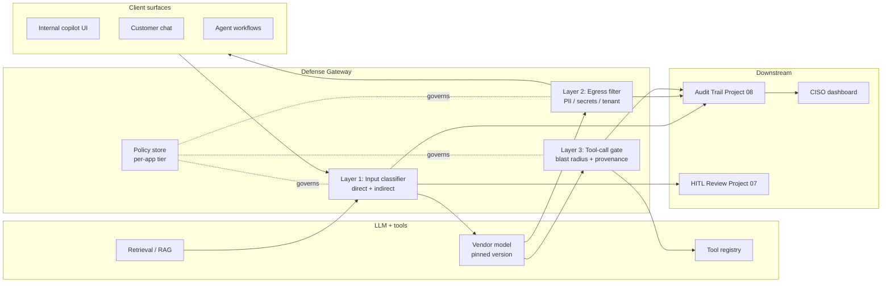
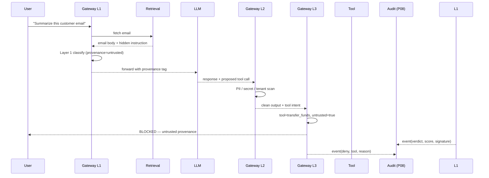

# Architecture · Prompt-Injection & Egress Defense

## System architecture

## Data flow — single attempted indirect injection

## Key trade-offs

- **Latency vs depth.** Each added detector costs p95 ms. Resolution: cheap rules synchronously, LLM-judge async on REVIEW-tier only, cache benign verdicts on identical-prefix hits.
- **Strict vs permissive defaults.** Customer-facing defaults strict, internal-research permissive, with App Owner co-sign required to relax. Default is enforce, never shadow, after Phase 0.
- **Build vs buy on classifier.** Buy commercial detector for known-attack coverage; build the indirect-injection + tenant-tag layer in-house because no vendor sees our data taxonomy.
- **Vendor-version pinning.** Required. Without it, egress patterns drift silently and Layer 2 calibration goes stale (see Project 01).

## Interlocks

- **Project 01 (DriftSentinel)** — pins the vendor model version; flags egress-pattern drift on upgrade.
- **Project 07 (HITL Designer)** — high-blast-radius tool calls always route through HITL; REVIEW-tier verdicts go to a reviewer pool.
- **Project 08 (Audit Trail)** — every gateway decision is a signed lineage event; the audit chain is the regulator-facing artifact.
- **Project 06 (Inference Economics)** — gateway adds metered $/inference for the classifier and LLM-judge layer; cost surface includes the security tax.
