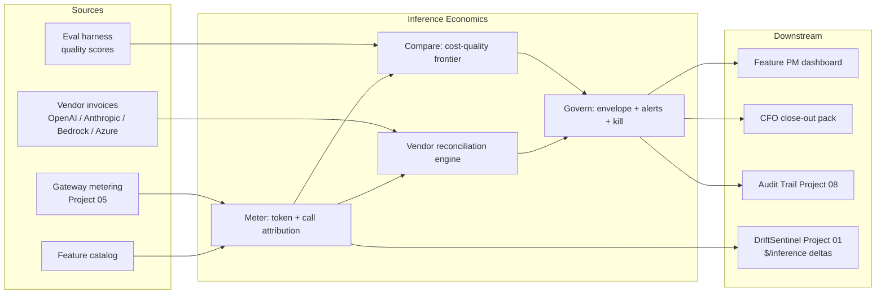

# Architecture · AI Inference Economics Dashboard

## System architecture



## Data flow — runaway prompt detection and throttle

```mermaid
sequenceDiagram
    participant GW as Gateway (P05)
    participant Met as Meter
    participant Anom as Anomaly Engine
    participant PM as Feature PM
    participant Gov as Governance
    participant Aud as Audit (P08)

    GW->>Met: per-call token + cost event
    Met->>Anom: rolling 14-day baseline diff
    Anom->>Anom: support_copilot tokens 2.4x baseline
    Anom-->>PM: alert (24h)
    PM->>Gov: investigate; root cause = unbounded retrieval
    Gov->>Gov: envelope at 92% mid-month
    Gov-->>GW: soft-throttle (downgrade to gpt-3.5-class)
    Gov-->>Aud: event(throttle, feature, model_swap)
    Met->>PM: post-throttle $/call back in band
```

## Key trade-offs

- **Per-call metering vs sampled metering.** Per-call wins for attribution depth; cost is storage. Resolution: per-call hot for 90 days, aggregated cold beyond.
- **Soft-throttle vs hard-throttle.** Customer-facing always soft (downgrade model); internal batch can be hard. Default per app tier.
- **Build vs buy on reconciliation.** Build — vendor invoice formats are heterogeneous and BFSI-specific tagging is internal.
- **Privacy vs attribution.** Per-user attribution is engineering-only; reporting outside engineering aggregates above k=20.

## Interlocks

- **Project 01 (DriftSentinel)** — $/inference is one of the proxy metrics for vendor-version drift; spike on upgrade is signal.
- **Project 02 (Eval-First Console)** — every model-swap candidate must hold the eval bar before promote.
- **Project 05 (Prompt-Injection Gateway)** — gateway is the metering point and adds its own line item (security tax).
- **Project 07 (HITL Designer)** — review-cost is metered and reported here too; reviewer time is a real economic input.
- **Project 08 (Audit Trail)** — every kill, swap, and envelope change emits a signed event.
