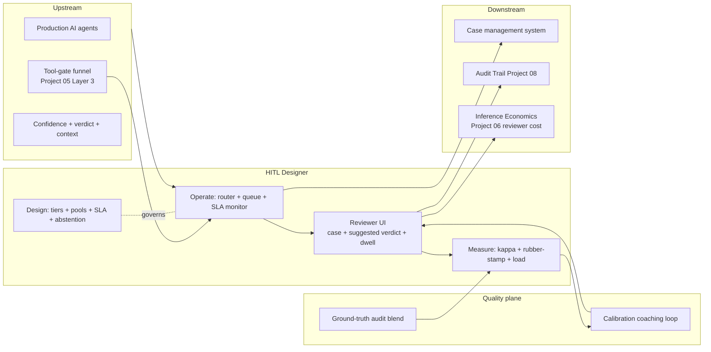

# Architecture · HITL Workflow Designer

## System architecture



## Data flow — single high-stakes decision

```mermaid
sequenceDiagram
    participant Agent as AI Agent
    participant Gate as Tool-Gate (P05)
    participant Router as HITL Router
    participant Queue as Reviewer Queue
    participant R as Reviewer
    participant QA as Quality Audit
    participant Aud as Audit (P08)

    Agent->>Gate: proposed action (high blast)
    Gate->>Router: forward (tier=3, conf=0.62)
    Router->>Router: tier check + pool select
    Router->>Queue: assign R07 (skill match, lowest load)
    Queue-->>R: case + AI suggested verdict + 35min budget
    R->>R: review (dwell 87s, scroll, refs)
    R-->>Aud: verdict + dwell + cursor signals
    Aud->>QA: blend ground-truth audit (5-10%)
    QA-->>Router: calibration drift detected
    Router->>Router: coach R07; recalibrate threshold next cycle
```

## Key trade-offs

- **Auto-approve threshold height.** High threshold → more reviewer load, lower auto-approve precision risk. Low threshold → less load, more risk. Resolution: per-workflow with eval evidence, Validator co-sign.
- **Abstention path latency.** Senior queue is slower. Resolution: tight SLA on senior queue too, with cross-cover.
- **Quality metric vs HR.** Strict separation in v1; coaching not consequence. Revisit in v2 with explicit policy.
- **Show AI suggested verdict to reviewer or not.** Showing it is faster but invites over-trust. Resolution: 10% blind-sample rotation per reviewer per week to measure independence.
- **Multi-reviewer consensus cost.** 2-of-2 on top tier doubles reviewer time. Defensible only on the highest blast radius.

## Interlocks

- **Project 01 (DriftSentinel)** — upstream confidence calibration is monitored; threshold recalibration is a sentinel-driven event.
- **Project 05 (Prompt-Injection Gateway)** — high-blast-radius tool calls funnel here by default; Layer 3 deny is the alternative path.
- **Project 06 (Inference Economics)** — reviewer time is metered as a real economic input; reported alongside model spend.
- **Project 08 (Audit Trail)** — every reviewer decision, escalation, and threshold change is a signed lineage event.
