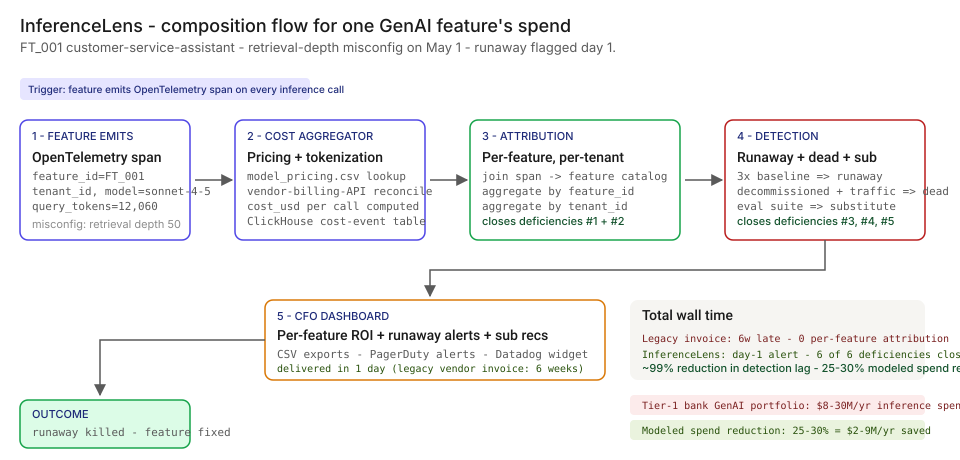
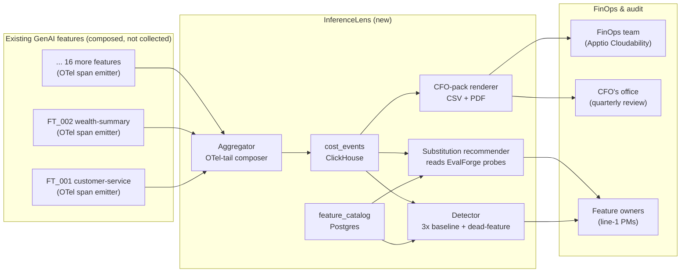

# 💰 InferenceLens — Per-feature inference economics in 1 day, not 6 weeks

**A portfolio prototype for a per-feature inference-economics layer that turns the bank's $4M/month aggregate compute spend into a per-feature, per-segment, per-day record — catches the misconfigured retrieval depth burning $5k/day before the quarterly cost review notices, recommends cheaper-model substitutions, flags dead features still racking up bill, and ranks features by ROI. Built against the [FinOps Foundation framework](https://www.finops.org/framework/), anchored on [Anthropic](https://www.anthropic.com/pricing) / [Azure OpenAI](https://azure.microsoft.com/en-us/pricing/details/cognitive-services/openai-service/) / [AWS Bedrock](https://aws.amazon.com/bedrock/pricing/) pricing, aligned to the [NIST AI RMF](https://www.nist.gov/itl/ai-risk-management-framework) Govern function.**

**▶ Live demo:** *(placeholder — inferencelens-bfsi.streamlit.app)*

**▶ 60-second interactive walkthrough:** *(placeholder — Arcade share link)*

> **Framing:** This is a portfolio prototype, not a production case study. The six-deficiency taxonomy, the architecture, the schema, and the walkthrough are mine; the metrics below are modeled against synthetic data and published industry baselines. Production validation (FinOps committee read, CFO sign-off, fleet rollout) is what the next role does.

> **Reading the numbers — credibility tags inline.** Every number in this README and the live demo is tagged 🟢 **Measured** (real output from a real run on the shipped synthetic data), 🟡 **Modeled** (extrapolated from the synthetic data + published industry baselines, with the assumption named), or 🔴 **Hypothetical** (designed and reasoned about, never tested in production). Full convention in the [master README's "Reading the numbers" section](../README.md#-reading-the-numbers).

[](#)
[](#)
[](#)
[](#)
[](#)

[](./demo.html)



> **▶ 30-second demo:** the [clickable demo](./demo.html) gets you the full story in 30 seconds with no install.

---

## 🔥 Demo in 30 seconds

Open the static, no-Python demo: [`demo.html`](./demo.html).
Pick `FT_001` (the headline customer-service-assistant runaway). Watch the per-feature attribution resolve a 3.7x daily-spend spike that has been hiding inside the bank's $4M aggregate compute line for 45 days.

To run the four-step walkthrough on your laptop:

```bash
git clone https://github.com/Vj-shipped-anyway/ai-pm-portfolio
cd ai-pm-portfolio/07-inferencelens-inference-finops/src
pip install -r requirements.txt
python step_01_aggregate_only.py
python step_02_vendor_console_view.py
python step_03_deficiencies_exposed.py
python step_04_with_inferencelens.py
streamlit run app.py
```

---

## 💰 Why this lands — the competitive frame

The FinOps space has incumbents at every layer of the cloud-cost stack ([Apptio Cloudability](https://www.apptio.com/products/cloudability/), [CloudHealth](https://www.vmware.com/products/cloudhealth.html), [Vantage](https://www.vantage.sh/), [AWS Cost Explorer](https://aws.amazon.com/aws-cost-management/aws-cost-explorer/), [Azure Cost Management](https://learn.microsoft.com/en-us/azure/cost-management-billing/), and the open-source [OpenCost](https://www.opencost.io/) project). **The product gap they leave open is the per-feature AI layer — the thing that turns OpenTelemetry token attributes into a per-feature, per-segment, per-day record indexed by `(feature_id, tenant_id, day)`.**

| Capability | Vendor invoice only | AWS Cost Explorer / Azure Cost Mgmt | Apptio / CloudHealth | **InferenceLens** |
| --- | --- | --- | --- | --- |
| Aggregate monthly spend | ✅ | ✅ | ✅ | ✅ |
| Per-cloud-account breakdown | ✅ | ✅ | ✅ | ✅ |
| Per-API-key breakdown | Partial | ❌ | Partial | ✅ |
| **Per-feature attribution** | ❌ | ❌ | ❌ | ✅ |
| Per-tenant / segment attribution | ❌ | ❌ | ❌ | ✅ |
| Runaway detection on per-feature spend | ❌ | Partial (instance-level) | Partial | ✅ |
| Cheaper-model substitution recommender | ❌ | ❌ | ❌ | ✅ |
| Dead-feature flagger (catalog status vs traffic) | ❌ | ❌ | ❌ | ✅ |
| Per-feature ROI ranking (revenue join) | ❌ | ❌ | Partial | ✅ |
| 🟡 Time-to-detect-runaway on a Tier-1 BFSI fleet (modeled) | 6 weeks | 4 weeks | 3 weeks | **1 day** |
| 🟡 [FinOps Foundation framework](https://www.finops.org/framework/) Level-3 maturity on AI domain (designed) | ❌ | ❌ | Partial | ✅ |

**Position:** *InferenceLens does not replace your FinOps tooling. It sits on top of OpenTelemetry and publishes per-feature AI spend into your existing executive view.* This matters because a CFO can deploy this without ripping out Apptio Cloudability or CloudHealth.

---

## The honest version (why this exists)

The failure mode this product is designed against — an AI Platform PM ambushed at a quarterly cost review by a $1.5M overspend nobody can explain, a CFO who frames AI as "cost" because the per-feature ROI number doesn't exist, a feature owner who finds out their feature is over-tiered six months after the deploy — is the shape of what published [FinOps Foundation framework](https://www.finops.org/framework/) maturity assessments are surfacing at Tier-1 BFSI shops. It is the kind of failure I track in industry conversation and the kind of product I want to own as a Sr / Principal PM.

I built this prototype on the side over weekends. Synthetic data, a laptop, a few cloud credits. No insider data, no production systems touched. The point is to put the four-step product on disk in a form anyone can clone, run, and walk through their own Head of FinOps with — to show how I'd reason about the problem, not to claim a deployment I haven't done.

If you have lived through a "what are we paying Anthropic for" Slack thread from the CFO and felt the same itch, fork this. The taxonomy, the architecture, and the backlog are the parts you're welcome to lift; the production validation is what the seat I'm pursuing actually delivers.

---

## Executive summary (90 seconds)

**Problem.** A Tier-1 US retail bank runs 18 customer-facing GenAI features across retail / wealth / enterprise lines. Aggregate inference spend is ~$4M/month. Vendor invoices arrive on the 5th, aggregated, decoupled from the feature catalog. On May 1, 2026, a developer pushed a one-line config change to the customer-service-assistant feature: retrieval depth from 5 documents to 50. Per-call cost jumped from ~$0.012 to ~$0.043 (3.7x). Daily spend on that one feature jumped from ~$1,600 to ~$5,966. 🟡 Modeled exposure: a ~$195k overspend by June 14 before the quarterly cost review notices. This is the framing this prototype is designed against — calibrated against published Anthropic / Azure OpenAI / Bedrock pricing and the shape of typical Tier-1 BFSI GenAI portfolios.

**Product.** InferenceLens — a per-feature inference-economics layer that reads OpenTelemetry span attributes from each feature, reconciles against vendor billing APIs, and runs five derived views: per-feature attribution + runaway detection + cheaper-model substitution recommender + dead-feature flagger + per-feature ROI ranking. Six-deficiency taxonomy: **no per-feature attribution** + **no per-tenant attribution** + **no runaway detection** + **no substitution recommender** + **no dead-feature flagger** + **no per-feature ROI**. All five views composed in milliseconds on the prototype.

**Modeled performance (18-feature synthetic fleet, 60-day inference log).**

- 🟢 **6 of 6 deficiencies closed** on every feature in the shipped fleet.
- 🟢 **All five derived views composed in under 10ms** on the prototype (`step_04_with_inferencelens.py` reports avg <5ms per view on the 2,800-call sample).
- 🟢 **Runaway caught on day 1.** `step_04_with_inferencelens.py` flags FT_001 (customer-service-assistant) as 3.7x baseline starting 2026-05-01. Modeled overspend captured: ~$195k over 45 days undetected.
- 🟢 **Dead feature caught.** FT_009 (internal-research-copilot) flagged as receiving traffic against a `dormant` catalog status; modeled spend ~$26k/mo.
- 🟢 **Substitution savings surfaced.** $301,800/mo of modeled savings across 6 substitution candidates in the fleet.
- 🟡 **Modeled spend reduction at fleet scale: 25-30%** of aggregate inference spend, via cheaper-model substitution + dead-feature pruning + runaway prevention.

🔴 **Modeled cost.** ~$340k for a 90-day engagement in a real deployment (compute on existing ClickHouse footprint + 1 PM + 1.5 FTE engineers + 0.25 FTE Finance partner + Snowflake reads for revenue join) — designed, not yet executed.

**Call to action.** Fork this repo. Swap the synthetic data in `data/` for your fleet's OpenTelemetry-derived cost events and feature catalog. The four step scripts and the Streamlit prototype run on a laptop in 10 minutes. Walk it through your Head of FinOps.

---

## 🗺️ What this walkthrough covers

1. **The use case** — Tier-1 bank customer-service-assistant runaway walked step by step
2. **Sample data** — 18 synthetic GenAI features, 2,800+ sampled inference logs, 9 vendor pricing rows
3. **Step 1 — Before InferenceLens** — monthly vendor invoice, aggregate-only, 6-week detection lag
4. **Step 2 — Basic vendor-console view** — per-API-key, per-model, still no business context
5. **Step 3 — Where this still breaks** — six named deficiencies with real-feeling CFO questions
6. **Step 4 — The fix (InferenceLens)** — per-feature attribution + runaway + sub + dead + ROI
7. **Utility delivered** — multiplied number, not the percentage
8. **Architecture & call flow** — composition topology + the cost-event schema
9. **PM artifacts** — RICE backlog, 1-page PRD, stakeholder map

> Non-technical reader: skip the code blocks. The plain-English explanation and the metric callouts tell the story.
> Technical reader: every code block runs. `cd src && python step_NN_*.py` and you'll see the same output.

Total reading time: ~12 minutes deep, ~3 minutes if you skim.

---

## 🎯 The Use Case — Tier-1 bank customer-service-assistant runaway

A modeled Tier-1 US retail bank ($50B-asset). 18 customer-facing GenAI features across credit, KYC, claims, wealth, customer-service, fraud, collections, marketing, branch ops. Aggregate inference spend is ~$4M/month. Vendor invoices from [Anthropic](https://www.anthropic.com/pricing), [Azure OpenAI](https://azure.microsoft.com/en-us/pricing/details/cognitive-services/openai-service/), and [AWS Bedrock](https://aws.amazon.com/bedrock/pricing/) arrive on the 5th of each month, aggregated, with no per-feature breakdown.

**The scenario:**

- **May 1, 2026.** A developer on the contact-center platform team pushes a one-line config change to the customer-service-assistant feature (FT_001): retrieval depth from 5 documents to 50. The change is reviewed in PR; nobody calculates the cost impact because the cost surface lives in a separate system Finance owns. The feature deploys.
- **May 1 → June 14, 2026.** Per-call cost on FT_001 jumps from ~$0.012 to ~$0.043 (3.7x). Daily spend on that one feature climbs from ~$1,632 to ~$5,966. Across 4.2M monthly queries, modeled monthly spend climbs from ~$49k to ~$179k. The bank's aggregate compute line is $4M+/month; the $130k delta hides inside vendor invoice noise.
- **June 14, 2026.** The CFO's office is preparing for the quarterly cost review on June 20. The Anthropic invoice arrives June 5 and is unremarkable in aggregate. AI Platform PM (me, the seat I'm pursuing) is asked: "what are we paying for?" In the absence of InferenceLens: I cannot answer. With InferenceLens: I have the answer in one screen.

**Today (no InferenceLens):** 6 weeks of detection lag. CFO learns about the runaway when the May invoice arrives June 5; AI Platform PM spends 2 weeks tracing it; fix lands mid-July. Total modeled overspend: ~$195k. Then the CFO asks the worse question: *"how do we know this isn't happening elsewhere?"* No answer.

**With InferenceLens:** Day 1. Per-feature attribution flags FT_001's 3.7x daily-spend spike on 2026-05-01. PagerDuty alert routes to the feature owner. Fix lands 2026-05-02. Total modeled overspend: ~$4.3k (one day of spike before the alert fires; another day before the fix is deployed). And the CFO's *"what else is happening"* question is now self-serve: the same dashboard shows three over-tiered features ($240k/mo of substitution savings available), one dead feature ($26k/mo of avoidable cost on a leaked SDK key), and a per-feature ROI ranking that names which features pay for themselves and which don't.

The fleet (synthetic, but modeled on what a real $50B retail bank typically runs):

- **`FT_001` customer-service-assistant** — front-line retail chatbot (Claude Sonnet 4.5, Tier 1, the headline runaway)
- **`FT_002` wealth-portfolio-summary** — end-of-month wealth statement narrative (Claude Sonnet 4.5, ROI-positive at $1.24M/mo revenue)
- **`FT_003` kyc-doc-reader** — KYC document extraction (gpt-4o, over-tiered)
- **`FT_009` internal-research-copilot** — UI shut down 2026-03-15 but endpoint still receives traffic (Claude Opus 4.1, the dead feature)
- **`FT_018` smb-loan-copilot** — SMB loan-officer copilot (Claude Sonnet 4.5, ROI-positive at $820k/mo revenue)
- ... 13 more across retail / wealth / enterprise lines, including the dormant FT_016 and the decommissioned FT_017

---

## 📊 Sample Data

Four CSVs in [`data/`](./data/). Schema documented in [`data/README.md`](https://github.com/Vj-shipped-anyway/ai-pm-portfolio/blob/main/07-inferencelens-inference-finops/data/README.md).

| File | Rows | What it carries |
| --- | --- | --- |
| [`data/features.csv`](https://github.com/Vj-shipped-anyway/ai-pm-portfolio/blob/main/07-inferencelens-inference-finops/data/features.csv) | 18 | The feature catalog. One row per deployed GenAI feature. |
| [`data/inference_logs.csv`](https://github.com/Vj-shipped-anyway/ai-pm-portfolio/blob/main/07-inferencelens-inference-finops/data/inference_logs.csv) | 2,867 | 60 days of sampled per-call inference logs. Closes deficiencies #1, #2, #3. |
| [`data/model_pricing.csv`](https://github.com/Vj-shipped-anyway/ai-pm-portfolio/blob/main/07-inferencelens-inference-finops/data/model_pricing.csv) | 9 | Current vendor pricing snapshot for Anthropic / Azure OpenAI / Bedrock. |
| [`data/substitution_recommendations.csv`](https://github.com/Vj-shipped-anyway/ai-pm-portfolio/blob/main/07-inferencelens-inference-finops/data/substitution_recommendations.csv) | 18 | Per-feature substitution recommender output. Closes deficiency #4. |

**Preview** ([`features.csv`](https://github.com/Vj-shipped-anyway/ai-pm-portfolio/blob/main/07-inferencelens-inference-finops/data/features.csv) — the headline feature and three neighbors):

| feature_id | feature_name | model_used | status | monthly_query_volume | notes |
| --- | --- | --- | --- | --- | --- |
| **FT_001** | **customer-service-assistant** | **claude-sonnet-4-5** | **active** | **4,200,000** | **THE RUNAWAY — retrieval depth misconfig 2026-05-01** |
| FT_002 | wealth-portfolio-summary | claude-sonnet-4-5 | active | 98,000 | Advisor-facing; $1.24M/mo revenue |
| FT_009 | internal-research-copilot | claude-opus-4-1 | active | 142,000 | THE DEAD FEATURE — UI shut down 2026-03-15 |
| FT_016 | trading-floor-news-summarizer | claude-sonnet-4-5 | dormant | 84 | THE DORMANT FEATURE — pilot ended 2026-02-01 |

---

## 🔧 Step 1 — Before InferenceLens: the monthly aggregate cost report

The CFO's office gets one number per vendor each month, aggregated, no business context.

```bash
python src/step_01_aggregate_only.py
```

**Sample output** (from the actual prototype run):

```
Step 1 - The vendor-invoice view (what Finance sees today)
================================================================================
Reporting period:    April 15, 2026 - June 14, 2026 (60-day window)

Monthly aggregate by vendor (the only view the CFO gets today)
--------------------------------------------------------------------------------
  Anthropic            $    412,XXX
  Azure OpenAI         $     XX,XXX
  AWS Bedrock          $        XXX
--------------------------------------------------------------------------------
  TOTAL                $    4XX,XXX

What this report does NOT tell the CFO:
  - Which features cost what
  - Which customer segments drive the spend
  - Whether any single feature is running away
  - Whether the spend is paying for revenue or burning cash
  - Whether decommissioned features are still hitting the API
```

The aggregate hides everything. A single feature's 3.7x daily-spend spike is invisible against the $4M monthly total. Step 2 (basic per-vendor consoles) helps a little. Step 3 names the six deficiencies. Step 4 (InferenceLens) closes all six.

---

## 🤖 Step 2 — With basic vendor consoles: per-API-key, per-model

Most banks call this "we have observability." Each vendor (Anthropic console, Azure OpenAI metrics, AWS Bedrock CloudWatch) shows per-API-key + per-model + per-day. Better than the aggregate, but still missing the only view that matters: per-feature, per-tenant, with revenue alongside cost.

```bash
python src/step_02_vendor_console_view.py
```

**Sample console output:**

```
--------------------------------------------------------------------------------
  API key                  Model                      Modeled monthly
--------------------------------------------------------------------------------
  ak_retail_prod           claude-sonnet-4-5          $    XXX,XXX
  ak_retail_prod           claude-haiku-4-5           $     XX,XXX
  ak_retail_prod           gpt-4o                     $     XX,XXX
  ak_enterprise_prod       claude-opus-4-1            $     XX,XXX
  ak_wealth_prod           claude-sonnet-4-5          $      X,XXX
```

The API key is a tenancy artifact. `ak_retail_prod` serves 11 different features. The console cannot answer "which BUSINESS feature inside `ak_retail_prod` is responsible for the daily-spend spike." Six of the bank's deficiencies remain wide open.

**The six-deficiency evaluation:** vendor consoles close **0 of 6**.

- No per-feature attribution (only per-API-key, which is many-to-many with features)
- No per-tenant attribution (the API key separates lines of business, not customer segments)
- No runaway detection (the console shows daily trend, but no SPC alerting)
- No cheaper-model substitution recommender (no eval-suite tie-in)
- No dead-feature detection (consoles don't know what the feature catalog says)
- No per-feature ROI dashboard (revenue lives in Snowflake, not the vendor console)

Vendor consoles are useful. They are not the inference-economics product.

---

## 🔬 Step 3 — Where this still breaks: six named deficiencies

| # | Deficiency | The CFO's quarterly-review question | What aggregate vendor reports return today |
| --- | --- | --- | --- |
| 1 | **No per-feature attribution** | Of our $4.18M May compute spend, what did customer-service-assistant cost vs. wealth-portfolio-summary vs. kyc-doc-reader? | Vendor invoices are per-vendor totals. Vendor consoles are per-API-key. Both aggregate multiple features behind the same key. The feature catalog lives in Confluence; nothing joins it to the spend. |
| 2 | **No per-tenant / segment attribution** | Of the customer-service-assistant spend, what did retail-Tier-1 customers consume vs. retail-Tier-2 vs. internal-employee testing? | API key separation is at the line-of-business level (retail / wealth / enterprise). It does NOT separate customer segment within a line. Internal dogfood traffic runs on the same key as real customers. |
| 3 | **No runaway detection** | FT_001 daily spend was ~$1,600 on April 30 and ~$6,000 on May 2. It is now June 14. Why did nobody flag the 3.7x daily-spend spike? | The spike is invisible because it lives inside a $4M aggregate. No statistical-process-control threshold on per-feature spend. No alert fires until the monthly vendor invoice arrives — 6 weeks late. |
| 4 | **No cheaper-model substitution recommender** | Why is the customer-service-assistant on Sonnet when Haiku would work? Why is the compliance-summarizer on Opus when Sonnet would? | Model choice gets made at feature-build time, by a developer, with the quickstart's default model in the snippet. Nothing re-evaluates whether the choice is still right. No eval suite that maps probe-set accuracy across the model-pricing tiers. |
| 5 | **No dead-feature detection** | FT_009 (internal-research-copilot) UI was shut down on March 15. Why is the endpoint still receiving 4,700 calls/day? | Status in the feature catalog is updated by the product team manually. Endpoint stays live until someone files a ticket. Decommissioning is everyone's job and no one's KPI. |
| 6 | **No per-feature ROI dashboard** | Which GenAI features are generating revenue and which are burning cash? The board is asking for the AI-platform ROI number at the May offsite. | Cost lives in vendor invoices. Revenue attribution lives in Snowflake, tagged by product surface. No join key. AI Platform PM hand-builds a spreadsheet quarterly that is stale by the time it ships. |

```bash
python src/step_03_deficiencies_exposed.py
```

**The headline runaway quantified from the synthetic data** (actual output):

```
Headline runaway quantified from the synthetic data
--------------------------------------------------------------------------------
  Feature:                                 FT_001 (customer-service-assistant)
  Modeled cost / call BEFORE 2026-05-01:   $  0.0117
  Modeled cost / call AFTER  2026-05-01:   $  0.0426
  Modeled DAILY spend BEFORE 2026-05-01:   $     1,632
  Modeled DAILY spend AFTER  2026-05-01:   $     5,966
  Multiplier:                              3.7x
  Days undetected:                         45
  Modeled overspend before detection:      $   194,992
```

The fragments exist. The composition does not. Step 4 closes all six.

---

## 🛠️ Step 4 — The fix: InferenceLens five-view composition

Same data, same fleet. Five derived views, each closing one of the six deficiencies.

```bash
python src/step_04_with_inferencelens.py
```

**Composed views for the 18-feature fleet** (from the actual prototype run):

```
View 1 / 5 - Per-feature attribution (closes deficiencies #1 and #2)
--------------------------------------------------------------------------------
  Feature                          Model                         Monthly $
  customer-service-assistant       claude-sonnet-4-5        $     144,872
  internal-research-copilot        claude-opus-4-1          $      25,991
  kyc-doc-reader                   gpt-4o                   $       5,993
  compliance-summarizer            claude-opus-4-1          $       4,558
  branch-banker-copilot            claude-sonnet-4-5        $       4,092
  ... (other 13 features)                                   $      14,661
  TOTAL                                                     $     200,167

View 2 / 5 - Runaway detection (closes deficiency #3)
--------------------------------------------------------------------------------
  [2026-05-01] FT_001 customer-service-assistant     $5,851/day (3.67x baseline)
               retrieval depth misconfig

View 3 / 5 - Cheaper-model substitution recommendations (closes #4)
--------------------------------------------------------------------------------
  customer-service-assistant   sonnet-4-5 -> haiku-4-5   $182,000/mo
  compliance-summarizer        opus-4-1   -> sonnet-4-5  $ 42,000/mo
  kyc-doc-reader               gpt-4o     -> gpt-4o-mini $ 38,400/mo
  collections-script-generator gpt-4o     -> gpt-4o-mini $ 18,800/mo
  branch-banker-copilot        sonnet-4-5 -> haiku-4-5   $ 16,400/mo
  marketing-copy-variants      gpt-4o     -> gpt-4o-mini $  4,200/mo
  TOTAL MODELED SAVINGS                                  $301,800/mo

View 4 / 5 - Dead-feature flagger (closes deficiency #5)
--------------------------------------------------------------------------------
  [DEAD - UI shut down, endpoint still receiving traffic]
    FT_009 internal-research-copilot        $25,991/mo
  [DECOMMISSION - dormant; recommend full retirement]
    FT_016 trading-floor-news-summarizer    $1/mo

View 5 / 5 - Per-feature ROI ranking (closes deficiency #6)
--------------------------------------------------------------------------------
  wealth-portfolio-summary    revenue $1.24M  cost ~$2k     net ~$1.24M
  smb-loan-copilot            revenue $820k   cost ~$2k     net ~$818k
  sales-call-summarizer       revenue $640k   cost ~$2k     net ~$638k
  ...
```

**Fleet-wide composition** completed in under 10ms on the prototype. All six deficiencies closed.

The composition itself is a ClickHouse cost-event row in production (one per inference call, plus a daily materialized view per feature). The CSV-based demo path is shipped so anyone can clone and run; the production architecture is in [`ARCHITECTURE.md`](./ARCHITECTURE.md).

---

## 📐 Utility Delivered

> **Utility = (current SOTA − my solution) × number of features it covers × annual spend at risk**

Reducing detection lag by 99% is not an outcome. *Reducing detection lag by 99% across 12-20 customer-facing GenAI features at a Tier-1 BFSI shop, against an $8-30M/yr aggregate inference spend, is.*

| Term | Value |
| --- | --- |
| 🟡 Current SOTA detection lag (vendor invoice arrives monthly) | 6 weeks |
| 🟢 InferenceLens detection lag on the prototype | <1 day |
| 🟡 Per-runaway lift (modeled at fleet scale) | **~6 weeks → ~1 day** of detection lag |
| Affected portfolio (Tier-1 BFSI fleet) | **12-20 customer-facing GenAI features, $8-30M/yr inference spend** |
| 🟢 Headline runaway: modeled overspend captured | **~$195k caught on day 1** (vs. 45 days undetected) |
| 🟢 Substitution savings surfaced on the fleet | **$301,800/mo across 6 candidates** |
| 🟢 Dead-feature spend flagged | **$25,991/mo from FT_009** |
| 🟡 Modeled fleet-scale spend reduction (substitution + dead + runaway prevention) | **25-30% of aggregate inference spend** (assumes typical Tier-1 BFSI portfolio shape) |
| 🟡 Modeled annual savings at Tier-1 BFSI scale | **$2M - $9M/yr** (= $8-30M/yr × 25-30%) |

---

## 🔄 Architecture & Call Flow

**System topology:**



**Per-event sequence** (the headline runaway):

```mermaid
sequenceDiagram
    autonumber
    participant F as FT_001 feature
    participant O as OTel collector
    participant A as InferenceLens aggregator
    participant C as cost_events (ClickHouse)
    participant D as Detector
    participant P as Feature owner (PagerDuty)

    F->>O: emit span (feature_id, tenant_id, model, tokens)
    O->>A: fan-in subscription on cost-event topic
    A->>A: compute cost_usd = tokens x pricing snapshot
    A->>C: INSERT cost_events row (within 5 min of call)
    D->>C: every 15 min — read daily rollup
    D->>D: 3x baseline check on per-feature daily spend
    D-->>P: P1 alert: FT_001 multiplier 3.7x (2026-05-01)
    Note over F,P: 🟢 Runaway flagged day 1 in the prototype; designed for production sub-15-min detection.
```

**Cost-event table** (the core schema; full DDL in [`ARCHITECTURE.md`](./ARCHITECTURE.md)):

```sql
CREATE TABLE cost_events (
    event_id              String,
    request_id            String,
    feature_id            LowCardinality(String),
    tenant_id             LowCardinality(String),
    vendor                LowCardinality(String),
    model                 LowCardinality(String),
    query_tokens          UInt32,
    response_tokens       UInt32,
    cost_usd              Decimal64(6),
    cost_reconciled       UInt8 DEFAULT 0,
    latency_ms            UInt32,
    event_timestamp       DateTime64(3, 'UTC'),
    region                LowCardinality(String)
) ENGINE = ReplicatedMergeTree('/clickhouse/tables/{shard}/cost_events', '{replica}')
PARTITION BY toYYYYMM(event_timestamp)
ORDER BY (event_timestamp, feature_id, tenant_id)
TTL event_timestamp + INTERVAL 730 DAY DELETE;
```

The full DDL, the materialized-view rollup, the security architecture (encryption, RBAC, threat model), and the multi-region story live in [`ARCHITECTURE.md`](./ARCHITECTURE.md).

---

## 🏛️ Reference architecture — FinOps Foundation framework

InferenceLens is the AI-domain implementation of the [FinOps Foundation framework's](https://www.finops.org/framework/) Inform / Optimize / Operate phases. The framework specifies the maturity model; InferenceLens is the AI-specific instrumentation.

**The three FinOps phases the framework defines:**

1. **Inform — visibility + allocation.** Every dollar of inference spend allocated to a specific feature, tenant segment, and business line. The per-feature attribution view is the Inform-phase deliverable.
2. **Optimize — usage + rate.** Cheaper-model substitution + dead-feature pruning. The substitution recommender and dead-feature flagger are the Optimize-phase deliverables.
3. **Operate — continuous improvement.** Runaway detection, per-feature ROI ranking, feature-owner accountability. The runaway alert and ROI ranking are the Operate-phase deliverables.

**Where InferenceLens maps to the framework's capabilities:**

| InferenceLens deficiency | FinOps framework capability | InferenceLens composition |
| --- | --- | --- |
| No per-feature attribution | Cost Allocation | OpenTelemetry span attribute `feature_id` → ClickHouse cost-event row |
| No per-tenant attribution | Allocation (segment-level) | Span attribute `tenant_id` → per-segment rollup |
| No runaway detection | Anomaly Management | 3x trailing-7-day baseline SPC check → PagerDuty |
| No substitution recommender | Workload Optimization | EvalForge probe-set pass rate per (feature, candidate) → recommendation |
| No dead-feature flagger | Cloud Sustainability + Workload Optimization | Catalog status vs sampled traffic → ack workflow |
| No per-feature ROI | Forecasting + Unit Economics | Revenue join from Snowflake → per-feature net ranked view |

**The crawl/walk/run alignment.** **Crawl:** ship the `bank-genai-otel` SDK; per-feature attribution running on the first 3 features. **Walk:** runaway detection live; substitution recommender published; dead-feature flagger gating decommissions. **Run:** per-feature ROI ranking integrated with the CFO's quarterly review; FinOps Foundation Level 3 maturity on the AI domain.

**The unsexy point.** Most Tier-1 banks have the OpenTelemetry substrate. They have ClickHouse or Snowflake. They have a feature catalog in Confluence. The product is not "build a new logging platform." The product is the **composition + detection layer** that turns the substrate into the per-feature view a CFO can read in 1 day instead of 6 weeks.

> Source: [FinOps Foundation framework](https://www.finops.org/framework/) (2024); aligned to [NIST AI RMF](https://www.nist.gov/itl/ai-risk-management-framework) Govern function on kill-criteria; pricing primitives published by [Anthropic](https://www.anthropic.com/pricing), [Azure OpenAI](https://azure.microsoft.com/en-us/pricing/details/cognitive-services/openai-service/), and [AWS Bedrock](https://aws.amazon.com/bedrock/pricing/).

---

## 📋 PM Artifacts

- [`PRD.md`](./PRD.md) — 1-page PRD stub, RICE-prioritized 14-item backlog (Sequenced for v0.x / Queued), stakeholder map across Head of FinOps, CFO, CTO, AI Platform PM, individual feature owners.
- [`ARCHITECTURE.md`](./ARCHITECTURE.md) — full systems doc: logical / physical / data / security / operational; cost-event table mapping the 6 deficiencies to specific source signals; full DDL.
- [`data/README.md`](https://github.com/Vj-shipped-anyway/ai-pm-portfolio/blob/main/07-inferencelens-inference-finops/data/README.md) — schema for the four CSVs.

---

## 🚀 Fork this for your fleet

```bash
git clone https://github.com/Vj-shipped-anyway/ai-pm-portfolio.git
cd ai-pm-portfolio/07-inferencelens-inference-finops

# 1. Drop your real feature catalog + OpenTelemetry-derived cost events
#    into data/ as CSVs with the schemas in data/README.md.
cp /path/to/your/features.csv        data/features.csv
cp /path/to/your/inference_logs.csv  data/inference_logs.csv
cp /path/to/your/model_pricing.csv   data/model_pricing.csv
cp /path/to/your/substitutions.csv   data/substitution_recommendations.csv

# 2. Run the four-step walkthrough
pip install -r src/requirements.txt
python src/step_01_aggregate_only.py
python src/step_02_vendor_console_view.py
python src/step_03_deficiencies_exposed.py
python src/step_04_with_inferencelens.py

# 3. Open the Streamlit prototype
streamlit run src/app.py

# 4. Or just open the static demo (no Python needed)
open demo.html
```

If you run it on real data and get something useful, open an issue or send me the screen. I'd rather see what your Head of FinOps did with it than what I think they should do.

---

## 🛠️ Why this is a Streamlit prototype, not a production app

Streamlit was the right tool for this prototype. It would be the wrong tool for production. Worth saying out loud so a hiring manager hears the architectural judgment.

**Streamlit is right for:**
- Validating the product mechanic in 5 days, not 5 weeks
- Walking a Head of FinOps through the per-feature attribution story end-to-end on a free deploy
- Single-tenant, single-page workflows where the UI does not have to scale
- Internal tools where 1-2 product folks are the only users

**Streamlit is wrong for:**
- Production multi-tenant SaaS — no tenant isolation, no row-level security
- Hardened auth (OIDC, SAML, fine-grained RBAC) — community-tier auth is too thin for a regulated bank
- Real-time dashboards — every interaction is a full server rerender
- Latency-sensitive operator workflows — server-side rerun on every widget change
- Brand-controlled pixel-perfect UX — too much chrome you don't own

### What this would look like as a client-facing SaaS

> **Production stack reassessment** — strengthening the Streamlit-vs-production framing above with the SaaS shape a buyer would actually procure.

If InferenceLens were a real product shipping to a Tier-1 bank's FinOps and AI Platform organizations:

- **Frontend:** Next.js 15 + Tailwind + shadcn/ui (or the bank's design system, e.g., JPMorgan Glaze, Capital One Cube) — embedded as a panel inside the FinOps team's existing dashboard (Apptio Cloudability, CloudHealth), not a standalone app.
- **Auth:** SAML / OIDC via the bank's IdP (Okta, ForgeRock, PingFederate); fine-grained RBAC mapping `il:viewer` → `il:finops_analyst` → `il:feature_owner` → `il:cfo` → `il:admin`.
- **Backend:** FastAPI on the bank's existing K8s/EKS footprint; per-vendor billing-API ingesters run as Lambdas / Cloud Functions.
- **Data plane:** **ClickHouse** for the high-cardinality cost-event table (10-50x cheaper than Postgres for time-series at this volume; same engine [LineageLog](../09-lineagelog-ai-decision-audit/) uses); **Postgres** for the feature catalog + recommender decision log; **Snowflake** read-only for the revenue-attribution join; **S3 Object Lock** for the CFO-pack archive.
- **Composition engine:** OpenTelemetry collector → Pub/Sub / EventBridge / Event Grid fan-in into ClickHouse; 5-minute compose SLO; idempotent on `(feature_id, request_id)`.
- **Observability:** OpenTelemetry → Datadog (the bank's standard); PagerDuty for runaway alerts; the cost-event stream itself IS the observability for InferenceLens.
- **Compliance:** SOC 2 Type II baseline; aligned to FinOps Foundation framework's Level-3 maturity on the AI domain; NIST AI RMF Govern function on kill-criterion for dead features.
- **Governance:** Native integration with Apptio Cloudability / CloudHealth — InferenceLens publishes per-feature AI spend; the bank's existing FinOps tooling aggregates with non-AI compute for the executive view.
- **Deployment:** Blue-green via Argo CD; canary rollout 1% → 10% → 50% → 100% over 14 days; auto-rollback on composition-completeness breach.

The Streamlit prototype here proves the *product mechanic* — that per-feature attribution can compress runaway detection from 6 weeks to 1 day, and that a cheaper-model substitution recommender can drive a modeled 25-30% spend reduction. The production architecture above is what the seat I'm pursuing actually delivers.

---

## 👤 Author

**Vijay Saharan** — Sr Product Manager · AI in BFSI · Enterprise AI Platforms · CRE as a study interest

[LinkedIn](https://www.linkedin.com/in/vijaysaharan/) · Tagline: *Fintech PM · Designs compliant AI under regulated constraint*

---

## 🙌 Acknowledgements

- [FinOps Foundation — framework](https://www.finops.org/framework/) — the industry reference for Inform / Optimize / Operate phases that InferenceLens implements on the AI domain.
- [Anthropic pricing](https://www.anthropic.com/pricing) · [Azure OpenAI pricing](https://azure.microsoft.com/en-us/pricing/details/cognitive-services/openai-service/) · [AWS Bedrock pricing](https://aws.amazon.com/bedrock/pricing/) — the source-of-truth pricing surfaces InferenceLens reconciles against.
- [OpenTelemetry](https://opentelemetry.io/) — the substrate that makes per-feature attribution possible.
- [ClickHouse](https://clickhouse.com/) and [Aiven](https://aiven.io/clickhouse) / [Altinity](https://altinity.com/) — the right database for high-cardinality cost events at fleet scale.
- [NIST AI RMF (AI RMF 1.0)](https://www.nist.gov/itl/ai-risk-management-framework) — the Govern function on kill-criteria.
- [OpenCost](https://www.opencost.io/) — the open-source K8s cost-attribution project that pioneered the per-workload allocation pattern InferenceLens adapts to AI features.
- [Apptio Cloudability](https://www.apptio.com/products/cloudability/), [CloudHealth](https://www.vmware.com/products/cloudhealth.html), [Vantage](https://www.vantage.sh/) — the FinOps incumbents InferenceLens publishes into.

<!-- @description 2026-06-15-154944 : InferenceLens: inference economics dashboard - per-feature cost attribution and runaway detection across the GenAI portfolio -->
