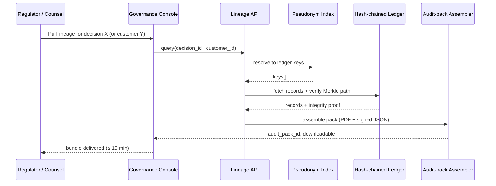

# Architecture · AI Audit Trail & Decision Lineage

## System architecture

```mermaid
flowchart LR
    subgraph FLEET[Production AI Fleet]
        M1[Credit ML v3]
        M2[Fraud ML v7]
        M3[AML ML v4]
        M4[GenAI Advisor v2]
    end

    subgraph CAP[Capture plane]
        C1[Lineage SDK / sidecar]
        C2[Schema enforcement at write]
        C3[Inference gateway version pin]
    end

    subgraph STORE[Storage plane]
        S1[Append-only event bus]
        S2[Hot tier 90d]
        S3[Warm tier 18m]
        S4[Cold tier 7y]
        S5[Daily Merkle anchor → write-once store]
    end

    subgraph QRY[Query plane]
        Q1[Governance console]
        Q2[Customer-pseudonym index]
        Q3[Audit-pack assembler]
        Q4[Lineage API]
    end

    subgraph CONS[Consumers]
        U1[MRM L2]
        U2[Compliance Counsel]
        U3[Customer Disputes Ops]
        U4[Internal Audit L3]
        U5[Project 01 DriftSentinel]
        U6[Project 07 HITL]
    end

    FLEET --> CAP --> STORE
    STORE --> QRY
    QRY --> CONS
```

## Data flow — single audit-evidence request

## Key trade-offs

- **Hash-or-raw on PII prompts.** Default = hash, with policy-controlled un-hash on subpoena. Raw-only flips legal exposure and storage cost; hash-only fails on certain dispute defenses. Hybrid wins.
- **Gateway-side capture vs. vendor-side.** Gateway gives uniformity across vendors and forces version pinning; vendor-side gives higher fidelity (intermediate reasoning, e.g., Anthropic extended thinking traces). Default gateway primary, vendor-side secondary where contractually available.
- **Hot/warm/cold tiering.** Cold-tier 7-yr retention is regulator-driven, not product-driven. Aggressive cold compression keeps the unit economics defensible.
- **Append-only vs. corrective writes.** Strictly append-only. Corrections are *new records* with `parent_decision_id` linkage. Never mutate.

## Interlocks

- **Project 01 (DriftSentinel)** — every Decide-loop output writes a lineage event tagged `kind=drift_action`.
- **Project 06 (Inference Economics)** — the inference gateway is also the canonical capture point for model_version + vendor_snapshot_hash.
- **Project 07 (HITL)** — every reviewer touch writes `reviewer_id`, dwell time, and a UI-state hash, so HITL-overridden decisions are forensically defensible.
- **MRM workflows** — attestation_ids written by MRM are referenced as foreign keys in lineage records.
