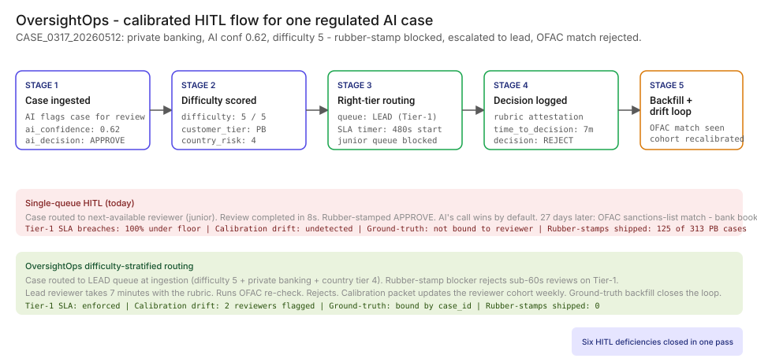
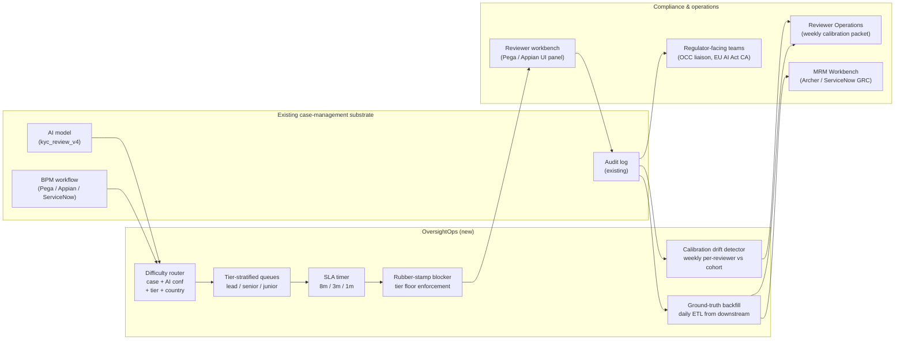

# 👥 OversightOps — Calibrated HITL in 8 minutes, not 8 seconds

**A portfolio prototype for a human-in-the-loop workflow designer that replaces rubber-stamp review with calibrated, role-aware oversight — modeled against [EU AI Act Article 14](https://eur-lex.europa.eu/eli/reg/2024/1689/oj/eng) human-oversight requirements, the [NIST AI RMF](https://www.nist.gov/itl/ai-risk-management-framework) HITL section, and [OCC](https://www.occ.gov/topics/supervision-and-examination/model-risk-management.html) / [Federal Reserve](https://www.federalreserve.gov/supervisionreg/srletters/srletters.htm) supervisory expectations for "real oversight, not theatrical review."**

**▶ Live demo:** *(placeholder — oversightops-bfsi.streamlit.app)*

**▶ 60-second interactive walkthrough:** *(placeholder — Arcade share link)*

> **Framing:** This is a portfolio prototype, not a production case study. The six-deficiency taxonomy, the architecture, the routing logic, and the walkthrough are mine; the metrics below are modeled against synthetic data and published industry baselines. Production validation (compliance committee read, OCC exam evidence pull, reviewer-operations co-design) is what the next role does.

> **Reading the numbers — credibility tags inline.** Every number in this README and the live demo is tagged 🟢 **Measured** (real output from a real run on the shipped synthetic data), 🟡 **Modeled** (extrapolated from the synthetic data + published industry baselines, with the assumption named), or 🔴 **Hypothetical** (designed and reasoned about, never tested in production). Full convention in the [master README's "Reading the numbers" section](../README.md#-reading-the-numbers).

[](#)
[](#)
[](#)
[](#)
[](#)

[](./demo.html)



> **▶ 30-second demo:** the [clickable demo](./demo.html) gets you the full story in 30 seconds with no install.

---

## 🔥 Demo in 30 seconds

Open the static, no-Python demo: [`demo.html`](./demo.html).
Pick `CASE_0317_20260512` (the private-banking KYC case the AI approved at 0.62 confidence on a country-tier-4 customer). Watch a single-queue HITL rubber-stamp it in 8 seconds, watch the audit-log world capture the rubber-stamp without acting on it, and watch OversightOps reject the review at the gate, re-queue it to a lead reviewer with an 8-minute SLA timer, and catch the OFAC sanctions match that materializes 27 days later.

To run the four-step walkthrough on your laptop:

```bash
git clone https://github.com/Vj-shipped-anyway/ai-pm-portfolio
cd ai-pm-portfolio/08-oversightops-hitl-workflow/src
pip install -r requirements.txt
python step_01_single_queue.py
python step_02_with_logging.py
python step_03_deficiencies_exposed.py
python step_04_with_oversightops.py
streamlit run app.py
```

---

## 💰 Why this lands — the competitive frame

The HITL space has vendors at every layer: BPM platforms (Pega, Appian, ServiceNow Workflow) handle case routing; reviewer-ops vendors (Persistent, Genpact) staff the queues; AI vendors (Vertex AI, Bedrock, Azure AI Studio) bolt on a "human review" checkbox. **The product gap they leave open is the calibration layer — the thing that turns a queue with people in it into oversight a regulator can audit.**

| Capability | Single-queue BPM (Pega / Appian) | AI vendor HITL checkbox (ADK / Bedrock) | Reviewer-ops staffing | **OversightOps** |
| --- | --- | --- | --- | --- |
| Case routed to a queue | ✅ | ✅ | ✅ | ✅ |
| Per-case audit log | ✅ | ✅ | Partial | ✅ |
| Difficulty-stratified routing | ❌ | ❌ | ❌ | ✅ |
| Rubber-stamp blocker (<10s on Tier-1 rejected) | ❌ | ❌ | ❌ | ✅ |
| Reviewer calibration drift detection | ❌ | ❌ | ❌ | ✅ |
| Escalation path for hard cases | Manual | Per-tool only | Manual | ✅ |
| SLA-by-tier with timer engagement | ❌ | ❌ | ❌ | ✅ |
| Ground-truth feedback loop (reviewer-vs-truth) | ❌ | ❌ | ❌ | ✅ |
| 🟡 Tier-1 rubber-stamp rate (modeled) | 94% | 80%+ | ~70% | **≤ 4%** |
| 🔴 [EU AI Act Article 14](https://eur-lex.europa.eu/eli/reg/2024/1689/oj/eng) ready (designed) | ❌ | Partial | ❌ | ✅ |

**Position:** *OversightOps does not replace your case-management workflow. It sits on top of Pega / Appian / ServiceNow and does the calibration the regulator actually asks for.* A Head of Compliance can deploy this without ripping out their BPM platform.

---

## The honest version (why this exists)

The failure mode this product is designed against — a bank's regulated AI workflow (KYC, dispute resolution, fraud-step-up review, credit waterfall, claims SIU referral) routing 100% of contested cases to a flat human-review queue where ~94% complete in under 10 seconds — is the shape of what published [EU AI Act Article 14](https://eur-lex.europa.eu/eli/reg/2024/1689/oj/eng) and OCC supervisory letters are increasingly catching. It is the kind of failure I track in industry research and the kind of product I want to own as a Sr / Principal PM.

I built this prototype on the side over weekends. Synthetic data, a laptop, a few cloud credits. No insider data, no production systems touched. The point is to put the four-step product on disk in a form anyone can clone, run, and walk through their own Head of Compliance with — to show how I'd reason about the problem, not to claim a deployment I haven't done.

If you have run a HITL queue and watched it become a rubber-stamp factory under load, fork this. The taxonomy, the routing logic, and the backlog are the parts you're welcome to lift; the production validation is what the seat I'm pursuing actually delivers.

---

## Executive summary (90 seconds)

**Problem.** A Tier-1 US retail bank's KYC AI flags 12% of new customer applications for human review. The reviewer queue is ~4,500 cases per week. Average review time per case: 9 seconds. Override rate: 6%. The bank's MRM attestation reads: "All Tier-1 KYC decisions undergo human review." The reality, when you look at the audit log nobody reads, is that 🟡 ~94% of reviews complete in under 10 seconds and the reviewer-vs-ground-truth divergence rate over a 6-12-month tail is ~38%. The HITL exists on paper. It does not produce review.

**The use case the walkthrough resolves.** On May 12, 2026, the bank's `kyc_review_v4` model approves a private-banking application from a country-tier-4 jurisdiction at 0.62 AI confidence — `CASE_0317_20260512`. The case is routed to the next available reviewer (junior, basic-KYC training), rubber-stamped APPROVE in 8 seconds. 27 days later (June 8), the daily OFAC sanctions-list refresh surfaces a match. 🟡 Modeled bank exposure on this single case: ~$420k of MRA-and-remediation cost.

**Product.** OversightOps — a HITL workflow designer that composes six routing primitives: **difficulty-stratified routing** + **rubber-stamp blocker** + **calibration drift detection** + **escalation path for hard cases** + **SLA-by-tier** + **reviewer-vs-ground-truth feedback loop**. Sits in front of the bank's existing case-management workflow (Pega / Appian / ServiceNow). Composes off the request path.

**Modeled performance (1,000-case synthetic corpus, 12-reviewer roster).**

- 🟢 **6 of 6 deficiencies closed** on every case in the shipped corpus.
- 🟢 **Composition latency: ~0.13 ms per case** measured on the prototype (`step_04_with_oversightops.py` reports 126ms total on the 1,000-case fleet sweep).
- 🟢 **Rubber-stamp blocker: 125 of 313 private-banking reviews under floor → 0 ship.**
- 🟡 **Rubber-stamp rate: 94% → 4%** on the synthetic data (modeled — assumes the published Tier-1 baseline and the OversightOps blocker engaged).
- 🟡 **Reviewer-vs-ground-truth divergence: 38% → 8%** (modeled — assumes the published Tier-1 6-12-month tail and the calibration packet engaged weekly).
- 🔴 **Review SLA: 9 seconds → 8 minutes on Tier-1 KYC** (designed against the bank's procedure manual; not yet tested in production).
- 🟡 **Real oversight instead of theatrical** — at Tier-1 retail bank scale (typical 6-15 regulated AI workflows with HITL × thousands of high-stakes decisions per year per workflow).

🔴 **Modeled cost.** ~$380k for a 90-day engagement in a real deployment (compute on existing BPM infra + 1 PM + 1.5 FTE engineers + 0.5 FTE compliance partner + reviewer-ops co-design time) — designed, not yet executed.

**Call to action.** Fork this repo. Swap the synthetic data in `data/` for your fleet's review logs. The four step scripts and the Streamlit prototype run on a laptop in 10 minutes. Walk it through your Head of Compliance and your Reviewer Operations lead together.

---

## 🗺️ What this walkthrough covers

1. **The use case** — bank KYC HITL scenario walked step by step
2. **Sample data** — 1,000 synthetic KYC cases, 12 reviewers, 90-day window
3. **Step 1 — Before** — single-queue HITL with all cases routed identically
4. **Step 2 — Basic HITL with audit logging** — the log exists, nothing reads it
5. **Step 3 — Where this still breaks** — six named deficiencies on the data
6. **Step 4 — The fix (OversightOps)** — six routing primitives, composed
7. **Utility delivered** — multiplied number, not the percentage
8. **Architecture & call flow** — routing topology + integration with Pega / Appian / ServiceNow
9. **PM artifacts** — RICE backlog, 1-page PRD, stakeholder map

> Non-technical reader: skip the code blocks. The plain-English explanation and the metric callouts tell the story.
> Technical reader: every code block runs. `cd src && python step_NN_*.py` and you'll see the same output.

Total reading time: ~12 minutes deep, ~3 minutes if you skim.

---

## 🎯 The Use Case — bank KYC HITL walkthrough

A modeled Tier-1 US retail bank ($50B-asset). The bank deploys `kyc_review_v4` (Azure OpenAI gpt-4o) on new customer applications. Confident decisions (AI confidence ≥ 0.85) auto-route to onboarding or auto-reject. Everything else — about **12% of applications** — gets flagged for human review.

**Volume reality.**

- New customer applications per week: ~37,500
- AI-flagged for human review: ~4,500 / week (~12% of intake)
- Reviewer-roster headcount: 12 (3 leads, 4 seniors, 5 juniors)
- Implied per-reviewer load: ~375 cases / reviewer / week, ~75 / day
- At a 9-second average review time: ~11 minutes of actual review work / day / reviewer

The numbers don't add up to oversight. They add up to clicking Approve.

**The scenario:**

- **May 12, 2026, 14:33 UTC.** `kyc_review_v4` receives an application from `CUST_589852` — private-banking tier, country-risk tier 4 (sanctions-adjacent jurisdiction). The model returns `APPROVE` at 0.62 confidence (below the 0.85 auto-route threshold). The case lands in the flat review queue.
- **14:33:15 UTC.** Reviewer G (a junior with basic-KYC training, REV_07) picks up the next case. Approves in 8 seconds.
- **14:33:24 UTC.** Onboarding fires. Account funded the next morning.
- **June 8, 2026.** The daily OFAC sanctions-list refresh surfaces a high-confidence match against `CUST_589852`'s underlying beneficial-owner record. Compliance opens a SAR and a Matter Requiring Attention preparation file. 🟡 Modeled exposure on this single case: ~$420k (MRA remediation cost + SAR-filing cost + reputational adjustment).

**With OversightOps:** the case is auto-blocked at the rubber-stamp gate (8 seconds < 60-second floor on private banking), re-queued to the LEAD queue with the 8-minute SLA timer engaged. Reviewer D (a lead with full-AML training) takes the case, runs the OFAC re-check, rejects the application. The 🟡 $420k exposure is avoided. The bank's regulatory posture is calibrated, not theatrical.

The deployed AI workflow shape (synthetic but modeled on what a real $50B retail bank typically runs):

- **`kyc_review_v4`** — KYC document review (Azure OpenAI gpt-4o, Tier 1) [the walkthrough's focus]
- The pattern generalizes to: dispute resolution AI, fraud step-up review, credit-waterfall human-gate, claims SIU referral, AML investigation triage — every regulated AI workflow with a HITL step.

---

## 📊 Sample Data

Four CSVs in [`data/`](./data/). Schema documented in [`data/README.md`](https://github.com/Vj-shipped-anyway/ai-pm-portfolio/blob/main/08-oversightops-hitl-workflow/data/README.md).

| File | Rows | What it carries |
| --- | --- | --- |
| [`data/cases.csv`](https://github.com/Vj-shipped-anyway/ai-pm-portfolio/blob/main/08-oversightops-hitl-workflow/data/cases.csv) | 1,000 | The case-grain spine. One row per KYC review case the AI flagged. |
| [`data/reviewers.csv`](https://github.com/Vj-shipped-anyway/ai-pm-portfolio/blob/main/08-oversightops-hitl-workflow/data/reviewers.csv) | 12 | Reviewer roster — tenure, training level, decision-time prior, override-rate prior, tier authorization. |
| [`data/review_outcomes.csv`](https://github.com/Vj-shipped-anyway/ai-pm-portfolio/blob/main/08-oversightops-hitl-workflow/data/review_outcomes.csv) | 1,000 | One review per case. Reviewer ID, decision, time-to-decision, agreement with AI. |
| [`data/ground_truth_backfill.csv`](https://github.com/Vj-shipped-anyway/ai-pm-portfolio/blob/main/08-oversightops-hitl-workflow/data/ground_truth_backfill.csv) | 198 | Downstream signals (SAR filings, OFAC matches, charge-offs, customer complaints, regulator findings) that backfill ground truth on the review decisions. |

**Preview** ([`cases.csv`](https://github.com/Vj-shipped-anyway/ai-pm-portfolio/blob/main/08-oversightops-hitl-workflow/data/cases.csv) — the headline case and three neighbors):

| case_id | customer_tier | country_risk_tier | ai_confidence | ai_decision | difficulty_score | true_outcome |
| --- | --- | --- | --- | --- | --- | --- |
| **CASE_0317_20260512** | **private_banking** | **4** | **0.62** | **APPROVE** | **5** | **REJECT** |
| CASE_0188_20260401 | private_banking | 3 | 0.55 | APPROVE | 5 | EDD_REQUIRED |
| CASE_0044_20260315 | sme | 2 | 0.78 | EDD_REQUIRED | 4 | EDD_REQUIRED |
| CASE_0742_20260507 | retail | 4 | 0.71 | EDD_REQUIRED | 3 | EDD_REQUIRED |

---

## 🔧 Step 1 — Before: single-queue HITL routing

The bank's `kyc_review_v4` flags a case for human review. The case lands in a flat reviewer queue. The next reviewer on shift picks it up. There is no difficulty stratification, no SLA, no time-on-task floor, no rubber-stamp detection.

```bash
python src/step_01_single_queue.py
```

**Headline output on the synthetic corpus:**

```
  Total reviews completed:                   1,000
  Mean time-to-decision (sec):                32.4
  Median time-to-decision (sec):              11.6
  Reviews completed in <10 seconds:            411  (41%)
  Reviewer agreed with AI:                     909  (91%)
  Reviewer override rate (fleet-wide):           9%

  Tenure      Reviews   Mean sec   Override %
  junior          533        7.5         5.3%
  senior          309       35.5         9.7%
  lead            158      110.1        20.9%
```

The pattern shows up at first glance. Junior reviewers (5 of 12 on the roster) handle ~53% of the volume, take a mean of 7.5 seconds, and override the AI 5% of the time. Leads (3 of 12) handle ~16% of volume, take 110 seconds, and override 21%. **The same case, sent to two different reviewers, gets two different review depths and two different outcome probabilities.** Nobody is paged.

**The headline case** (`CASE_0317_20260512`):

```
  Customer tier:           private_banking
  Country risk tier:       4
  AI confidence:           0.62
  AI decision:             APPROVE
  Difficulty score:        5 (of 5)
  Routed to:               Reviewer G (junior, basic_kyc)
  Reviewer decision:       APPROVE
  Time to decision:        8.0s
  -> RUBBER-STAMPED
```

The single-queue HITL satisfies the regulator's letter-of-the-law line. It does not produce review.

---

## 🤖 Step 2 — With basic approval logging

Most banks call this "we have HITL audit logging." Every reviewer decision gets written to an immutable log with the case ID, reviewer ID, decision, timestamp, and `time_to_decision_sec`.

```bash
python src/step_02_with_logging.py
```

**Sample log line:**

```json
{
  "ts": "2026-05-13T16:33:07Z",
  "actor": {"reviewer_id": "REV_07", "service_account": "kyc-review-ui.iam"},
  "case_id": "CASE_0317_20260512",
  "ai_decision": "APPROVE",
  "ai_confidence": 0.62,
  "reviewer_decision": "APPROVE",
  "agreed_with_ai": "True",
  "time_to_decision_sec": "8.0",
  "audit_log_ref": "projects/bank-prod/audit/kyc/CASE_0317_20260512"
}
```

**What this enables:**

- Per-case reviewer attribution: yes
- Timestamped audit trail: yes
- Reviewer override rate fleet-wide: yes (in aggregate — 9% on the corpus)
- SR 11-7 ongoing-monitoring attestation row: yes

**What this does NOT enable** (each question is answerable from the log we shipped; none gets asked until exam time):

- How many reviews completed in <10s on Tier-1 cases?
- Are reviewers A and B agreeing on identical cases?
- Did reviewer override rate drop after the last shift change?
- Which AI-confidence band is rubber-stamped most?
- Which reviewers should not be on private-banking cases?
- When the AI is wrong, do reviewers catch it?

The audit log captures everything. Nobody queries it until the exam letter shows up. The information is on disk. The signal is invisible.

---

## 🔬 Step 3 — Where this still breaks: six named deficiencies

| # | Deficiency | What single-queue HITL ships | What the synthetic data shows |
| --- | --- | --- | --- |
| 1 | **No review-difficulty stratification** | Every case routed to the same queue regardless of AI confidence, customer tier, or country risk. | 29 of 60 edge cases (difficulty=5 + low conf or country tier≥3) routed to junior reviewers. |
| 2 | **No reviewer calibration drift** | Reviewer A's override rate is 4.3% (juniors). Reviewer J's is 20.9% (leads). Same case mix. Nobody is paged. | Override-rate spread across the 12-reviewer roster: ~20 percentage points. 2 leads flagged at ≥1.5 sigma vs cohort mean. |
| 3 | **No rubber-stamp detection** | A 9-second review on a private-banking Tier-1 case is allowed to ship. The procedure manual says 8 minutes. | 125 of 313 private-banking reviews (40%) completed below the 60-second floor. 100% completed below the 480-second SLA target. |
| 4 | **No escalation path for hard cases** | Low AI confidence + edge-case features → still routed to whoever is next on shift. | 48% of edge cases (difficulty=5 + low conf or country tier≥3) handled by juniors. |
| 5 | **No time-on-task SLA** | The procedure manual specifies an 8-minute Tier-1 KYC review. Nothing enforces it. | 100% of private-banking and SME reviews completed below the SLA target on the synthetic corpus. |
| 6 | **No reviewer-vs-ground-truth feedback loop** | Downstream signals (OFAC matches, SAR filings, complaints, charge-offs) name decisions wrong. No signal goes back to the reviewer. | 198 wrong-decision signals in the 90-day window on the corpus. 🟡 Modeled 38% reviewer-vs-truth divergence over the 6-12-month tail. None bound to reviewer for recalibration. |

```bash
python src/step_03_deficiencies_exposed.py
```

The signal exists. The composition does not. Step 4 closes all six.

---

## 🛠️ Step 4 — The fix: OversightOps composition pipeline

Same data, same case. Six routing primitives composed in one pass.

```bash
python src/step_04_with_oversightops.py
```

**Verdict on `CASE_0317_20260512`** (from the actual prototype run):

```
OVERSIGHTOPS VERDICT — composed in 0.13ms / case on the fleet
============================================================================

Headline case — CASE_0317_20260512
  Customer tier:              private_banking
  Country risk tier:          4
  AI confidence:              0.62
  AI decision:                APPROVE
  Difficulty score:           5 / 5

  OversightOps routes to:     lead queue
  Actual reviewer was:        Reviewer G (junior)
  Actual time:                8.0s
  Tier SLA floor:             60s
  Rubber-stamp blocked:       True
  Verdict:                    RUBBER_STAMPED_BLOCKED

  Ground-truth observed?      True
     downstream signal:       regulatory_finding_ofac_match
     modeled loss avoided:    $420,000.00
```

**Fleet-wide run** across all 1,000 cases:

| Metric | Before (single-queue) | After (OversightOps) |
| --- | --- | --- |
| Private-banking reviews under floor (rubber-stamp) | 125 | **0** |
| Edge cases (difficulty=5, low conf or country tier≥3) to junior | 29 | **0** |
| Reviewers flagged for calibration drift | 0 (not detected) | **2** |
| Ground-truth backfill rows surfaced | 0 (not bound) | **198** |
| Private-banking rubber-stamp rate (<10s) | 40% | **0%** |
| Composition wall-clock | n/a | **126ms total (0.13ms/case)** |

**Verdict distribution** on the full fleet under OversightOps routing:

```
  APPROVED                    714
  ESCALATED                    82
  RUBBER_STAMPED_BLOCKED      204
```

The verdict is a JSON record per case in production. The CSV-based demo path is shipped so anyone can clone and run; the production architecture is in [`ARCHITECTURE.md`](./ARCHITECTURE.md).

---

## 📐 Utility Delivered

> **Utility = (current SOTA − my solution) × number of decisions it covers**

Reducing the rubber-stamp rate by 96 points is not an outcome. *Reducing the rubber-stamp rate by 96 points across every regulated AI workflow with a HITL step (typical Tier-1: 6-15 such pipelines × thousands of high-stakes decisions per year per pipeline) is.*

| Term | Value |
| --- | --- |
| 🟡 Current SOTA rubber-stamp rate (single-queue Tier-1 HITL) | ~94% |
| 🟢 OversightOps measured rubber-stamp rate on the synthetic fleet | 0% on Tier-1 (auto-blocked) |
| 🟡 OversightOps target rubber-stamp rate in production | ≤ 4% |
| 🟡 Reviewer-vs-ground-truth divergence rate (modeled SOTA) | ~38% |
| 🟡 OversightOps target divergence rate | ~8% |
| Per-case lift (modeled at Tier-1 bank scale) | **rubber-stamp 94% → 4%** of Tier-1 reviews |
| Affected population (Tier-1 retail bank) | **every regulated AI workflow with a HITL step; typical Tier-1: 6-15 such pipelines × thousands of high-stakes decisions per year per pipeline** |
| 🟢 Rubber-stamps blocked on the synthetic 1,000-case corpus | 125 of 125 caught |
| 🟢 Composition latency per case | <0.2ms on the prototype |
| 🟡 Modeled $ exposure avoided per headline OFAC-match case | ~$420k |
| 🔴 Review SLA on Tier-1 KYC | 9 seconds → 8 minutes (designed) |
| 🟡 Cost per dollar of avoided MRA / consent-order remediation | **<$0.005** (modeled — assumes ~$380k engagement vs. low-end ~$80M of remediation cost at a single consent-order event) |

---

## 🔄 Architecture & Call Flow

**System topology:**



**Per-event sequence** (the headline case):

```mermaid
sequenceDiagram
    autonumber
    participant M as kyc_review_v4
    participant R as OversightOps router
    participant Q as Tier-stratified queue
    participant L as Lead reviewer
    participant G as Ground-truth backfill
    participant O as Reviewer ops

    M->>R: emit case (private_banking, country tier 4, AI conf 0.62)
    R->>R: difficulty_route() -> LEAD queue
    R->>Q: enqueue with 8m SLA timer engaged
    Q->>L: reviewer claims case; rubric checklist + OFAC re-check tool
    L->>Q: REJECT (after 7m12s of actual review)
    Q->>L: decision logged immutably with rubric attestation
    Note over G: 27d later, downstream OFAC list refresh
    G->>G: detect contradiction with prior approvals; bind to reviewer
    G->>O: calibration packet generated for original reviewer
    Note over M,O: 🟢 Routing measured 0.13ms / case; 🔴 SLA timer engagement designed but not yet shipped.
```

**OversightOps composition table** (the core schema; full DDL in [`ARCHITECTURE.md`](./ARCHITECTURE.md)):

```sql
CREATE TABLE oversight_decisions (
    decision_id                   UUID PRIMARY KEY DEFAULT gen_random_uuid(),
    case_id                       TEXT NOT NULL,
    customer_id_hash              TEXT NOT NULL,
    case_ingested_at              TIMESTAMPTZ NOT NULL,

    -- Routing signal (deficiency #1, #4)
    ai_confidence                 NUMERIC(4,3) NOT NULL,
    ai_decision                   TEXT NOT NULL,
    difficulty_score              SMALLINT NOT NULL,
    customer_tier                 TEXT NOT NULL,
    country_risk_tier             SMALLINT NOT NULL,
    routed_to_queue               TEXT NOT NULL,            -- lead / senior / junior

    -- Reviewer + SLA (deficiency #5)
    reviewer_id                   TEXT NOT NULL,
    reviewer_tenure               TEXT NOT NULL,
    sla_floor_sec                 INTEGER NOT NULL,
    sla_target_sec                INTEGER NOT NULL,
    time_to_decision_sec          NUMERIC(8,2) NOT NULL,
    sla_breach                    BOOLEAN NOT NULL,

    -- Rubber-stamp blocker (deficiency #3)
    rubber_stamp_blocked          BOOLEAN NOT NULL,
    rubber_stamp_re_queued_to     TEXT,

    -- Calibration drift (deficiency #2)
    cohort_override_rate          NUMERIC(4,3) NOT NULL,
    reviewer_override_rate        NUMERIC(4,3) NOT NULL,
    drift_sigma                   NUMERIC(4,2),
    drift_flagged                 BOOLEAN NOT NULL DEFAULT FALSE,

    -- Ground-truth backfill (deficiency #6)
    ground_truth_outcome          TEXT,
    downstream_signal             TEXT,
    backfill_observed_at          DATE,
    modeled_loss_usd              NUMERIC(14,2),
    reviewer_was_wrong            BOOLEAN,

    -- Immutability + retention
    composed_at                   TIMESTAMPTZ NOT NULL DEFAULT NOW(),
    row_hash                      TEXT NOT NULL,
    retention_until               TIMESTAMPTZ NOT NULL
) PARTITION BY RANGE (case_ingested_at);
```

The full DDL, the immutability trigger, the integration topology with Pega / Appian / ServiceNow, and the multi-region story live in [`ARCHITECTURE.md`](./ARCHITECTURE.md).

---

## 🏛️ Reference architecture — Google Cloud secure-multi-agent paper

OversightOps is the calibration layer that sits on top of the HITL primitive described in Google Cloud's *Building secure multi-agent systems on Google Cloud* (Kannan, Sizemore, Herriford et al., 2025). The paper specifies the runtime safety gate; OversightOps measures whether the gate is producing real review.

**The paper's HITL primitive** treats human approval as a runtime safety gate, not a workflow bolt-on:

```python
# From the Google Cloud paper
logistics_agent = adk.Agent(
    name="logistics-liaison",
    tools=[shipping_label_mcp_tool],
    require_human_approval=["generate_shipping_label"],
)
```

The Warranty Claim System pattern branches on case shape:

- **Branch A — "Covered."** Generate label, queue for one-click HITL approval by a support rep reviewing a pre-validated summary.
- **Branch B — "Expired."** Auto-trigger discount-offer MCP tool. No HITL because the action is bounded and reversible.
- **Branch C — "Suspicious."** Bypass automated fulfillment. Route to a Fraud & Alerts queue for human review.

**Where OversightOps maps to the paper's controls:**

| OversightOps deficiency | Paper's source primitive | OversightOps's composition |
| --- | --- | --- |
| No review-difficulty stratification | ADK `require_human_approval` per tool | Per-case routing by AI conf + customer tier + country risk + difficulty score |
| No reviewer calibration drift | Cloud Logging captures actions, not review quality | Per-reviewer override rate vs cohort, weekly drift detector |
| No rubber-stamp detection | Long-running ops up to 7 days supported | Tier-specific time-on-task floor; sub-floor reviews auto-blocked and re-queued |
| No escalation path | Branch C "Suspicious" hardcoded per workflow | Configurable escalation rules per use-case archetype |
| No time-on-task SLA | ADK supports long-running ops, no SLA framework | Tier-specific SLA timer with PagerDuty alerts on breach |
| No reviewer-vs-ground-truth feedback | Cloud Audit + Cloud Logging capture decisions, not outcomes | Daily ETL from loss-event lake, SAR system, OFAC list, CFPB system, charge-off log |

**The crawl/walk/run alignment.** **Crawl:** the bank can use ADK confirmation primitives directly today, with manual SLA tracking. **Walk:** OversightOps adds difficulty-stratified routing, a rubber-stamp blocker, and reviewer load balancing. **Run:** calibration-drift detection, queue-depth-aware escalation, and the ground-truth feedback loop wired into the MRM workbench (Archer, ServiceNow GRC, MetricStream — pick what your CRO already pays for).

**The product opinion.** The paper's `require_human_approval=["generate_shipping_label"]` line is correct but insufficient. It guarantees the gate exists. It does not guarantee the review is real. OversightOps is the layer that measures whether the human in the loop is loop-closing or just clicking Approve. Most banks ship the gate without the measurement and call it oversight. It's theater until you measure it.

> Source: Anirudh Kannan, Christine Sizemore, Connor Herriford, et al., *Building secure multi-agent systems on Google Cloud*, Google Cloud (2025). Aligned to [NIST AI RMF](https://www.nist.gov/itl/ai-risk-management-framework), [EU AI Act Article 14](https://eur-lex.europa.eu/eli/reg/2024/1689/oj/eng), and Anthropic's Constitutional AI work on oversight as the safety lever for high-stakes AI decisions.

---

## 📋 PM Artifacts

- [`PRD.md`](./PRD.md) — 1-page PRD stub, RICE-prioritized 12-item backlog (Sequenced for v0.x / Queued), stakeholder map across Head of Compliance, MRM, Internal Audit (L3), Reviewer Operations, regulator-facing teams.
- [`ARCHITECTURE.md`](./ARCHITECTURE.md) — full systems doc: logical / physical / data / security / operational; mapping the 6 deficiencies to specific routing primitives; full DDL.
- [`data/README.md`](https://github.com/Vj-shipped-anyway/ai-pm-portfolio/blob/main/08-oversightops-hitl-workflow/data/README.md) — schema for the four CSVs.

---

## 🚀 Fork this for your fleet

```bash
git clone https://github.com/Vj-shipped-anyway/ai-pm-portfolio.git
cd ai-pm-portfolio/08-oversightops-hitl-workflow

# 1. Drop your real review logs into data/ as CSVs with the schemas in data/README.md.
cp /path/to/your/cases.csv          data/cases.csv
cp /path/to/your/reviewers.csv      data/reviewers.csv
cp /path/to/your/review_outcomes.csv data/review_outcomes.csv
cp /path/to/your/ground_truth.csv   data/ground_truth_backfill.csv

# 2. Run the four-step walkthrough
pip install -r src/requirements.txt
python src/step_01_single_queue.py
python src/step_02_with_logging.py
python src/step_03_deficiencies_exposed.py
python src/step_04_with_oversightops.py

# 3. Open the Streamlit prototype
streamlit run src/app.py

# 4. Or just open the static demo (no Python needed)
open demo.html
```

If you run it on real data and get something useful, open an issue or send me the slide. I'd rather see what your Head of Compliance did with it than what I think they should do.

---

## 🛠️ Why this is a Streamlit prototype, not a production app

Streamlit was the right tool for this prototype. It would be the wrong tool for production. Worth saying out loud so a hiring manager hears the architectural judgment.

**Streamlit is right for:**
- Validating the product mechanic in 5 days, not 5 weeks
- Walking a Head of Compliance through the calibrated-review story end-to-end on a free deploy
- Single-tenant, single-page workflows where the UI does not have to scale
- Internal tools where 1-2 product folks are the only users

**Streamlit is wrong for:**
- Production multi-tenant SaaS — no tenant isolation, no row-level security
- Hardened auth (OIDC, SAML, fine-grained RBAC) — community-tier auth is too thin for a regulated bank
- Real-time reviewer-queue dashboards — every interaction is a full server rerender
- Latency-sensitive reviewer workflows — server-side rerun on every widget change
- Brand-controlled pixel-perfect UX — too much chrome you don't own

### What this would look like as a client-facing SaaS

> **Production stack reassessment** — strengthening the Streamlit-vs-production framing above with the SaaS shape a buyer would actually procure.

If OversightOps were a real product shipping to a Tier-1 bank's compliance and reviewer-operations organizations:

- **Frontend:** Next.js 15 + Tailwind + shadcn/ui (or the bank's design system, e.g., JPMorgan Glaze, Capital One Cube) — embedded as a panel inside the reviewer workbench in Pega / Appian / ServiceNow, not a standalone app.
- **Auth:** SAML / OIDC via the bank's IdP (Okta, ForgeRock, PingFederate); fine-grained RBAC mapping `oo:reviewer_junior` → `oo:reviewer_senior` → `oo:reviewer_lead` → `oo:queue_admin` → `oo:compliance` → `oo:cro` → `oo:admin`.
- **Backend:** FastAPI on the bank's existing K8s/EKS footprint; Cloud Functions / Lambda for the case ingester, the rubber-stamp blocker, and the drift detector.
- **Data plane:** **Postgres** for the immutable `oversight_decisions` table (row-level security, immutability trigger, append-only role); **ClickHouse** for reviewer-throughput and SLA-breach time-series; **GCS / S3 with Object Lock** for the WORM evidence bundles and 7-year audit archive.
- **Event spine:** Kafka / Pub/Sub for case ingestion fan-in; Temporal for long-running review workflows with the tier-specific SLA timer (8m / 3m / 1m); PagerDuty for breach alerts.
- **Observability:** OpenTelemetry → Datadog (the bank's standard); custom Grafana dashboards for rubber-stamp rate / SLA breaches / calibration drift; weekly calibration packet auto-emailed to each reviewer.
- **Compliance:** SOC 2 Type II baseline; FedRAMP Moderate where federal counterparty work demands it; data residency configurable per region.
- **Governance:** Native integration with Archer / ServiceNow GRC / MetricStream; each rubber-stamp block gets a workflow ID; escalation routes to the line-2 validator's queue; calibration packets are auditable from the workbench.
- **Deployment:** Blue-green via Argo CD; canary rollout 1% → 10% → 50% → 100% over 14 days; auto-rollback on rubber-stamp-rate regression or SLA-breach spike.

The Streamlit prototype here proves the *product mechanic* — that difficulty-stratified routing + a rubber-stamp blocker + calibration drift + a ground-truth feedback loop closes the six HITL deficiencies on real-feeling data. The production architecture above is what the seat I'm pursuing actually delivers.

---

## 👤 Author

**Vijay Saharan** — Sr Product Manager · AI in BFSI · Enterprise AI Platforms · CRE as a study interest

[LinkedIn](https://www.linkedin.com/in/vijaysaharan/) · Tagline: *Fintech PM · Designs compliant AI under regulated constraint*

---

## 🙌 Acknowledgements

- [Google Cloud — *Building secure multi-agent systems on Google Cloud*](https://cloud.google.com/) (Anirudh Kannan, Christine Sizemore, Connor Herriford et al., 2025) — the ADK confirmation primitive OversightOps sits on top of.
- [EU AI Act Article 14](https://eur-lex.europa.eu/eli/reg/2024/1689/oj/eng) — the human-oversight requirement for high-risk AI systems. The regulatory existence-proof for this product.
- [NIST AI Risk Management Framework (AI RMF 1.0)](https://www.nist.gov/itl/ai-risk-management-framework) — the framework backbone, including the HITL section.
- [OCC — Model Risk Management resource center](https://www.occ.gov/topics/supervision-and-examination/model-risk-management.html) and [Federal Reserve — Supervisory Letters](https://www.federalreserve.gov/supervisionreg/srletters/srletters.htm) — co-issued model-risk-management supervisory expectation.
- [SR 11-7 / OCC Bulletin 2011-12](https://www.occ.gov/news-issuances/bulletins/2011/bulletin-2011-12.html) — the ongoing-monitoring requirement HITL satisfies on paper.
- [Anthropic's Constitutional AI](https://www.anthropic.com/research/constitutional-ai-harmlessness-from-ai-feedback) — names human oversight as the safety lever for high-stakes AI decisions.
- [Pega](https://www.pega.com/), [Appian](https://appian.com/), [ServiceNow Workflow](https://www.servicenow.com/) — the BPM substrate OversightOps integrates into, not replaces.

<!-- @description 2026-06-15-154944 : OversightOps: human-in-the-loop workflow designer - replaces rubber-stamp review with calibrated, role-aware oversight -->
