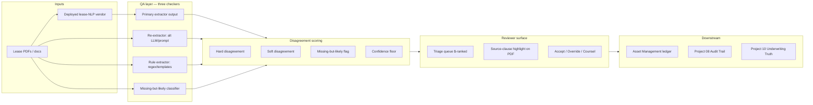
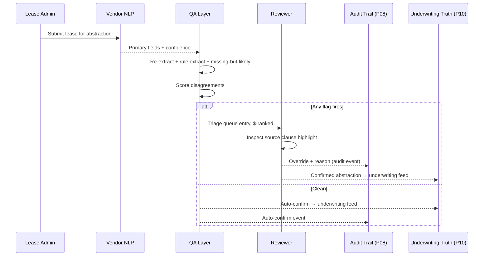

# Architecture · CRE Lease Abstraction Error Detector

## System architecture

## Data flow — single lease through QA

## Key trade-offs

- **Run ensemble on every lease vs. only when primary low-confidence.** Tier the ensemble: full ensemble on leases scoring below confidence threshold or flagged by missing-but-likely; primary-only on high-confidence standard leases. Saves 60%+ on ensemble cost.
- **Source-clause highlight on PDF.** Char-offset primary, embedding-search fallback when offsets misalign (older OCR'd docs). Two-tier highlight prevents reviewer trust collapse on misaligned highlights.
- **Override authority.** Reviewer always overrides; the QA layer never auto-corrects. Trade: slower throughput, but litigation defensibility intact.
- **Vintage and asset-class fairness.** Missing-but-likely classifier risks systematic bias against older vintages or non-standard assets. Quarterly fairness audit is a mandatory gate.

## Interlocks

- **Project 08 (Audit Trail)** — every reviewer override is a lineage event with reviewer_id, source-clause hash, original primary value, corrected value.
- **Project 10 (CRE Underwriting Reliability Sentinel)** — confirmed abstractions feed the comp/T-12/rent-roll arithmetic validation. Bad abstractions in = bad underwriting out; this project closes that loop upstream.
- **Asset Management ledger** — corrected abstractions update the operational rent roll, escalation schedule, and CAM cap registry. Recovered rent is realized here.
