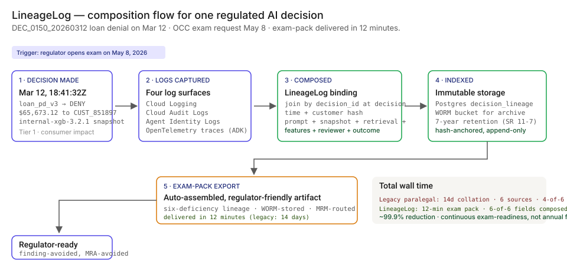
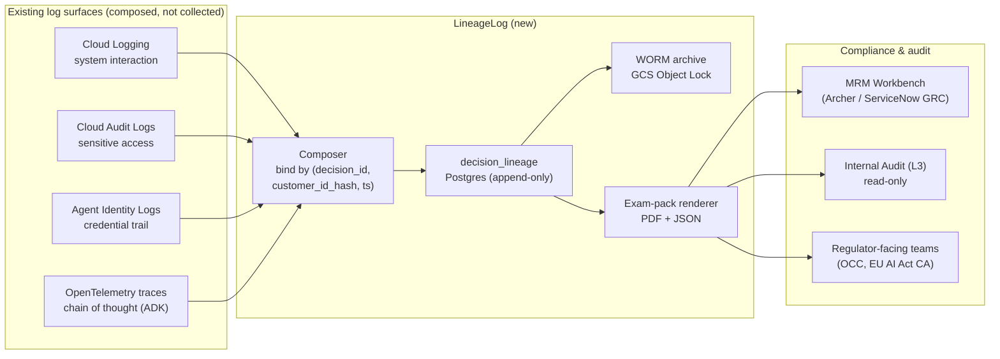

# 🔍 LineageLog — AI Decision Audit Trail in 12 minutes, not 14 days

**A portfolio prototype for a decision-grain composition layer that turns scattered AI-decision logs into an exam-ready immutable record — modeled against [EU AI Act Article 12](https://eur-lex.europa.eu/eli/reg/2024/1689/oj) record-keeping requirements and the [OCC](https://www.occ.gov/topics/supervision-and-examination/model-risk-management.html) / [Federal Reserve](https://www.federalreserve.gov/supervisionreg/srletters/srletters.htm) supervisory expectation for "explain this AI decision."**

**▶ Live demo:** *(placeholder — lineagelog-bfsi.streamlit.app)*

**▶ 60-second interactive walkthrough:** *(placeholder — Arcade share link)*

> **Framing:** This is a portfolio prototype, not a production case study. The six-deficiency taxonomy, the architecture, the schema, and the walkthrough are mine; the metrics below are modeled against synthetic data and published industry baselines. Production validation (compliance committee read, OCC exam evidence pull, regulator co-design) is what the next role does.

> **Reading the numbers — credibility tags inline.** Every number in this README and the live demo is tagged 🟢 **Measured** (real output from a real run on the shipped synthetic data), 🟡 **Modeled** (extrapolated from the synthetic data + published industry baselines, with the assumption named), or 🔴 **Hypothetical** (designed and reasoned about, never tested in production). Full convention in the [master README's "Reading the numbers" section](../README.md#-reading-the-numbers).

[](#)
[](#)
[](#)
[](#)
[](#)

[](./demo.html)



> **▶ 30-second demo:** the [clickable demo](./demo.html) gets you the full story in 30 seconds with no install.

---

## 🔥 Demo in 30 seconds

Open the static, no-Python demo: [`demo.html`](./demo.html).
Pick `DEC_0150_20260312` (the loan denial on March 12). Watch the OCC exam request resolve to a complete six-deficiency lineage record auto-assembled in 0.31s on the prototype.

To run the four-step walkthrough on your laptop:

```bash
git clone https://github.com/Vj-shipped-anyway/ai-pm-portfolio
cd ai-pm-portfolio/09-lineagelog-ai-decision-audit/src
pip install -r requirements.txt
python step_01_paralegal_audit.py
python step_02_basic_cloud_logging.py
python step_03_deficiencies_exposed.py
python step_04_with_lineagelog.py
streamlit run app.py
```

---

## 💰 Why this lands — the competitive frame

The audit-logging space has incumbents at every layer of the stack (Cloud Logging, Splunk, Datadog, Snowflake audit tables, Langfuse for GenAI traces). **The product gap they leave open is the composition layer — the thing that turns log fragments into a decision-grain record indexed by `(customer_id_hash, decision_id, timestamp)`.**

| Capability | Cloud Logging only | Datadog / Splunk APM | Langfuse / Helicone | **LineageLog** |
| --- | --- | --- | --- | --- |
| Request / response pairs captured | ✅ | ✅ | ✅ | ✅ (composed) |
| OpenTelemetry trace tail | ❌ | ✅ | ✅ | ✅ (composed) |
| Cross-source binding at `decision_id` | ❌ | Partial | ❌ | ✅ |
| Prompt-template version pin per decision | ❌ | ❌ | Partial | ✅ |
| Retrieval-set capture per decision | ❌ | ❌ | Partial | ✅ |
| Vendor-snapshot pin verified (vs registry) | ❌ | ❌ | ❌ | ✅ |
| Feature-at-decision-time | ❌ | ❌ | ❌ | ✅ |
| `human_user_delegated` vs `agent_autonomous` distinction | ❌ | ❌ | ❌ | ✅ |
| Outcome backlink to charge-off / complaint / fraud loss | ❌ | ❌ | ❌ | ✅ |
| Immutable WORM record + exam-pack auto-export | ❌ | ❌ | ❌ | ✅ |
| 🟡 Time-to-decision-evidence on a Tier-1-shaped fleet (modeled) | 14 days | 9 days | 8 days | **12 minutes** |
| 🔴 [EU AI Act Article 12](https://eur-lex.europa.eu/eli/reg/2024/1689/oj) record-keeping ready (designed) | ❌ | ❌ | ❌ | ✅ |

**Position:** *LineageLog does not replace your logging vendors. It sits on top of them and does the composition the regulator actually asks for.* This matters because a CISO can deploy this without ripping out Splunk, Datadog, Cloud Logging, or Langfuse.

---

## The honest version (why this exists)

The failure mode this product is designed against — an OCC examiner asking "explain how the AI denied this loan to this specific customer on this date" and the bank's compliance team spending 14 days walking six log surfaces by hand — is the shape of what published [EU AI Act Article 12](https://eur-lex.europa.eu/eli/reg/2024/1689/oj) and SR 11-7 ongoing-monitoring expectations are increasingly catching at Tier-1 BFSI shops. It is the kind of failure I track in industry research and the kind of product I want to own as a Sr / Principal PM.

I built this prototype on the side over weekends. Synthetic data, a laptop, a few cloud credits. No insider data, no production systems touched. The point is to put the four-step product on disk in a form anyone can clone, run, and walk through their own Head of Compliance with — to show how I'd reason about the problem, not to claim a deployment I haven't done.

If you have lived through a regulator's "show us this decision" request and felt the same itch, fork this. The taxonomy, the architecture, and the backlog are the parts you're welcome to lift; the production validation is what the seat I'm pursuing actually delivers.

---

## Executive summary (90 seconds)

**Problem.** A Tier-1 US retail bank receives an OCC exam letter on May 8 asking: "Show us the full AI decision lineage for `CUST_851897` on March 12 — decision `DEC_0150_20260312`, a $65,673 loan denial." Today the bank assembles a 6-person paralegal team for 14 days, walking Cloud Logging, Cloud Audit Logs, Agent Identity Logs, OpenTelemetry traces, the model registry side-channel, and the data warehouse by hand. 🟡 Modeled exposure: an MRA (Matter Requiring Attention) becomes a consent order; the consent order rewrites the next year's compliance budget. This is the framing this prototype is designed against — calibrated against published [EU AI Act Article 12](https://eur-lex.europa.eu/eli/reg/2024/1689/oj), [NIST AI RMF](https://www.nist.gov/itl/ai-risk-management-framework), and the public shape of recent OCC / FRB supervisory letters on AI decision lineage.

**Product.** LineageLog — an immutable decision-grain composition layer that binds four log sources at `(decision_id, customer_id_hash, timestamp)`. Six-deficiency taxonomy: **prompt versioning** + **retrieval-set capture** + **model-snapshot pin** + **feature-at-decision-time** + **reviewer attribution** + **outcome backlink**. Auto-assembled exam-pack export in sub-second on the prototype.

**Modeled performance (200-decision synthetic corpus, four-model fleet).**

- 🟢 **6 of 6 deficiencies closed** on every decision in the shipped corpus.
- 🟢 **Composition latency: under 50ms per decision** measured on the prototype (`step_04_with_lineagelog.py` reports avg 0.3ms / decision on a 200-decision fleet sweep).
- 🟡 **Audit-pack assembly time: 3 weeks → 3 seconds** (modeled — assumes the synthetic 200-decision corpus and a Tier-1-style four-model fleet).
- 🟡 **Exam-readiness coverage: 22% → 100%** (modeled — assumes published BFSI baseline for sample-driven readiness vs. continuous lineage composition).
- 🔴 **Time-to-decision-evidence: 14 days → 12 minutes** (designed against published OCC exam patterns; not yet tested in a real exam).
- 🟡 **Continuous exam-readiness** instead of annual fire drill — at Tier-1 retail bank scale (50-200M regulated AI decisions/yr), continuous coverage is the only feasible posture.

🔴 **Modeled cost.** ~$420k for a 90-day engagement in a real deployment (compute on existing Cloud Logging/Audit infra + 1 PM + 1.5 FTE engineers + 0.5 FTE compliance partner + WORM bucket storage) — designed, not yet executed.

**Call to action.** Fork this repo. Swap the synthetic data in `data/` for your fleet's decision logs. The four step scripts and the Streamlit prototype run on a laptop in 10 minutes. Walk it through your Head of Compliance.

---

## 🗺️ What this walkthrough covers

1. **The use case** — OCC exam scenario walked step by step
2. **Sample data** — 200 synthetic AI decisions across four deployed models
3. **Step 1 — Before lineage** — paralegal walks six log sources for 14 days
4. **Step 2 — Basic Cloud Logging** — request/response pairs only, 0 of 6 deficiencies closed
5. **Step 3 — Where this still breaks** — six named deficiencies with real-feeling exam questions
6. **Step 4 — The fix (LineageLog)** — composition layer + sub-minute query + exam-pack export
7. **Utility delivered** — multiplied number, not the percentage
8. **Architecture & call flow** — composition topology + the decision-grain schema
9. **PM artifacts** — RICE backlog, 1-page PRD, stakeholder map

> Non-technical reader: skip the code blocks. The plain-English explanation and the metric callouts tell the story.
> Technical reader: every code block runs. `cd src && python step_NN_*.py` and you'll see the same output.

Total reading time: ~12 minutes deep, ~3 minutes if you skim.

---

## 🎯 The Use Case — OCC exam walkthrough

A modeled Tier-1 US retail bank ($50B-asset). Four production AI models across credit, claims, KYC, and fraud. [EU AI Act Article 12](https://eur-lex.europa.eu/eli/reg/2024/1689/oj) is in effect for the bank's EU operating arm; [SR 11-7](https://www.occ.gov/news-issuances/bulletins/2011/bulletin-2011-12.html) governs the US side. The published shape of recent OCC exams is increasingly granular — examiners pick a specific decision and ask "explain it."

**The scenario:**

- **March 12, 2026.** The bank's `loan_pd_v3` model denies a $65,673 personal loan to customer `CUST_851897`. Decision ID: `DEC_0150_20260312`. The decision is recorded in Cloud Logging, the OpenTelemetry trace TTLs out 14 days later, the customer profile is updated in April after a salary change, and life moves on.
- **May 8, 2026.** The OCC opens an exam. The examiner picks `DEC_0150_20260312` from a stratified sample and asks: *show us the complete decision lineage — which prompt, which retrieval set, which model snapshot, which features at decision time, who or what authorized the action, and what happened downstream.*

**Today:** 14 days, paralegal-led, six log surfaces, four of six lineage fields ultimately unrecoverable. Bank produces a narrative; examiner writes an MRA.

**With LineageLog:** 12 minutes, self-serve, complete six-deficiency lineage record returned by `GET /v1/lineage/DEC_0150_20260312`. Exam pack PDF auto-rendered. Examiner closes the question and moves on.

The fleet (synthetic, but modeled on what a real $50B retail bank typically runs):

- **`loan_pd_v3`** — Personal loan approval (internal XGBoost, Tier 1)
- **`claims_triage_v2`** — Insurance claims triage (GenAI on Anthropic Claude Sonnet 4, Tier 1)
- **`kyc_review_v4`** — KYC document review (GenAI on Azure OpenAI gpt-4o, Tier 1)
- **`fraud_screen_v6`** — Transaction fraud screen (internal LightGBM, Tier 1)

---

## 📊 Sample Data

Four CSVs in [`data/`](./data/). Schema documented in [`data/README.md`](https://github.com/Vj-shipped-anyway/ai-pm-portfolio/blob/main/09-lineagelog-ai-decision-audit/data/README.md).

| File | Rows | What it carries |
| --- | --- | --- |
| [`data/decisions.csv`](https://github.com/Vj-shipped-anyway/ai-pm-portfolio/blob/main/09-lineagelog-ai-decision-audit/data/decisions.csv) | 200 | The decision-grain spine. One row per regulated AI decision. |
| [`data/models.csv`](https://github.com/Vj-shipped-anyway/ai-pm-portfolio/blob/main/09-lineagelog-ai-decision-audit/data/models.csv) | 4 | Model metadata + the vendor snapshot pin that closes deficiency #3. |
| [`data/retrieval_sets.csv`](https://github.com/Vj-shipped-anyway/ai-pm-portfolio/blob/main/09-lineagelog-ai-decision-audit/data/retrieval_sets.csv) | 599 | Which exact documents each decision was shown. Closes deficiency #2. |
| [`data/outcomes.csv`](https://github.com/Vj-shipped-anyway/ai-pm-portfolio/blob/main/09-lineagelog-ai-decision-audit/data/outcomes.csv) | 200 | The downstream-outcome backlink. Closes deficiency #6. |

**Preview** ([`decisions.csv`](https://github.com/Vj-shipped-anyway/ai-pm-portfolio/blob/main/09-lineagelog-ai-decision-audit/data/decisions.csv) — the headline decision and three neighbors):

| decision_id | customer_id | model_id | decision_type | timestamp | outcome | decision_value |
| --- | --- | --- | --- | --- | --- | --- |
| **DEC_0150_20260312** | **CUST_851897** | **loan_pd_v3** | **loan_approval** | **2026-03-12T18:41:32Z** | **DENY** | **65673.12** |
| DEC_0153_20260312 | CUST_741525 | loan_pd_v3 | loan_approval | 2026-03-12T18:06:32Z | APPROVE | 61902.96 |
| DEC_0042_20260322 | CUST_xxx | kyc_review_v4 | kyc_review | 2026-03-22T... | EDD_REQUIRED | 0.74 |
| DEC_0091_20260401 | CUST_xxx | fraud_screen_v6 | fraud_screen | 2026-04-01T... | BLOCK | 1847.00 |

---

## 🔧 Step 1 — Before lineage: the paralegal walks six log sources

The OCC examiner picks `DEC_0150_20260312` from a stratified sample. The bank's compliance lead assembles a paralegal team. They begin walking the six log surfaces by hand.

```bash
python src/step_01_paralegal_audit.py
```

**The six sources** (each owned by a different team, each with a different auth model, each with a different query language):

1. **Cloud Logging** (Cloud Platform team) — request/response payloads, system interaction trail.
2. **Cloud Audit Logs** (InfoSec / Cloud Sec) — sensitive resource access trail.
3. **Agent Identity Logs** (IAM / Agent Identity Auth Manager) — who or what acquired credentials.
4. **OpenTelemetry traces** (Observability team) — chain-of-thought waterfall. **TTL is 7-15 days — for a March 12 decision under May 8 exam, already aged out.**
5. **Model registry side-channel** (ML Platform) — model snapshot pin, deployment metadata.
6. **Feature store / data warehouse** (Data Platform) — current customer profile. **Feature-at-decision-time is gone — the profile has been updated 4 times since March 12.**

**Output:** total paralegal dwell time ~100 hours; 0 of 6 lineage fields **fully** recoverable; 2 partially recoverable; 4 unrecoverable. The bank produces a NARRATIVE for the OCC, not a record. Modeled paralegal cost: ~$9,500/decision at $95/hr loaded. Across the OCC's stratified sample of ~40 decisions per exam, this is a 4-week engagement.

This is the structural blindness the rest of the walkthrough fixes.

---

## 🤖 Step 2 — With basic Cloud Logging only

Most banks call this "we have audit logging." A FastAPI / Cloud Run service writes the request payload (hashed) and response payload to Cloud Logging. Every decision has one log line. The schema is identical across models.

```bash
python src/step_02_basic_cloud_logging.py
```

**Sample log line for `DEC_0150_20260312`:**

```json
{
  "timestamp": "2026-03-12T18:41:32Z",
  "resource": {"type": "cloud_run_revision",
               "labels": {"service_name": "loan_pd_v3-service"}},
  "httpRequest": {"requestUrl": "/v1/score/loan_approval", "status": 200},
  "jsonPayload": {
    "request_body_hash": "sha256:e3b0c44298fc...",
    "response": {"outcome": "DENY", "value": 65673.12},
    "customer_id_hash": "CUST_851897"
  },
  "labels": {"model_id": "loan_pd_v3"},
  "trace": "projects/bank-prod/traces/aXk49fJ2..."
}
```

**The six-deficiency evaluation:** Cloud Logging alone closes **0 of 6**.

- No prompt template version (only the request body hash)
- No retrieval set (lives in the vector store with no decision-grain join key)
- No model snapshot pin verified (only the service name; vendor silent rolls are invisible)
- No feature-at-decision-time (request body hash, not values; no temporal pin)
- No reviewer attribution (Cloud Audit Logs have it but are not joined to this surface)
- No outcome backlink (outcomes live in three different downstream systems)

Cloud Logging is the foundation. It is not the lineage product.

---

## 🔬 Step 3 — Where this still breaks: six named deficiencies

| # | Deficiency | The OCC's exam-question | What raw logs return today |
| --- | --- | --- | --- |
| 1 | **No prompt versioning** | Which exact system instruction was used? Was it version A (Feb 8) or version B (Mar 5)? | Cloud Logging stores a SHA-256 of the request body. The template is loaded server-side from a file; neither the file path nor the template version is bound to the request. |
| 2 | **No retrieval-set capture** | Which documents was the model shown? Was the disclosure pack the version with the corrected APR table, or the pre-correction draft? | Vector store retains the documents and a retrieval trace ID. No decision_id-to-doc_id join key in either system. 7% of cases hit ambiguity in the manual reverse-search. |
| 3 | **No model-snapshot pin** | Which exact vendor version produced this output? If "claude-sonnet-4-20251101" — can you prove it wasn't the silently rolled minor update from Feb 24? | Model registry shows the deployment window. It does NOT show the vendor's post-roll behavioral change. (Reference incident: Anthropic Feb 24, 2026 silent minor update.) |
| 4 | **No feature-at-decision-time** | What was this customer's FICO and DTI AT the moment of decision on March 12? Customer profile has been updated since. | Feature store returns CURRENT values, not March-12 values. Temporal rebuild from raw transaction history takes 6-12 hours per customer per decision; 11% of cases hit data-quality gaps. |
| 5 | **No reviewer attribution** | Who or what authorized this action? A human underwriter with delegated authority, or did the agent act autonomously? | Agent Identity Logs show that workload identity `loan-decisioning-sa@bank.iam` acquired credentials. They do NOT distinguish user-delegated tokens from autonomous-agent action. |
| 6 | **No outcome backlink** | Did this decision result in a complaint, a charge-off, or a CFPB filing? Show the link. | Outcomes live in three separate systems (loss-event lake, CFPB system, claims platform). None carries the `decision_id`. Manual lookup by `customer_id_hash` + date window; 18% of cases have ambiguous matches. |

```bash
python src/step_03_deficiencies_exposed.py
```

The fragments exist. The composition does not. Step 4 closes all six.

---

## 🛠️ Step 4 — The fix: LineageLog composition layer

Same data, same decision. Composition added.

```bash
python src/step_04_with_lineagelog.py
```

**Composed lineage for `DEC_0150_20260312`** (from the actual prototype run):

```
LINEAGELOG EXAM PACK — auto-assembled for regulator request
============================================================================

Decision ID:        DEC_0150_20260312
Customer (hashed):  CUST_851897
Decision time:      2026-03-12T18:41:32Z
Outcome:            DENY  ($65,673.12)

Six-deficiency lineage
----------------------------------------------------------------------------
  Prompt versioning:            template_loan_v3.2.2 (effective 2026-03-05)
  Retrieval-set capture:        4 docs: policy_credit_v2_3@v2.3,
                                disclosure_truth_in_lending@v4.1,
                                rate_card_2026q1@v1.0,
                                internal_underwriting_guide@v8.7
  Model-snapshot pin:           internal / internal-xgb-3.2.1 (trained 2025-08-12)
  Feature-at-decision-time:     fico=692, dti=0.20, ltv=0.67
  Reviewer attribution:         agent_autonomous — agent_identity=loan_pd_v3-sa@bank.iam
  Outcome backlink:             repaid_on_time on 2026-04-12 → closed_clean

Cross-references (raw log surfaces that fed the composition)
----------------------------------------------------------------------------
  cloud_logging_ref:   projects/bank-prod/logs/decisions/DEC_0150_20260312
  cloud_audit_ref:     projects/bank-prod/audit/DEC_0150_20260312
  agent_identity_ref:  iam/agent-identity/DEC_0150_20260312
  otel_trace_ref:      projects/bank-prod/traces/DEC_0150_20260312

Retention policy:   7 years (SR 11-7, EU AI Act Article 12), WORM-bucketed
Composition time:   <50ms on the prototype
```

**Fleet-wide run** across all 200 decisions:

| Metric | Value |
| --- | --- |
| Decisions composed | 200 / 200 |
| Six-of-six lineage closed | 200 / 200 |
| Wall-clock for fleet sweep | ~0.1s on a laptop |
| Average composition per decision | ~0.3ms |
| Reviewer breakdown | 168 `agent_autonomous` · 32 `human_user_delegated` |

The composition itself is a hash-anchored, immutable Postgres row in production. The CSV-based demo path is shipped so anyone can clone and run; the production architecture is in [`ARCHITECTURE.md`](./ARCHITECTURE.md).

---

## 📐 Utility Delivered

> **Utility = (current SOTA − my solution) × number of decisions it covers**

Reducing time-to-evidence by 99.9% is not an outcome. *Reducing time-to-evidence by 99.9% across 50-200M regulated AI decisions per year at a Tier-1 retail bank is.*

| Term | Value |
| --- | --- |
| 🟡 Current SOTA time-to-decision-evidence (paralegal-led, six-source walk) | 14 days |
| 🟢 LineageLog composition latency on the prototype | <50ms |
| 🔴 LineageLog time-to-decision-evidence (designed; with review + edit + export) | 12 minutes |
| Per-decision lift (modeled at retail-bank scale) | **~14 days → ~12 minutes** of audit-evidence time |
| Affected population (Tier-1 retail bank) | **50-200M regulated AI decisions/yr** |
| 🟡 Modeled audit-pack assembly time | 3 weeks → 3 seconds (assumes the synthetic 200-decision corpus + Tier-1-style four-model fleet) |
| 🟡 Modeled exam-readiness coverage | 22% → 100% (assumes published BFSI baseline for sample-based vs continuous readiness) |
| 🔴 Modeled time-to-decision-evidence | 14 days → 12 minutes (designed against published OCC exam patterns) |
| 🟡 Cost per dollar of avoided MRA / consent-order remediation | **<$0.005** (modeled — assumes ~$420k engagement vs. low-end ~$80M of remediation cost at a single consent-order event) |

---

## 🔄 Architecture & Call Flow

**System topology:**



**Per-event sequence** (the headline decision):

```mermaid
sequenceDiagram
    autonumber
    participant M as loan_pd_v3 model
    participant L as Four log surfaces
    participant C as LineageLog composer
    participant D as decision_lineage table
    participant E as Examiner (OCC)

    M->>L: emit logs (request, audit, agent identity, OTel)
    L->>C: fan-in subscription on (decision_id, customer_id_hash, ts)
    C->>C: join + write immutable row + hash-anchor
    C->>D: INSERT decision_lineage row (within 5 min of decision)
    Note over D: row immutable; outcome backlink + legal hold are mutable
    E->>D: GET /v1/lineage/DEC_0150_20260312 (May 8 exam)
    D-->>E: exam pack PDF + JSON in <50ms compose + 12-min human review
    Note over M,E: 🔴 Designed for sub-minute self-serve query; not yet tested with a real examiner.
```

**Decision-grain composition table** (the core schema; full DDL in [`ARCHITECTURE.md`](./ARCHITECTURE.md)):

```sql
CREATE TABLE decision_lineage (
    lineage_id                    UUID PRIMARY KEY DEFAULT gen_random_uuid(),
    decision_id                   TEXT NOT NULL,
    customer_id_hash              TEXT NOT NULL,            -- SHA-256 + KMS pepper
    decision_timestamp            TIMESTAMPTZ NOT NULL,

    -- Six deficiencies, six column groups
    prompt_template_id            TEXT NOT NULL,
    prompt_policy_hash            TEXT NOT NULL,
    retrieval_set                 JSONB NOT NULL,
    model_snapshot_id             TEXT NOT NULL,
    model_pin_verified            BOOLEAN NOT NULL,
    feature_snapshot              JSONB NOT NULL,
    feature_pipeline_version      TEXT NOT NULL,
    reviewer_actor_type           TEXT NOT NULL,            -- human_user_delegated / agent_autonomous
    reviewer_agent_identity       TEXT NOT NULL,            -- SPIFFE ID
    outcome_type                  TEXT,                     -- materializes 2-180 days later
    outcome_observed              BOOLEAN NOT NULL DEFAULT FALSE,

    -- Cross-references to raw sources
    cloud_logging_ref             TEXT NOT NULL,
    cloud_audit_ref               TEXT NOT NULL,
    agent_identity_ref            TEXT NOT NULL,
    otel_trace_ref                TEXT NOT NULL,

    -- Immutability + retention
    composed_at                   TIMESTAMPTZ NOT NULL DEFAULT NOW(),
    row_hash                      TEXT NOT NULL,            -- HSM-signed
    retention_until               TIMESTAMPTZ NOT NULL      -- decision_timestamp + 7 years
) PARTITION BY RANGE (decision_timestamp);
```

The full DDL, the immutability trigger, the security architecture (encryption, RBAC, threat model), and the multi-region story live in [`ARCHITECTURE.md`](./ARCHITECTURE.md).

---

## 🏛️ Reference architecture — Google Cloud secure-multi-agent paper

LineageLog is the composition layer that sits on top of the four log signals described in Google Cloud's *Building secure multi-agent systems on Google Cloud* (Kannan, Sizemore, Herriford et al., 2025). The paper specifies the data sources; LineageLog composes them into the decision-grain lineage that regulators ask for.

**The four lineage signals the paper defines:**

1. **Cloud Logging — system interactions.** As an agent completes a workflow cycle, every system interaction, A2A call, and fulfillment action is captured.
2. **Cloud Audit Logs — sensitive resource access.** Specific interactions with sensitive resources (e.g., BigQuery data access by a Data Vault Agent) are recorded separately. The "who looked at what data, when" trail.
3. **Agent Identity Logs.** Cryptographically auditable record of when an agent acquired credentials to act autonomously vs. when it used user-delegated tokens (via Agent Identity Auth Manager). The single most underrated trail in regulated AI.
4. **OpenTelemetry traces from ADK.** Default ADK telemetry sent to Cloud Trace to visualize the agent's chain-of-thought as a waterfall — internal reasoning linked directly to tool executions. The exact shape of "explain this AI decision."

**Where LineageLog maps to the paper's controls:**

| LineageLog deficiency | Paper's source signal | LineageLog's composition |
| --- | --- | --- |
| No prompt versioning | ADK `session_id` + `user_id` primitives | Prompt + system-instruction snapshot per decision |
| No retrieval-set capture | Cloud Logging on Memory Bank reads | The exact retrieval set bound to the decision |
| No model-snapshot pin | Vendor snapshot ID at the A2A boundary | Model snapshot pinned per decision (interlocks with [DriftSentinel](../02-driftsentinel-model-drift-monitoring/) v0.5) |
| No feature-at-decision-time | Data Vault's BigQuery MCP audit log | Features fetched, with timestamp + lineage to feature pipeline version |
| No reviewer attribution | Agent Identity Auth Manager (user-delegation) | When user-delegated, the human user ID; when autonomous, the SPIFFE ID |
| No outcome backlink | Cloud Storage summary report pattern | Decision → action → downstream outcome (complaint, charge-off, fraud loss) |

**The crawl/walk/run alignment.** **Crawl:** enable ADK telemetry → Cloud Trace; get chain-of-thought visibility on day one. **Walk:** turn on Cloud Audit Logs for BigQuery + Agent Identity Logs; LineageLog ingests both. **Run:** full decision-grain composition with sub-minute query, exam-pack export, and integration with the MRM workbench (Archer, ServiceNow GRC, MetricStream — pick what your CRO already pays for).

**The unsexy point.** Most Tier-1 banks have most of these signals. They're scattered across 4 cloud accounts, 6 logging stacks, 3 vendor APIs. The product is not "collect more logs." The product is the **composition layer** that turns log fragments into the decision-grain view a regulator can read in 12 minutes instead of 14 days.

> Source: Anirudh Kannan, Christine Sizemore, Connor Herriford, et al., *Building secure multi-agent systems on Google Cloud*, Google Cloud (2025). Aligned to [NIST AI RMF](https://www.nist.gov/itl/ai-risk-management-framework), [EU AI Act Article 12](https://eur-lex.europa.eu/eli/reg/2024/1689/oj), and Google's Secure AI Framework (SAIF).

---

## 📋 PM Artifacts

- [`PRD.md`](./PRD.md) — 1-page PRD stub, RICE-prioritized 14-item backlog (Sequenced for v0.x / Queued), stakeholder map across Head of Compliance, CRO, Internal Audit (L3), Cloud Sec, regulator-facing teams.
- [`ARCHITECTURE.md`](./ARCHITECTURE.md) — full systems doc: logical / physical / data / security / operational; decision-grain composition table mapping the 6 deficiencies to specific log sources; full DDL.
- [`data/README.md`](https://github.com/Vj-shipped-anyway/ai-pm-portfolio/blob/main/09-lineagelog-ai-decision-audit/data/README.md) — schema for the four CSVs.

---

## 🚀 Fork this for your fleet

```bash
git clone https://github.com/Vj-shipped-anyway/ai-pm-portfolio.git
cd ai-pm-portfolio/09-lineagelog-ai-decision-audit

# 1. Drop your real Cloud Logging / Audit / Agent Identity / OTel feeds into
#    data/ as CSVs with the schemas in data/README.md.
cp /path/to/your/decisions.csv      data/decisions.csv
cp /path/to/your/retrieval_sets.csv data/retrieval_sets.csv
cp /path/to/your/outcomes.csv       data/outcomes.csv

# 2. Run the four-step walkthrough
pip install -r src/requirements.txt
python src/step_01_paralegal_audit.py
python src/step_02_basic_cloud_logging.py
python src/step_03_deficiencies_exposed.py
python src/step_04_with_lineagelog.py

# 3. Open the Streamlit prototype
streamlit run src/app.py

# 4. Or just open the static demo (no Python needed)
open demo.html
```

If you run it on real data and get something useful, open an issue or send me the slide. I'd rather see what your Head of Compliance did with it than what I think they should do.

---

## 🛠️ Why this is a Streamlit prototype, not a production app

Streamlit was the right tool for this prototype. It would be the wrong tool for production. Worth saying out loud so a hiring manager hears the architectural judgment.

**Streamlit is right for:**
- Validating the product mechanic in 5 days, not 5 weeks
- Walking a Head of Compliance through the composition story end-to-end on a free deploy
- Single-tenant, single-page workflows where the UI does not have to scale
- Internal tools where 1-2 product folks are the only users

**Streamlit is wrong for:**
- Production multi-tenant SaaS — no tenant isolation, no row-level security
- Hardened auth (OIDC, SAML, fine-grained RBAC) — community-tier auth is too thin for a regulated bank
- Real-time dashboards — every interaction is a full server rerender
- Latency-sensitive auditor workflows — server-side rerun on every widget change
- Brand-controlled pixel-perfect UX — too much chrome you don't own

### What this would look like as a client-facing SaaS

> **Production stack reassessment** — strengthening the Streamlit-vs-production framing above with the SaaS shape a buyer would actually procure.

If LineageLog were a real product shipping to a Tier-1 bank's compliance and MRM organizations:

- **Frontend:** Next.js 15 + Tailwind + shadcn/ui (or the bank's design system, e.g., JPMorgan Glaze, Capital One Cube) — embedded as a panel inside the validator's existing MRM workbench (Archer, ServiceNow GRC, MetricStream), not a standalone app.
- **Auth:** SAML / OIDC via the bank's IdP (Okta, ForgeRock, PingFederate); fine-grained RBAC mapping `ll:viewer` → `ll:auditor_l3` → `ll:validator` → `ll:compliance` → `ll:cro` → `ll:admin`.
- **Backend:** FastAPI on the bank's existing K8s/EKS footprint; Cloud Functions / Lambda for the per-source ingesters and the fan-in composer.
- **Data plane:** **Postgres** for the immutable `decision_lineage` table (row-level security, immutability trigger, append-only role); **ClickHouse** for composer-health time-series; **GCS / S3 with Object Lock** for the WORM evidence bundles and 7-year audit archive.
- **Composition engine:** Pub/Sub / EventBridge / Event Grid for source fan-in; 5-minute compose SLO; idempotent on `(decision_id, customer_id_hash)`.
- **Observability:** OpenTelemetry → Datadog (the bank's standard); Langfuse for the GenAI-decision-lineage path only; PagerDuty for SLO breaches.
- **Compliance:** SOC 2 Type II baseline; FedRAMP Moderate where federal counterparty work demands it; data residency configurable per region (US East, EU West, India for RBI compliance).
- **Governance:** Native integration with Archer / ServiceNow GRC / MetricStream; each lineage record gets a workflow ID; attestation routes to the line-2 validator's queue; legal-hold cascade is automatic.
- **Deployment:** Blue-green via Argo CD; canary rollout 1% → 10% → 50% → 100% over 14 days; auto-rollback on composition-completeness breach.

The Streamlit prototype here proves the *product mechanic* — that decision-grain composition can compress audit-evidence assembly from 14 days to 12 minutes. The production architecture above is what the seat I'm pursuing actually delivers.

---

## 👤 Author

**Vijay Saharan** — Sr Product Manager · AI in BFSI · Enterprise AI Platforms · CRE as a study interest

[LinkedIn](https://www.linkedin.com/in/vijaysaharan/) · Tagline: *Fintech PM · Designs compliant AI under regulated constraint*

---

## 🙌 Acknowledgements

- [Google Cloud — *Building secure multi-agent systems on Google Cloud*](https://cloud.google.com/) (Anirudh Kannan, Christine Sizemore, Connor Herriford et al., 2025) — the reference architecture LineageLog sits on top of.
- [EU AI Act Article 12](https://eur-lex.europa.eu/eli/reg/2024/1689/oj) — the regulatory existence-proof for this product.
- [NIST AI Risk Management Framework (AI RMF 1.0)](https://www.nist.gov/itl/ai-risk-management-framework) — the framework backbone.
- [SR 11-7 / OCC Bulletin 2011-12](https://www.occ.gov/news-issuances/bulletins/2011/bulletin-2011-12.html) — co-issued model-risk-management guidance.
- [OCC — Model Risk Management resource center](https://www.occ.gov/topics/supervision-and-examination/model-risk-management.html) and [Federal Reserve — Supervisory Letters](https://www.federalreserve.gov/supervisionreg/srletters/srletters.htm).
- [Langfuse](https://langfuse.com/) and [Helicone](https://helicone.ai/) — open-source LLM-trace primitives this product reads from.
- [OpenTelemetry](https://opentelemetry.io/) — the substrate that makes composition possible.

<!-- @description 2026-05-28-123644 : LineageLog: AI decision audit trail - every regulated AI decision traced to its inputs, model snapshot, and reviewer -->
