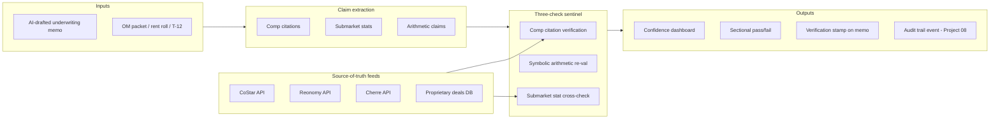
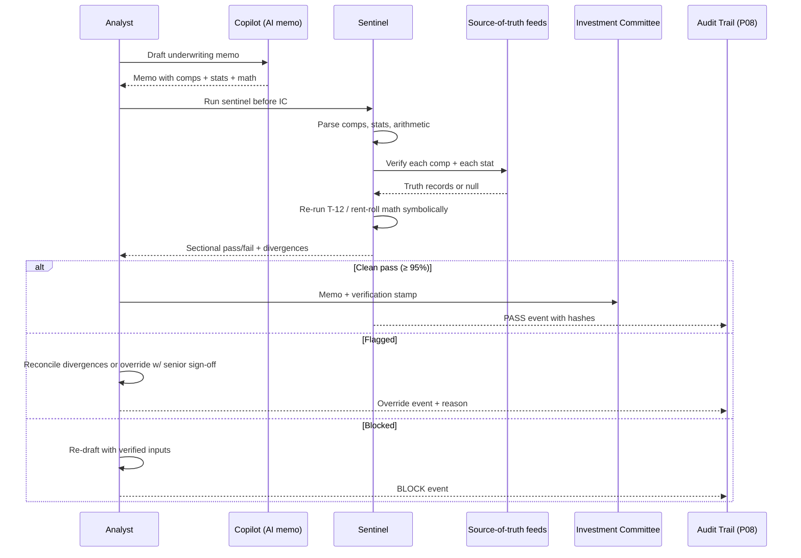

# Architecture · CRE AI Underwriting Reliability Sentinel

## System architecture

## Data flow — single memo through sentinel

## Key trade-offs

- **Symbolic re-validation vs. second LLM on math.** Symbolic wins, every time. Math is a deterministic problem; LLMs introduce non-determinism into a place that doesn't tolerate it.
- **Single source-of-truth vs. multi-feed.** Multi-feed always for stats (and surface disagreements rather than picking). Single feed acceptable for comp existence checks where ground truth is unambiguous.
- **Tolerance bands.** Tight bands → analyst friction; loose bands → hallucinations slip. Operating point is set quarterly against IC outcomes (override-and-was-right rate is the calibration signal).
- **Override authority.** Senior sign-off required for any override; every override is an audit event. Analysts cannot silently bypass the sentinel.
- **Cost discipline.** Cap sentinel cost at ~$3 per memo; cache aggressive on stat pulls; batch comp lookups.

## Interlocks

- **Project 08 (Audit Trail)** — every sentinel run, every override, every IC-forwarded memo writes a lineage event with verification record + reviewer ID.
- **Project 09 (Lease Abstraction Detector)** — corrected lease abstractions (post-QA) feed Check 2's rent-roll arithmetic. Bad lease abstractions in = bad NOI re-val out; this project's reliability depends on Project 09's truth.
- **IC packet workflow** — sentinel verification stamp becomes a required field on IC memos; gating rule lives in IC governance, not in the sentinel.
- **Asset Management handoff** — at close, the verified underwriting (not the raw AI draft) is what attaches to the property file for post-close benchmarking.
